# eScriptorium and Kraken - introduction

eScriptorium is a web-based application designed to work on historical manuscripts and printed books, to prepare manual and automatic transcriptions. The application is integrated with Kraken, a tool using deep learning algorithms for text recognition (OCR and HTR). eScriptorium is a project led by a team from École Pratique des Hautes Études - Université PSL.

## Table of contents

- [Acknowledgements](#acknowledgements)
- [Version](#version)
- [Installation](#installation)
- [Login to the application and its main window](#login-to-the-application-and-its-main-window)
- [How to create a new project](#how-to-create-a-new-project)
- [How to create a new document](#how-to-create-a-new-document)
  - [Image import](#image-import)
  - [Import of transcripts and images](#import-of-transcripts-and-images)
- [Document tags](#document-tags)
- [Document tabs](#document-tabs)
- [List of images](#list-of-images)
- [Binarisation](#binarisation)
- [Segmentation](#segmentation)
  - [Image editing window, segmentation correction, transcription editing](#image-editing-window-segmentation-correction-transcription-editing)
  - [Verification and correction of segmentation](#verification-and-correction-of-segmentation)
- [Defining types and annotations for image elements](#defining-types-and-annotations-for-image-elements)
  - [Assigning types to segmentation elements](#assigning-types-to-segmentation-elements)
  - [Assigning labels to text passages](#assigning-labels-to-text-passages)
  - [Assigning labels to parts of the image](#assigning-labels-to-parts-of-the-image)
- [Entering a manual transcription](#entering-a-manual-transcription)
  - [Virtual keyboard](#virtual-keyboard)
  - [Order of lines](#order-of-lines)
- [Models, import of publicly available models](#models-import-of-publicly-available-models)
  - [Menu My Models](#menu-my-models)
  - [Zakładka Models w dokumencie](#zak%C5%82adka-models-w-dokumencie)
- [Transkrypcja automatyczna](#transkrypcja-automatyczna)
  - [Wersje transkrypcji](#wersje-transkrypcji)
- [Automatic alignment - funkcja wyrównywania tekstu](#automatic-alignment---funkcja-wyr%C3%B3wnywania-tekstu)
- [Trenowanie własnego modelu w eScriptorium](#trenowanie-w%C5%82asnego-modelu-w-escriptorium)
- [Trenowanie modelu bezpośrednio w Krakenie](#trenowanie-modelu-bezpo%C5%9Brednio-w-krakenie)
- [Strategia trenowania modeli](#strategia-trenowania-modeli)
- [Współpraca z innymi użytkownikami](#wsp%C3%B3%C5%82praca-z-innymi-u%C5%BCytkownikami)
  - [Udostępnianie projektów](#udost%C4%99pnianie-projekt%C3%B3w)
  - [Udostępnianie dokumentu](#udost%C4%99pnianie-dokumentu)
  - [Przenoszenie dokumentu do innego projektu](#przenoszenie-dokumentu-do-innego-projektu)
  - [Eksport, udostępnienie i usunięcie modelu](#eksport-udost%C4%99pnienie-i-usuni%C4%99cie-modelu)
- [Eksport transkrypcji](#eksport-transkrypcji)
- [Raporty](#raporty)
- [Administracja systemem eScriptorium](#administracja-systemem-escriptorium)
- [API (REST) eScriptorium](#api-rest-escriptorium)
- [Fora dyskusyjne, kody źródłowe, licencje](#fora-dyskusyjne-kody-%C5%BAr%C3%B3d%C5%82owe-licencje)

## Acknowledgements

The creation of this description would not have been possible without reading previously created materials and tutorials, e. g. [eScriptorium Tutorial (en)](https://lectaurep.hypotheses.org/documentation/escriptorium-tutorial-en), without watching the numerous videos available on [vimeo](https://vimeo.com/user130532566) and [youtube](https://www.youtube.com/watch?v=tut007D6w3o) or, finally, without reading the articles on [LECTAUREP](https://lectaurep.hypotheses.org/articles). A lot of valuable information was also taken from the Kraken system documentation - [Training](https://kraken.re/master/ketos.html). Above all, of course, thanks are due to the developers of the eScriptorium and Kraken applications for preparing and making available under open licences tools that open up new possibilities in the field of digital humanities.

## Version

The current version of the application is 0.13.2, and this is the version described in this tutorial (as of 16.12.2022).
<figure>
  
</figure>

## Installation

The eScriptorium is not a public platform where you can create an account. To use the application, you must first install it. Locally or on a server - the installation procedure using the docker is described on [wiki](https://gitlab.com/scripta/escriptorium/-/wikis/docker-install).

## Login to the application and its main window

To log in to the eScriptorium instance, you must enter your username and password. The login window is displayed by selecting the Login button in the top right corner of the application screen.
<figure>
  
</figure>

After logging in, a list (table) of the user's projects is visible. These can be projects created by the person logged in or shared by other users. In the middle column of the project table, you can see - for each project - the username of its creator. In the last column, you can see the number of documents in a project. A project may have multiple documents, and each document may contain multiple images. The first column on the left is the title of the respective project.
<figure>
  
</figure>

Above the list of projects you can see the main application menu:
- menu 'My Models' displays the list of models available to the user,
- the 'Hello {USER}' menu provides, among other things, the possibility to change the password, edit the user profile, and view the status of tasks. Tasks such as model training, or transcription of a large number of files can be time-consuming, the Task monitoring or Task report commands allow the status of tasks to be checked. Depending on your permissions, you can also find here the function to manage the settings of the eScriptorium application. This menu also includes the option to log out of the system.
- 'My Projects' menu - displays the list (table) of projects.
- the 'Contact' menu - allows communication with the administrators of a given eScriptorium instance, if this option has been configured.
- Home' menu - displays the main window of the application, with information about its capabilities, version, etc.
<figure>
  
</figure>

## How to create a new project

The 'Create new Project' button is visible in the top right corner of the screen (above the projects table) allows you to create a new project. The only field that can and should be filled in is the project title - up to 512 characters. Note: in the version described here, you cannot change the name of a project once it has been created, so it is worth entering a clever title that will allow you to search for our project from many others in the future.
<figure>
  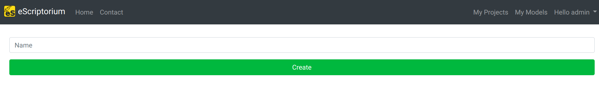
</figure>

The application displays a notification (green message box in the top right corner) indicating that the project has been created correctly, which will also appear immediately in the project list.
<figure>
  
</figure>

## How to create a new document

Once created, a project can be opened by clicking on the title. The project is something like a container for documents. You can group documents containing, for example, scans of various books of a given historical source. Creating a new document starts with clicking the green 'Create new Document' button - in the upper right corner of the screen.
<figure>
  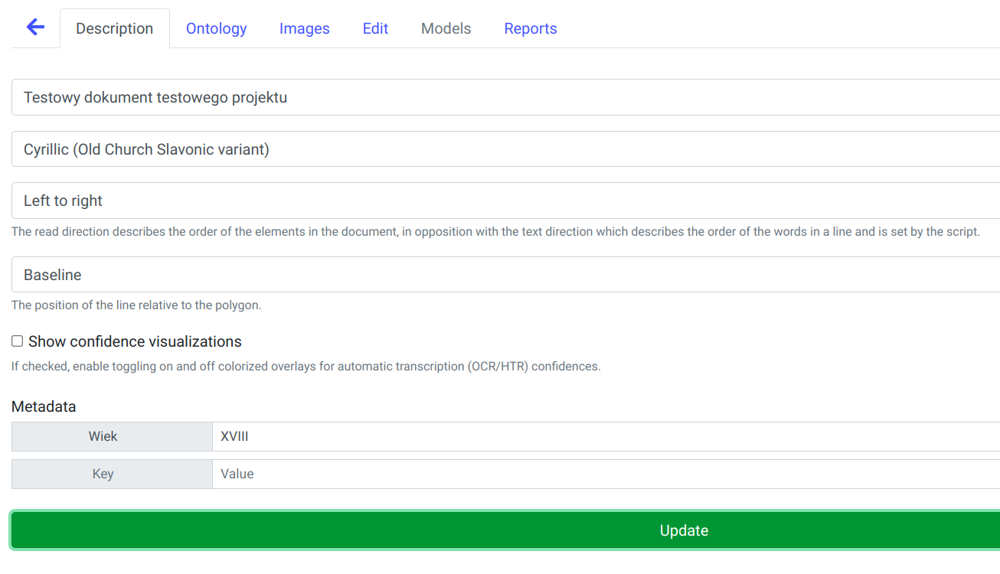
</figure>

The document window is much more complex than the project window. The information is divided into six tabs: Description, Ontology, Images, Edit, Models, and Reports (some are initially inaccessible). To add and save a new document, first of all, you need to fill in the fields in the first tab (Description), starting with the name of the document e.g. 'Book vol. 23' (unlike for projects, you can rename the document later). Then select from the list the type of script (main script) - for example:  'Latin', 'Cyrillic' or 'Cyrillic (Old Church Slavonic variant)'. It should also be determined whether the order of the elements in the document is 'Left to right' or 'Right to left' (the direction of the script itself is determined by the choice of main script).

In the next field, indicate the position of the line to the polygon (shape) of the text line: 'Baseline', 'Topline', 'Centered'. The application optionally displays the degree of confidence for individual fragments of the automatic transcription; if you want to display such information, tick the 'Show confidence visualizations' checkbox (the visualization will appear in the 'Transcription' panel in the scan/image editing mode).

The Metadata section allows you to enter your metadata describing the document (you can enter information concerning, for example, the chronological period or geographical origin). Once you have completed entering this basic data, the 'Create' button at the bottom of the window will create our new document, displaying an appropriate message (notification) in the top right of the screen.
All the information entered will be available for future additions and corrections.
Saving the document unlocks access to the primary tab: 'Images' - this is where the processed scans of manuscripts and prints will be located.
<figure>
  
</figure>

### Image import

The 'Images' tab consists of three main elements:
 -the box for importing images/scans at the top (a white box surrounded by a dashed line, with the words 'Drop images here or click to Upload'),
- a toolbar in the middle
- and a list of scans that can be scrolled (horizontally) when the number of scans exceeds the width of the screen. For a new document, the scan list is not yet visible.
<figure>
  
</figure>

The simplest method of importing images is to select a file or group of files in any application for managing files in your operating system (Explorers in Windows, or Files in Ubuntu) and dragging them into the scan import box area. This action will start the import process - the scans will appear in the import field and gradually move into the list of scans. You can import quite large collections in this way, even several hundred images.
You can also click within the import field, which will trigger the standard system dialog with the possibility of selecting files. Typical image file formats are supported, for example JPEG, PNG, TIFF.

### Import of transcripts and images

Additional import possibilities are provided by the Import button visible on the toolbar. The button unfolds providing three commands:
- import images from an external server via the **IIIF protocol**, which is useful if you already have a collection of scans in a repository that supports this protocol. Example IIIF manifest: `https://digitalcollections.universiteitleiden.nl/iiif_manifest/item%3A1603568/manifest` (Book of hours (Dutch) - Bibliotheca Publica Latina).
<figure>
  
</figure>

- import of images **from a pdf file** - each page of the file will be imported as a separate image
<figure>
  
</figure>

- import of transcriptions **in XML** format (e.g. ALTO v.4 or PAGE XML). This option allows importing transcriptions and segmentation to previously loaded scans, the transcriptions can be a group of XML files or can be packed as a **zip file**. This function also allows you to import a zip file containing both scans and XML transcriptions. The application will then extract the images and place them in the list of scans while simultaneously loading the information from the XML files - transcription, segmentation, etc. Note: by default, the maximum size of the imported zip file cannot exceed 150 MB. In the case of importing files originating from e.g. Transkribus (the PAGE format is then recommended), line masks must be corrected after import (segmentation with the 'only line mask' option).
<figure>
  
</figure>

When importing images via the IIIF protocol, the metadata of the imported collection is usually also downloaded from the server, which can be viewed in the 'Description' tab of the document.
<figure>
  
</figure>

## Document tags

You can assign user-defined tags to a document. Tags are a type of labels describing a document and allow for quick filtering of documents, e.g. you can add the 'IIIF' tag to all project documents imported via this protocol to later filter out only documents of this type. Adding a tag to a document is supported by a blue icon (with a label symbol) in the list of documents. A similar icon, but in the toolbar above the list of documents (next to the button for creating a new document) displays the tag management window, where you can change the name of the tag or the color assigned to it.
<figure>
  
</figure>

## Document tabs

The document window is the place of the application that is most often displayed when working with eScriptorium. It consists of 6 tabs:
- _Description_ - where you can find basic information and metadata describing the document.
- _Ontology_ - with definitions of types, labels and annotations for text and image.
- _Images_ - where you can add and delete scans, import transcriptions, carry out the most important operations such as segmentation or automatic transcription, train HTR/OCR models and finally export data.
- _Edit_ - in which the user works with a specific image/scan.
- _Models_ - containing a list of models related to a given document (models used to create the transcript or models trained on the basis of this document).
- _Reports_ - reports tab about the current document, e.g. information about the number of images in the document, the average transcription confidence factor or the frequency of characters in the transcription.

## List of images

The image list, visible in the 'Images' tab of the document, is the main place to quickly browse the collection of images in the document. Image processing is also invoked from the image list: binarisation, segmentation or transcription. Images are displayed as thumbnails; if there are more than a few and they do not fit on the screen, the application displays a horizontal scroll bar.
<figure>
  
</figure>

A toolbar is visible above the image list. The first two buttons on the bar allow all images to be marked (selected) or deselected - image processing operations are performed only on the selected images. The next buttons are responsible for import and export, training - it is possible to train a segmentation model or a transcription model. The availability of the 'Train' button depends on user rights. A group of buttons on the right-hand side of the toolbar allows the processing of scans: binarisation, segmentation, transcription and automatic alignment (Align) with the indicated text (e.g. manual transcription).
<figure>
  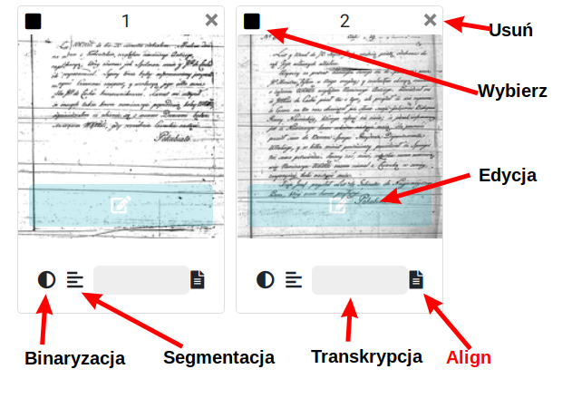
</figure>

Each image displayed as a thumbnail has a set of icons/buttons that indicate the status of a particular scan and allow certain operations to be performed on it. For example, the checkbox in the upper-left corner of the thumbnail selects a particular scan, while the small cross icon (in the upper-right corner) allows you to delete a scan from a document. The green box/button in the centre of the thumbnail allows you to enter edit mode, and the icons below the thumbnail indicate whether any of the processing operations have been carried out on the scan, in which case they turn green. For example, the round black/white icon is for binarisation, the icon with schematic lines is for segmentation, the icon which is a white empty rectangle is for transcription and the icon which looks like a file/document symbol corresponds to the Align function (automatic text alignment). By grabbing a thumbnail with the mouse and moving it within the image list, you can change the order of the images in the document.

## Binarisation

In the current version of the application, binarization is not recommended. The system warns that this may even lead to a deterioration in the quality of the results.
<figure>
  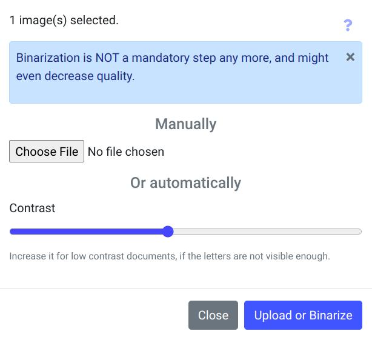
</figure>

## Segmentation

Before running automatic image transcription (OCR/HTR), it is necessary to correctly divide the manuscript into regions and lines. For individual small images, this procedure can be done manually, but for a larger collection of images, this would be too time-consuming. The eScriptorium has an automatic segmentation mechanism using a deep learning model. To activate it, select one or more images in the list and then click the 'Segment' button in the toolbar. A window with segmentation options will be displayed, where you select the model, the scope of work, the layout of elements on the page, etc.
<figure>
  
</figure>

In the current version of the application, one segmentation model is available: blla.mlmodel, giving otherwise very good results. The default range set:
- 'Lines and regions' - determines baselines, line masks (polygons), and regions.
You can change the segmentation range by expanding the list below the model name field. Additional options will then appear:
- 'Lines Baselines and mask' (designates only lines and line masks),
-'only line Mask' - only line masks (this function recalculates the shape of the masks - polygons from scratch and does not use the model),
- 'Regions' - designates regions, without modifying baselines and line masks.

The third field of the segmentation parameters window specifies the layout of the text on the pages, by default 'Horizontal l2r' is selected, 'Horizontal r2l', 'Vertical l2r' and 'Vertical r2l' are also available. The 'Override' checkbox at the bottom of the window means that any pre-existing segmentation for the images will be removed, the transcription will also be removed.

The segmentation procedure can be time-consuming. During the process, the application displays a discrete animation for the images being processed - a small icon with lines (the scan segmentation icon) blinks on the images selected for processing (below the thumbnail). A yellow button against the thumbnail is also displayed, allowing the user to cancel the segmentation currently being carried out. When the procedure is complete, a notification is displayed in the top right-hand corner of the screen and the icon turns green. This also acts as a button - segmentation can be started by clicking on the small icon below the thumbnail.

Note: when importing scans and transcriptions from Transkribus (PAGE XML format preferred), segmentation is recommended, but only using the 'only line Mask' option.

### Image editing window, segmentation correction, transcription editing

To see the image segmentation created by the model, enter edit mode for the image in question - if you hover the mouse cursor over a scan thumbnail, a bar will appear with a white icon symbolizing editing, and a balloon with a prompt 'Edit', clicking on the bar will open the scan in edit mode. Alternatively, one of the tabs in the document is the 'Edit' tab, which launches the edit mode for the first image in the document, the edit mode can navigate to the next/previous scan (arrow icons at the top of the screen), by moving left/right you can find the correct scan (navigation is also possible using the keyboard: Crtl + left/right arrow or Page Down/Page Up keys).

The image editing window can display between 1 and 5 panels. Panels can be switched on and off via the icons in the upper right corner of the window.
<figure>
  
</figure>

- 'Text'(?)- Page/scan metadata, where the page title, comment, and metadata can be stored in the form of key-value pairs.
<figure>
  
</figure>
- 'Source Image' - Original image. The icons in the panel's toolbar allow you to rotate the image (90 degrees left/right), and to download the image file.
<figure>
  
</figure>
- 'Segmentation' - Segmentation, where manual or automatic segmentation is visible: baselines, line masks, and regions. Icons in the image panel are tools for editing segmentation: curved arrows undo or redo editing operations, and a drop-down 'Editor settigns' icon displays colors assigned to a region or line type. A green icon with four white squares enables/disables region mode (R hotkey), an icon with a down arrow and numbers displays the line order (L key), and an icon with a mask symbol - enables the display of the mask shape (M key). The yellow icon with the scissors symbol is the cutting tool, which enables e.g. trimming of baselines.
<figure>
  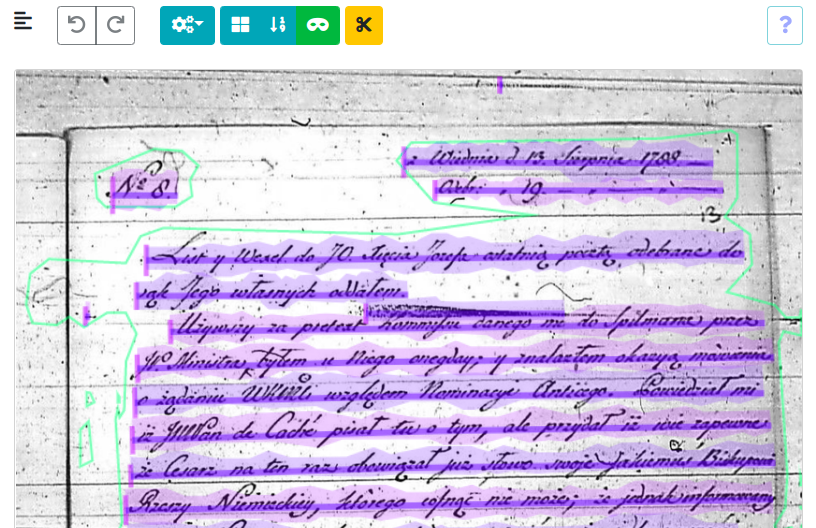
</figure>
- 'Transcription' - When an automatic transcription is performed, this panel displays the results in graphical form. Optionally, it can also display 'confidence visualisations' - if enabled in the document parameters (Description tab), by coloring the rows from orange through yellow to shades of green - the higher the confidence of the transcription, the closer it is to a luscious green. A slider control allows you to adjust the sensitivity of the degree of certainty - moving more to the right will emphasize differences more strongly.
<figure>
  
</figure>
- 'Text' - Text of manual or automatic transcriptions (if the scan in question has already been recognized by the model(s)), at the top of the window you can select from a drop-down list which version of the transcription is to be displayed. An icon with white triangles in the panel's toolbar allows you to enable row-sorting mode. If annotations labels have been defined for the text in the 'Ontology' tab of the document, they will be visible in the toolbar as on/off buttons.
<figure>
  
</figure>

### Verification and correction of segmentation

Although it is possible to correct both baselines and line masks, the manual correction of masks is not recommended. A better solution is to correct the length and shape of the baselines, and the line masks are then (usually with a 1-2 second delay) automatically adjusted by the application.
<figure>
  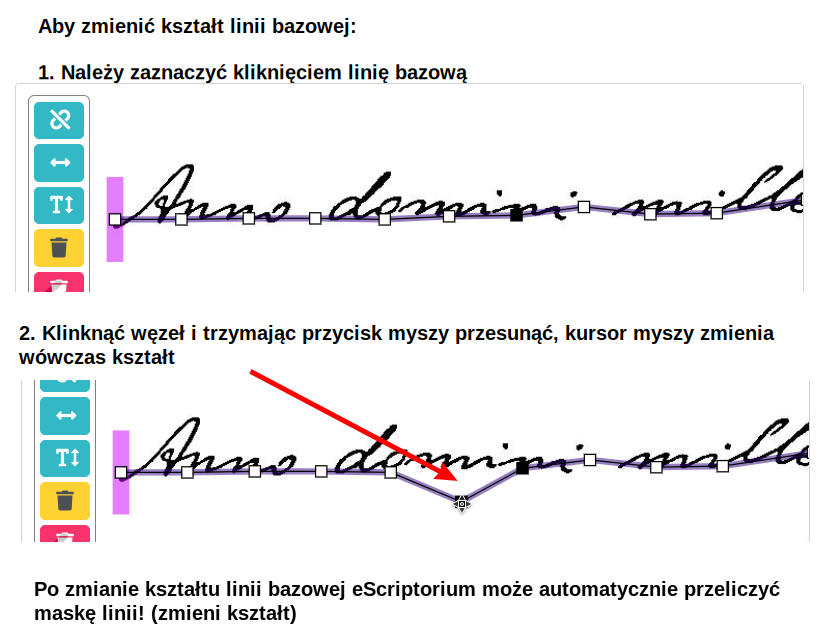
</figure>

In case of problems with selecting the correct line node, you can use the so-called **lasso** - with the Shift key pressed and the left mouse button pressed, select the area with the node of interest to us. The selected node will turn black and can be moved, the mouse cursor positioned over such a node changes to a 'hand' shape.
<figure>
  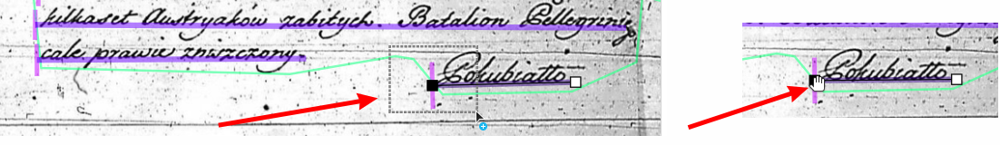
</figure>

It is possible to add nodes to existing baselines by selecting the line and double-clicking at the desired point on the line. The new line node can be moved. The selected node can also be deleted - when editing a segmentation, an additional toolbar is visible, and one of the tools is a yellow icon with a basket symbol, which is used precisely to delete nodes.
<figure>
  
</figure>

For selected lines it is possible to change their reading direction. In the auxiliary toolbar an icon with a horizontal line and arrows at both ends changes the reading direction when used - the vertical line marking the beginning of the line moves to the other end. Using the tool again restores the original situation.
<figure>
  
</figure>

Another tool visible in the auxiliary toolbar is the icon for linking (or disconnecting) a line to a region (icon with a node symbol - 'Link/Unlink').
<figure>
  
</figure>

However, if there is a need to modify the line mask, note that editing the mask works a little differently. After enabling visibility of line masks, selecting the line to be modified, click not so much on the mask node as on its vicinity, and moving the mouse cursor you will see that the line mask node follows it.
<figure>
  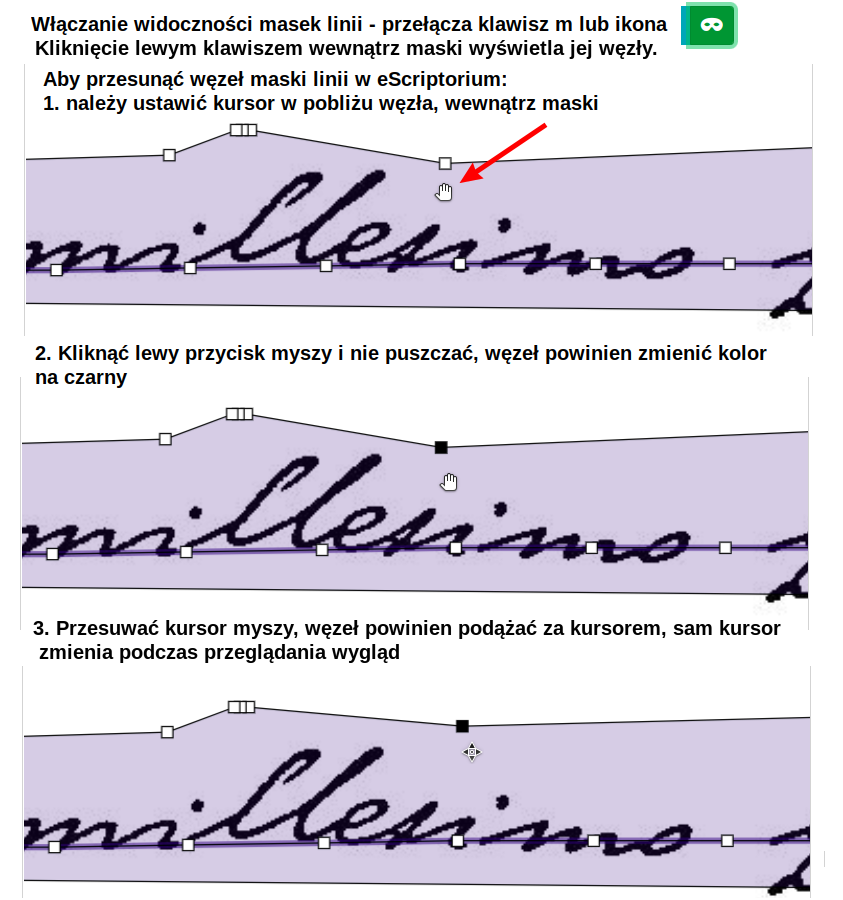
</figure>

A useful tool when modifying segmentation is the 'Cut through lines' tool (icon with a scissors symbol on a yellow background). When activated (the colour of the icon changes to green), it allows you to select a rectangular area that trims parts of lines (or removes whole lines).
<figure>
  
</figure>

Low-quality input images, e.g. with numerous soils, artefacts resulting from scanning old microfilms with damage, damage to the scanned or photographed documents themselves have a negative impact on the quality of segmentation. Recognition of sets of damage or dirt as regions, sometimes false recognition of non-existent lines, can be expected.
<figure>
  
</figure>

The eScriptorium allows group operations in the segmentation editing window. It is possible to use the function of the so-called.
**lasso** (SHIFT + selecting an area with the mouse cursor) to select a group of line or line nodes and, for example, move them in groups (with the CRTL key pressed, grab one of the nodes via the mouse cursor and move), changing the shape of the lines or lengthening/shortening them.
<figure>
  
</figure>

It is also possible to delete selected lines in groups - either with the tool from the toolbar (red icon with bin) or with the shortcut key - DELETE.

When at least two lines are selected, a new icon appears in the pop-up toolbar, associated with the line gluing tool. When clicked, the application tries to merge the selected lines into one.
<figure>
  
</figure>

## Defining types and annotations for image elements

In the Ontology tab of the document, labels can be defined to describe image elements - region and line types, as well as image annotations and text annotations. The application suggests several standard region types ('Main', 'Title'), but you can add your types. Only those with tick boxes will be visible when editing the image. Similarly, for line types, a couple of standard ones are available ('Numbering', 'Signature'), and using the edit box at the bottom of the 'Line types' section and the green plus icon, you can add your line types. Again - only the selected ones will be visible when working in the image editor.
<figure>
  
</figure>

Further in the 'Ontology' window, annotation definitions can be created for both image and text. During creation, the color that distinguishes the individual annotations is determined, as well as whether it will be possible to add user comments to the annotations.

### Assigning types to segmentation elements

To assign a type to a region or line, you must first select an element. For example, when working in the Images tab with a specific image of a manuscript page, you should display the 'Segmentation' panel, turn on the region operation mode (green icon with four squares above the scan) and then click on the selected region. In the upper left corner of the image, a toolbar will be displayed with two icons: a red one indicating deletion of the region, and a green one with a T, which allows you to assign a type to a region from the list. Once a region type has been selected, the application will assign the color associated with the type to that region.
<figure>
  
</figure>

In addition to highlighting with color, the type of region will now be displayed in the upper right corner of the screen when you move the mouse over the region.
<figure>
  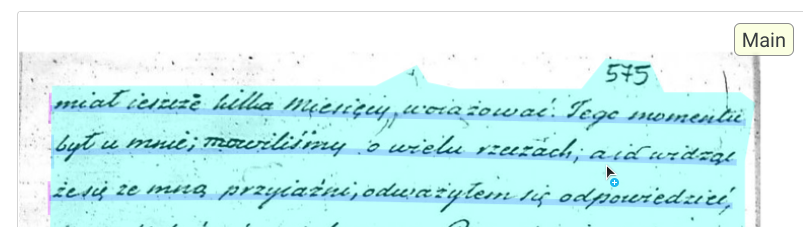
</figure>

In baselines mode (regions mode off, baselines on - with or without masks), types can be assigned to lines. For example, when a line with a signature ('Corticelli' in the image below) is selected, a toolbar is displayed, as for regions
with an icon for setting the line type (green icon with a T). When the line type 'Signature' is selected, it will be assigned to a line (or several if more than one is selected). The colour associated with the line type will henceforth be a vertical (usually) line drawn to indicate the start of the line and its height.
<figure>
  
</figure>

As with regions, the line type will be visible in the upper right corner of the image as you move your mouse over the line.
<figure>
  
</figure>

### Assigning labels to text passages

When working in panel 4 - 'Text', it is possible to annotate parts of the transcription text with labels previously defined in the 'Ontology' tab of the document. If labels have been defined the appearance of the toolbar above the text box changes, and toggle buttons corresponding to the labels appear. Activating such a button allows the selected text fragment to be selected, after which a dialog box appears  in which a comment can be entered (if so defined in the tag definition) and save the changes.
<figure>
  
</figure>

Text with an assigned label will be marked with the color chosen when defining the label in question.
<figure>
  
</figure>

**Note:** in the current version there is (probably) no possibility to use text annotation - labels are not exported, neither in TXT nor XML format.

### Assigning labels to parts of the image

Image fragments can also be annotated. Panel 1 - 'Source image' should be displayed and if annotation labels were defined in the 'Ontology' tab, they will appear as toggle buttons. Once you have selected one of these, you can select an image fragment (depending on the definition, as a rectangle or polygon) and optionally annotate it. In this way, it is possible to mark, for example, parts of the scan that are not part of the original manuscript, microfilm damage not present on the original document, etc.
<figure>
  
</figure>

## Entering a manual transcription

eScriptorium can be used as an environment for preparing training material (_ground truth_) which is necessary to create a new model. For this purpose, good quality images (scans) of manuscripts and texts read from manuscripts by experts are necessary. Having such materials, you can load a series of images into a new document, then complete the 'manual' transcription layer for each image - preparing the text data corresponding to the page of the scan, with the division into lines according to the division in the manuscript. In edit mode for the image, panel 3 = 'Segmentation' and panel 4 - 'Text' should be displayed, where you can enter the text of the page. For the manuscript image, segmentation should be carried out beforehand so that regions and lines of text and their order are delineated. It is important to agree on the correct line layout, so that the line text in the Text panel corresponds to the correct manuscript line determined by the segmentation.

The most convenient way to check this is to turn on the browse mode and edit individual lines of the transcription -> in the segmentation panel, click on any line, then a fragment of the manuscript scan with the given line and an editable text field will be displayed.
<figure>
  
</figure>

Within a page, the arrow icons at the top of the window allow you to move between successive lines. If the active element is an editing text field, the up/down arrow keys also navigate between the previous and next lines of text, and the Enter key (which also triggers the saving of changes) moves you to the next line.

The window for editing a single line of the transcription additionally contains information about the last author and the date of changes, and allows the entire history of changes to a given line to be displayed by clicking on the 'Toggle history' link (the link will only appear if a given line has been modified). Once the change history is displayed, the user can restore one of the previous states of the line using the green icons to the right of the change list.
<figure>
  
</figure>

### Virtual keyboard

The virtual keyboard function was introduced to make it easier to enter special characters in the application. The keyboard can be activated while editing a transcription line (or in the 'Text' panel), using the button with the keyboard symbol icon, which displays an additional window showing the defined characters ready for insertion. The same icon is used to deactivate the virtual keyboard. You can also change to a different keyboard definition, add your own, or modify an existing one.
<figure>
  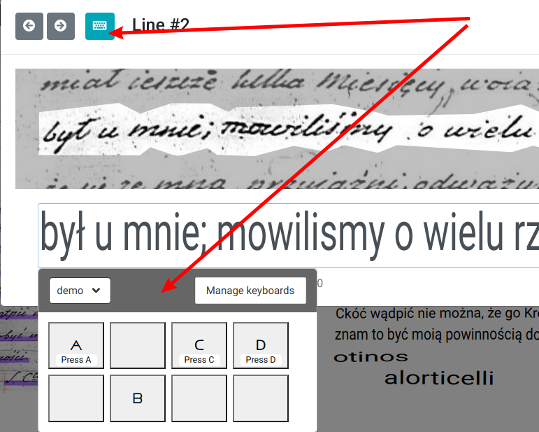
</figure>

### Order of lines

The order of the rows determined automatically can be displayed in the segmentation panel, via the icon in the panel toolbar (icon with arrow symbol and numbers).
<figure>
  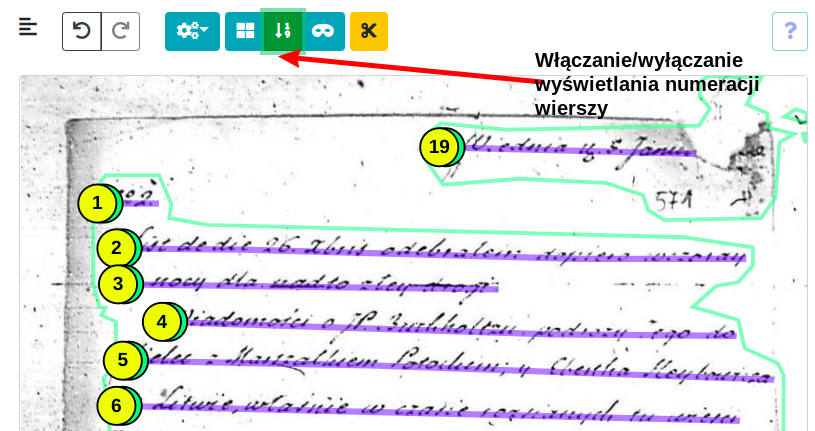
</figure>

The order of the rows can be modified in the 'Text' panel after activating the sorting mode (with the arrow icon). The application then allows you to move the lines in the text panel using the mouse cursor. Note that eScriptorium tends to automatically correct the order when lines are added manually by the user, and accidentally adding lines happens quite easily.
<figure>
  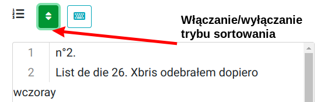
</figure>

## Models, import of publicly available models

Once installed, eScriptorium has no default OCR/HTR model. You can train your own model based on the materials you have (_ground truth_ - collections of images and matching 100% verified texts). Collections of publicly available material under open licenses can be found in [HTR-United](https://htr-united.github.io/), similar collections but mainly for OCR material have been collected at [OCR and Ground Truth Resources](https://cneud.github.io/ocr-gt/).

There is, however, a collection of pre-trained models stored at [zenodo.org](https://zenodo.org/communities/ocr_models?page=1&size=20). Currently, there are several models available, from models for Arabic, Hebrew or Vietnamese manuscripts to those designed for Latin and French medieval writing of the 8th-15th centuries, or trained on French manuscripts from the 18th-20th centuries. The collection also includes OCR models for old Persian or Ottoman prints. All are available free of charge, usually under a Creative Commons Attribution 4.0 International license. You can, of course, also make your model available in this catalogue, as long as it is useful to other users.

Each model in the collection has its own sub-page, often with information about the collection of manuscripts on which it was trained. For example, the model 'HTR-United - Manu McFrench V1 (Manuscripts of Modern and Contemporaneous French)' (https://zenodo.org/record/6657809#.Y6LfDtLMJKs) was prepared based on the 17th- to 21st-century French collection from the aforementioned HTR-United collection, with the addition of a small sample of 19th-century Spanish letters and 20th-century English manuscripts.

The models are stored in binary files with the extension *.mlmodel (a format introduced by Apple as part of the CoreML framework, for integrating machine learning methods into applications, see https://apple.github.io/coremltools/mlmodel/index.html) and can be downloaded from the 'Files' section of the model's subpage. The size of the model is usually between a dozen and a few tens of megabytes. Once downloaded to a local drive, such a model can be imported into eScriptorium using the 'Upload a model' function in the model list window visible when navigating to the 'My Models' menu at the top of the application screen.

When used directly, Kraken has built-in support for downloading models from the zenodo repository, using the `kraken list', `kraken show' and `kraken get' commands, described in the documentation under [Model Repository](https://kraken.re/master/advanced.html#querying-and-model-retrieval).

### Menu My Models

In the main menu of the application (located in the upper right corner of the window), the 'My Models' option opens a window that displays a list of models available to the user, including those that have been imported, trained by the user, or shared with the user. The large green 'Upload a Model' button is exclusively for importing a model that has been downloaded from a source such as zenodo.org and must be in *.mlmodel format. Note that by default the application suggests a model name based on the filename, but users can change it. However, once the import is approved, the name cannot be changed in the current version of eScriptorium.

The list of models displays basic information for each model, such as its type (whether it can be used for transcription as 'Recognize' or for segmentation as 'Segmentation'), its size in megabytes, whether it is already trained or in training, and its best accuracy ('Accuracy'). For models trained in a current instance of eScriptorium, users can also view the number of incorrect and all characters identified during post-training validation. The last column indicates whether the model is 'owned' by the current user ('Owner') or is available to the user ('User', 'Public'). Tool icons are located behind the information columns, and the number of icons displayed depends on whether the model is 'ours' and whether it has been trained in eScriptorium:

- zielona ikona z symbolem pliku pozwala na pobranie modelu na dysk lokalny (plik *.mlmodel)
- niebieska ikona z zakrzywioną strzałką pozwala na udostępnienie 'naszego' modelu innym użytkownikom
- czerwona ikona z koszem na śmieci pozwala na usunięcie modelu - ale nie modelu udostępnionego
- ikona w niebieskim-morskim kolorze umożliwia - tylko dla modeli trenowanych w danej instancji eSCriptorium - na przełączenie na inną wersję modelu (jedną z wersji pośrednich stworzonych podczas uczenia)

### Zakładka Models w dokumencie

Zakładka 'Models' w dokumencie wyświetla podobną listę do tej z menu 'My Models'. Są tam jednak widoczne tylko modele związane z bieżącym dokumentem. Np. użyte do transkrypcji automatycznej, czy wytrenowane na bazie plików z dokumentu. W tym oknie nie można usuwać modeli, widoczna jest jednak żółta ikona z symbolem kosza na śmieci - to narzędzie powoduje jedynie usunięcie modelu z listy modeli dokumentu.
<figure>
  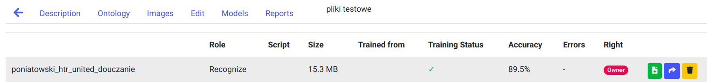
</figure>

## Transkrypcja automatyczna

Po zaimportowaniu plików z obrazami (skanami), wykonaniu segmentacji, zweryfikowaniu segmentacji i zakładając, że istnieje model (zaimportowany lub wytrenowany) pasujący do rękopisów w obrazach, można przystąpić do wykorzystania jednej z najważniejszych funkcji eScriptorium czyli automatycznej transkrypcji. Aplikacja wykorzystuje w tym celu program Kraken. Do przeprowadzenia transkrypcji należy uprzednio zaznaczyć choć jeden obraz z listy obrazów bieżącego dokumentu. Przycisk 'Transcribe' w pasku narzędzi uruchamia procedurę wyświetlając okno dialogowe z parametrami transkrypcji - właściwie jednym parametrem, należy bowiem wybrać jeden z listy dostępnych modeli.
<figure>
  
</figure>

Proces transkrypcji, zależnie od zakresu (jeden czy kilkaset obrazów) może zająć dłuższą chwilę i odbywa się w tle, na serwerze z eScritptorium. Po zakończeniu transkrypcji aplikacja wyświetla odpowiednie powiadomienie w górnym prawym rogu ekranu.
Aby ocenić jakość transkrypcji należy wówczas wejść w tryb edycji obrazu (poprzez ikonę na tle miniatury skanu) lub wejść w zakładkę Edit w oknie dokumentu. Nowa transkrypcja będzie widoczna w panelu 3 - 'Transciption' oraz jako tekst w panelu 4 - 'Text'.
W górnym prawym rogu ekranu, powyżej ikon włączających/wyłączających panele widoczna jest lista wersji transkrypcji, jeżeli domyślnie wyświetlona została inna, można tu odnaleźć i ustawić nowo przygotowaną transkrypcję.
<figure>
  
</figure>

### Wersje transkrypcji

Przycisk z symbolem koła zębatego znajdujący się obok listy wersji transkrypcji wyświetla okno zarządzania wersjami transkrypcji, z którego można usunąć wybrane wersje. Uwaga: nie można usuwać transkrypcji manualnej ('manual') oraz bieżącej, aktualnie wyświetlanej transkrypcji. Usuwanie wersji transkrypcji dotyczy wszystkich obrazów dokumentu, nie tylko bieżącego obrazu.
<figure>
  
</figure>

Zaznaczenie w tym samym oknie paru pól wyboru (po lewej stronie nazwy wersji transkrypcji) pozwoli na wyświetlenie porównania transkrypcji (na poziomie wiersza). Po zamknięciu okna wersji, kliknięciu w wybrany wiersz transkrypcji (w panelu transkrypcji) wyświetlony zostanie edytor linii, tym razem w dolnej części okienka edytora widoczna będzie opcja 'Toggle transcription comparison'. Włączenie jej wyświetli warianty bieżącego wiersza z zaznaczonych wcześniej transkrypcji.
<figure>
  
</figure>

## Automatic alignment - funkcja wyrównywania tekstu

Funkcja Align jest nowością wprowadzoną w wersji 0.13 eScriptorium, mechanizm ten jest jeszcze dopracowywany, dlatego należy traktować go jako wersję beta. Wykorzystuje program PASSIM Davida Smitha do porównywania dostarczonego pliku txt z wybraną warstwą OCR/HTR. Na podstawie podziału na strony i podziału na linie w warstwie OCR funkcja ta jest w stanie dopasować plik txt do skanów/obrazów, podzielić na wiersze zgodnie z podziałem w rękopisie i zapisać wynik jako kolejną warstwę OCR. Mając wystarczająco dobre wyniki OCR/HTR można w ten sposób wykorzystać je do wczytania jako warstwy np. tekstu z opracowania krytycznego danego rękopisu, nawet gdy tekst ten nie zachowuje oryginalnego układu z rękopisu.
<figure>
  
</figure>

Przed uruchomieniem funkcji należy przede wszystkim zaznaczyć 1 lub więcej skanów, które będą podlegały przetwarzaniu, w innym przypadku kliknięcie przycisku 'Align' na pasku narzędzi wywoła przypominający o tym komunikat. Okno parametrów funkcji 'Align' jest jednym z bardziej rozbudowanych w aplikacji eScriptorium. Należy w nim wskazać warstwę transkrypcji, z którą będzie porównywany plik tekstowy, wskazać lokalny plik tekstowy (lub wybrać z listy jeżeli był już użyty - eScriptorium zapamiętuje pliki). W sekcji 'Settings' okna należy wprowadzić nazwę nowej warstwy, parametr 'Use full transcribed document' określa czy porównywana będzie cała zawartość warstwy transkrypcji, czy każda strona osobo. Można też wskazać jakie typy regionów skanu będą brane pod uwagę (domyślnie wszystkie). Domyślnie odznaczona jest opcja 'Merge aligned text with existing transcription', która powoduje uzupełnienie wynikowej warstwy tekstem wskazanej warstwy transkrypcji gdy system nie zdoła dopasować odpowiednich fragmentów (jeżeli opcja nie jest użyta takie niedopasowane wiersze tekstu będą puste). Możliwe jest ograniczenie analizy do wskazanych typów regionów - domyślnie wybrane są wszystkie. Okno posiada jeszcze grupę parametrów ukrytych - zaawansowanych: kliknięcie 'Show/hide advanced settigns' wyświetla blok technicznych parametrów funkcji Align, ich krótki opis znajduje się w tym samym oknie poniżej każdego z nich, dodatkowych informacji należy szukać w dokumentacji programu Passim (https://github.com/dasmiq/passim).
<figure>
  
</figure>

Warto zauważyć, że 'wyrównywany' tekst np. z edycji krytycznej może nie tylko nie zachowywać podziału na strony i wiersze, ale również zawierać więcej tekstu niż poddane przetwarzaniu skany. Np. przy przetwarzaniu skanu z listem Corticellego poddanego transkrypcji modelem o 89% dokładności i 'wyrównywanego' z tekstem przygotowanym manualnie przez ekspertów zawierającym treść wielu listów, funkcja _Align_ dopasowała praktycznie idealnie właściwy fragment, podzieliła go też poprawnie na wiersze.
<figure>
  
</figure>

**Uwaga:** ponieważ jest to funkcjonalność w fazie 'beta' nie jest dostępna automatycznie, aby funkcja Align była widoczna i działała poprawnie należy ustawić zmienną środowiskową `TEXT_ALIGNMENT=True` oraz uruchomić dodatkowy kontener dockera: celery-jvm.

## Strategia trenowania modeli

Utworzenie i wytrenowanie nowego modelu od podstaw wymaga solidnej wielkości materiału treningowego a także sporej ilości czasu i mocy komputera do przeprowadzenia procesu uczenia. Typowe, dostępne publicznie modele pisma ręcznego zostały utworzone na podstawie kilkunastu do kilkudziesięciu tysięcy wierszy 'ground truth' (zob. [lectaurep](https://github.com/lectaurep/lectaurep_base_model)). Przygotowanie takiego materiału (o 100% poprawności zweryfikowanej przez ekspertów) jest najbardziej pracochłonnym etapem pracy nad modelem.

Proces uczenia może być łatwiejszy jeżeli posiadamy dostęp do modelu wytrenowanego na materiale zbliżonym do naszych rękopisów. Możliwe jest wówczas trenowanie na bazie istniejącego modelu, czyli wykorzystanie mechanizmu tzw. _transfer learning_ ('uczenie transferowe', zob. https://en.wikipedia.org/wiki/Transfer_learning), przy użyciu dużo mniejszej liczby wierszy _ground truth_ - np. od kilkuset do paru tysięcy. Douczanie (inaczej: dostrajanie) modelu jest (do pewnego stopnia) skuteczne także w przypadku różnic w alfabecie między modelem bazowym, a materiałem treningowym którym douczamy ten model, kiedy to w trakcie uczenia model musi 'poznać' zupełnie nowe znaki. Proces douczania - fine tuning - jest znacznie szybszy niż uczenie modelu od podstaw.
> "Korzystanie z wcześniej wytrenowanych modeli jest najważniejszą metodą, dzięki której możemy trenować kolejne, dokładniejsze modele, przy czym cała operacja odbywa się szybciej, z użyciem mniejszej ilości danych oraz w krótszym czasie, a także przy mniejszym poziomie kosztów"
>
> Jeremy Howard, Sylvain Gugger, _Deep Learning dla programistów_, 2021, str. 52

Jeżeli jednak nie istnieje żaden model, który mógłby pełnić rolę modelu bazowego dla przetwarzanych rękopisów, pozostaje ścieżka trenowania 'od zera'. Ponieważ praca bezpośrednio z Krakenem daje możliwości modyfikacji parametrów uczenia, czego nie można zrobić z poziomu eScriptorium, wydaje się że taki sposób trenowania jest lepszym podejściem. Wymaga to jednak opanowania obsługi Krakena z linii komend, czyli zapoznania się z dokumentacją polecenia [ketos train](https://kraken.re/master/ketos.html), czy zapoznania się z opisem [VGSL](https://kraken.re/master/vgsl.html#vgsl) dotyczącym architektury sieci neuronowych. Bardzo ciekawą lekturą będzie też dwuczęściowy artykuł opisujący doświadczenia podczas trenowania modelu opartego na francuskich rękopisach notarialnych z lat 1742-1928: [część 1](https://lectaurep.hypotheses.org/475), [część 2](https://lectaurep.hypotheses.org/488).

## Trenowanie własnego modelu w eScriptorium

eScriptorium zintegrowane jest z programem Kraken i pozwala nie tylko na rozpoznawanie pisma przygotowanymi wcześniej modelami, ale także na utworzenie całkowicie nowego modelu, lub douczenie (fine tuning) istniejącego. Proces trenowania można uruchomić w oknie dokumentu, w zakładce edycji. Jeden z widocznych w pasku narzędzi przycisków - 'Train', uruchamia trenowanie modelu segmentacji (Train -> Segmentator), lub - co jest częściej wykorzystywane - modelu transkrypcji (Train -> Recognizer). Pierwszym krokiem jest zaznaczenie co najmniej jednego skanu. Wybór narzędzia
Train -> Recognizer wyświetla okno parametrów trenowania modelu transkrypcji. Uwaga: narzędzie 'Train' może nie być widoczne dla wszystkich użytkowników, jego dostępność zależy od przyznanych uprawnień w panelu administracyjnym (zob. [Administracja systemem](#administracja-systemem-escriptorium)).

<figure>
  
</figure>

Należy w nim wskazać warstwę transkrypcji, która będzie użyta w procesie uczenia,
model bazowy (jeżeli chcemy oprzeć się na istniejącym modelu, który będzie douczany) oraz nazwę wynikowego modelu. Trenowanie z poziomu eScriptorium nie pozwala na ustawienie bardziej zaawansowanych opcji uczenia, które są dostępne podczas trenowania bezpośrednio w aplikacji Kraken.

## Trenowanie modelu bezpośrednio w Krakenie

Oprócz trenowania modelu z poziomu eScriptorium możliwe jest uruchomienie tego procesu z bezpośrednim użyciem programu Kraken z linii komend. Trzeba jednak pamiętać, że Kraken działa na systemach Linux i MacOS (na procesorach x64 i ARM, aczkolwiek w przypadku nowych komputerów Apple z procesorami M1 czyli z architekturą ARM Kraken nie umie na razie wykorzystać ich procesora graficznego), w przypadku systemu Windows można ewentualnie wypróbować WSL - Windows Subsystem for Linux.

Kraken jest aplikacją napisaną w języku Python i potrzebuje do działania zainstalowanej wersji 3 tego interpretera (najlepiej 3.8 lub nowszą). Instalacja opisana została na stronie programu: https://kraken.re/master/index.html

Po zainstalowaniu użytkownik dysponuje poleceniami: `kraken` i `ketos` do rozpoznawania OCR/HTR i trenowania modeli.

Dane do uczenia można pobrać z eScriptorium (skany oraz pliki XML), mogą też pochodzić z Transkribusa - w tym przypadku zalecany format to PAGE XML a przed trenowaniem zalecane jest przetworzenie segmentacji w eScriptorium (opcja Segmentation steps = 'Only Line Mask')

Aby nieco przyspieszyć proces uczenia z plików xml i skanów można przygotować tzw. binarny dataset poleceniem `ketos compile` (parametr `--random-split` decyduje o losowym podziale próbki - 80% uczenie, 10% walidacja podczas uczenia, 10% test; parametr `-f page` informuje o formacie plików wejściowych: PAGE XML; parametr `--workers` określa ile wątków - rdzeni CPU może być zajęte przez proces kompilacji, praca wielowątkowa znacznie przyspiesza przetwarzanie):

    ketos compile --workers 3 --random-split 0.8 0.1 0.1 -f page -o name_dataset.arrow *.xml

zakładając, że polecenie uruchamiane jest w katalogu z plikami xml i skanami.

Przygotowany w ten sposób plik *.arrow posłuży np. do douczania (fine tuning - https://kraken.re/4.2.0/ketos.html#fine-tuning) istniejącego modelu (parametr `-i` wskazuje nazwę pliku z modelem bazowym, bez podania tego parametru kraken będzie trenował model od podstaw; parametr `--resize` jest istotny w przypadku różnicy alfabetu między modelem bazowym a danymi treningowymi, informuje Krakena co zrobić w przypadku napotkania nieznanych znaków w materiale treningowym):

    ketos train -i base_model.mlmodel --resize add --workers 3 --output new_model_name -f binary name_dataset.arrow

<figure>
  
</figure>

Na ekranie powyżej widoczne są kolejne iteracje - epoki treningowe (_epoka_ to pełne przetworzenie treningowego zbioru danych) wraz z walidacją po procesie uczenia, uczenie trwa dopóki wyniki się poprawiają, jeżeli 5 kolejnych epok (tym parametrem można sterować) nie przyniesie poprawy Kraken kończy procedurę uczenia zwracając najlepszy z dotychczasowych modeli pod nazwą `{new_model_name}_best.mlmodel` gdzie 'new_model_name' to nazwa podana przez użytkownika poprzez parametr `--output`.

Do przetestowania modelu można użyć polecenia: `ketos test`, podając jako parametry model do testów i dane trenowania np. w formie binarnego datasetu - pliku *.arrow utworzonego powyżej (taki zestaw danych zawiera zwykle zarówno dane treningowe, walidacyjne jak i dane testowe, nie używane podczas trenowania):

    ketos test -m name_model.mlmodel -f binary name_dataset.arrow

Przykładowy wynik:

    === report  ===
    84685     Characters
    1142      Errors
    98.65%    Accuracy``

Gdzie 'Accuracy' (dokładność) to wskaźnik mierzący jakość rozpoznania przez model - procent poprawnie rozpoznanych znaków. Ten sam wskaźnik jest podawany po każdej epoce trenowania modelu (val_accuracy)
podczas weryfikacji wyników na próbce walidacyjnej danych (tam w formie ułamka np. 0.83).

Polecenie uruchamiające trenowanie modelu od podstaw, z modyfikacją architektury sieci neuronowej (parametr `-s`) oraz _learning rate_ (parametr `-r`) oparte na przykładzie z [artykułu](https://lectaurep.hypotheses.org/488):

    ketos train --augment -u NFD -s '[1,120,0,1 Cr3,13,32 Do0.1,2 Mp2,2 Cr3,13,32 Do0.1,2 Mp2,2 Cr3,9,64 Do0.1,2 Mp2,2 Cr3,9,64 Do0.1,2 S1(1x0)1,3 Lbx200 Do0.1,2 Lbx200 Do.1,2 Lbx200 Do]' --output poniatowski_from_scratch --lag 5 --workers 2 -r 0.0001 -f binary poniatowski.arrow

Szczegółowy opis procesu i parametrów trenowania znajduje się na stronie:
https://kraken.re/master/training.html

Model wytrenowany bezpośrednio w Krakenie (plik *.mlmodel) może zostać później zaimportowany do eScriptorium. Można też model dobrej jakości, który warto udostępnić publicznie, umieścić w repozytorium zenodo.org. Kraken umożliwia opublikowanie modelu z poziomu linii komend poleceniem: `ketos publish`, procedura wymaga posiadania konta w serwisie zenodo i jest opisana na stronie: https://kraken.re/master/advanced.html

## Współpraca z innymi użytkownikami

Aplikacja posiada możliwość współdzielenia zarówno projektów jak i dokumentów czy modeli z innymi użytkownikami.

### Udostępnianie projektów

Aby udostępnić projekt innemu użytkownikowi należy w oknie projektu odnaleźć niebieską ikonę 'Share this Project' w górnym prawym rogu okna. Wyświetlone zostanie wówczas okno dialogowe, w którym należy wprowadzić login użytkownika, któremu chcemy udostępnić projekt. Po zatwierdzeniu system wyświetli powiadomienie o udanym udostępnieniu a docelowy użytkownik powinien zobaczyć projekt na swojej liście.
<figure>
  
</figure>

Alternatywnie, jeżeli w naszej instancji eScriptorium utworzone zostały grupy użytkowników, zamiast udostępniać projekt pojedynczym osobom można udostępnić go całej grupie (tworzenie grup i przypisywanie użytkowników do grup jest dostępne w panelu administracyjnym aplikacji).

Użytkownik może zrezygnować z projektu który został mu udostępniony. Na liście projektów te stworzone przez inną osobę i udostępnione posiadają z prawej strony żółtą ikonę z czarnym symbolem koszta na śmieci ('Remove from list'). Użycie tego narzędzia nie spowoduje usunięcia projektu w ogóle, ale usunie jedynie projekt z naszej listy projektów.

### Udostępnianie dokumentu

Możliwe jest także udostępnienie konkretnego dokumentu. W oknie dokumentu (jeżeli aktywna jest zakładka Description!) w górnym prawym rogu ekranu widoczne są ikony dotyczące wykonywania operacji na bieżącym dokumencie. Jedną z nich jest ikona udostępniania dokumentu innym użytkownikom. Kliknięcie na nią wyświetla okno dialogowe udostępniania.
<figure>
  
</figure>

W oknie tym należy wskazać grupy użytkowników lub konkretnych użytkowników, którzy mają mieć dostęp do naszego dokumentu.
<figure>
  
</figure>

### Przenoszenie dokumentu do innego projektu

Ciekawą opcją jest możliwość przeniesienia dokumentu do innego projektu. W górnym prawym rogu ekranu dokumentu (podczas pracy w zakładce Description), obok ikony uruchamiającej udostępnianie dokumentu widoczna jest ikona narzędzia przenoszenia dokumentu ('Migrate to another project'). W oknie dialogowym przenoszenia widoczne są dwa pola, w pierwszym polu z listą rozwijaną należy wskazać docelowy projekt, zaś widoczne poniżej pole wyboru decyduje o tym czy wraz z dokumentem przenieść jego tagi (chodzi o tagi przypisane na poziomie dokumentu narzędziem Assign Tag widocznym na liście dokumentów projektu - niebieska ikona z etykietami).
<figure>
  
</figure>

Po potwierdzeniu przyciskiem 'Migrate' aplikacja wyświetli odpowiednie powiadomienie o skutecznym zakończeniu operacji a nasz dokument będzie od tej pory częścią innego projektu.

<figure>
  
</figure>

### Eksport, udostępnienie i usunięcie modelu

Modele przechowywane w eScriptorium można wyeksportować, np. w celu umieszczenia w repozytorium zenodo.org lub użycia bezpośrednio w programie Kraken. Na liście modeli (menu 'My Models'), z prawej strony okna widoczne są kolorowe ikony pozwalające na eksport (pobranie) modelu - zielona ikona pliku ze strzałką w dół, usunięcie modelu - czerwona ikona z symbolem kosza, oraz udostępnienie modelu - niebieska ikona z zakrzywioną strzałką. Uwaga: usuwanie modelu następuje natychmiast, bez dodatkowego pytania, podobnie pobranie (eksport) modelu od razy uruchamia procedurę pobierania pliku *.mlmodel.
<figure>
  
</figure>

Z kolei udostępnianie modelu wyświetla dodatkowe okno programu, w którym można zdecydować którym użytkownikom lub grupom użytkowników udostępniamy nasz model, można też udostępnienie dla danego użytkownika/grupy usunąć.
<figure>
  
</figure>

## Eksport transkrypcji

Przygotowane w eScriptorium transkrypcje skanów można zapisać w formie plików XML, w formatach ALTO lub PAGE, a także w postaci zwykłego pliku TXT. Eksport dostępny jest podczas pracy z dokumentem, w zakładce 'Images' po zaznaczeniu choć jednego skanu/obrazu. Przycisk 'Export' w pasku narzędzi (powyżej listy miniatur skanów) wyświetla okno dialogowe, w którym należy określić warstwę transkrypcji (skany mogły być rozpoznawane przez wiele modeli OCR/HTR), oczekiwany format danych (ALTO, PAGE. TXT), czy eksport ma zawierać oryginalne skany/obrazy. Po zatwierdzeniu okna system wygeneruje paczkę zip z plikami i wyświetli w górnym prawym roku ekranu powiadomienie. Powiadomienie będzie zawierało link do pobrania pliku zip z danymi. Jeżeli system został poprawnie skonfigurowany eScriptorium wyśle także użytkownikowi e-mail z informacją o przygotowaniu pliku zip i linkiem do pobrania (w przypadku większych kolekcji skanów, przygotowanie danych może zająć dłuższą chwilę).
<figure>
  
</figure>

## Raporty

Zarówno projekty jak i dokumenty posiadają zakładki 'Reports' z informacjami statystycznymi na temat zawartości projektu czy dokumentu. Dotyczą one np. liczby obrazów, liczby rozpoznanych regionów  i wierszy, liczby słów i znaków w transkrypcjach. Osobną część stanowi sekcja Vocabulary gdzie po odświeżeniu wyświetlana jest aktualna częstotliwość występowania poszczególnych znaków. W zakładce 'Reports' dla dokumentu podawana jest także przeciętna pewność transkrypcji.
<figure>
  
</figure>

## Administracja systemem eScriptorium

Administrator eScriptorium i każdy użytkownik o odpowiednich uprawnieniach ma dostęp do panelu administracyjnego systemu poprzez menu 'Hello {USER}' -> Site administration w górnym prawym rogu okna eScriptorium. Uruchomienie tej funkcji wyświetla typowy dla aplikacji stworzonych w technologii Django panel w którym można zarządzać użytkownikami systemu, ich uprawnieniami, tworzyć nowe konta, grupy użytkowników, tokeny do współpracy z eScriptorium przez API. Administrator z poziomu panelu może nadawać lub odbierać uprawnienia do modeli OCR/HTR a także do dokumentów ze skanami i transkrypcjami, może również usuwać dokumenty i projekty.
<figure>
  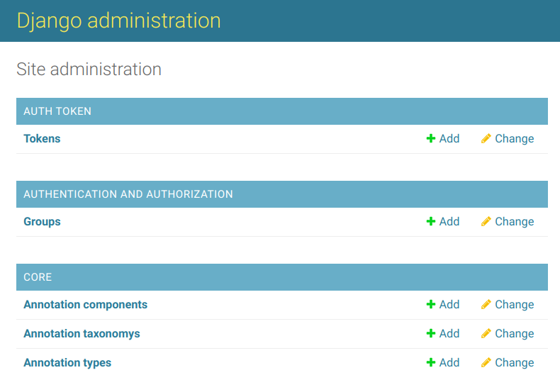
</figure>

## API (REST) eScriptorium

eScriptorium posiada interfejs API (wykorzystuje Django REST framework), który widoczny jest pod adresem https://{SERWER}/api/ (gdzie {SERWER} to domena lub ip serwera, na którym działa eScriptorium). Robocza wersja dokumentacji API dostępna jest w formie dokumentu google: https://docs.google.com/document/d/1tl48eXHq36KJ1zyXq0dMwYEzdnQYUm_MKfzMat9vjPc/edit#heading=h.j2ygnbgnoruv

Użytkownik posiadający uprawnienia i wygenerowany token (w panelu administracyjnym aplikacji) może poprzez API, np. z wykorzystaniem connectora dla języka python (https://gitlab.com/sofer_mahir/escriptorium_python_connector) uruchomić niektóre funkcje eScriptorium. Przykłady we wspomnianej wyżej dokumentacji. 
<figure>
  
</figure>

## Fora dyskusyjne, kody źródłowe, licencje

Techniczne forum eScriptorium, związane bardziej z rozwojem tej aplikacji, dostępne jest na gitterze:
https://gitter.im/escripta/escriptorium , dość często jednak zdarzają się tam pytania (i odpowiedzi) zwykłych użytkowników systemu.

Kod źródłowy aplikacji przechowywany jest w serwisie gitlab - https://gitlab.com/scripta/escriptorium/ , tam też znajduje się lista błędów i propozycji rozwojowych: https://gitlab.com/scripta/escriptorium/-/issues/?sort=created_date&state=opened&first_page_size=100

eScriptorium udostępnione zostało na otwartej licencji własnej (https://gitlab.com/scripta/escriptorium/-/blob/develop/LICENSE).

Program Kraken rozwijany jest na innej platformie - github: https://github.com/mittagessen/
a udostępniony został na licencji Apache 2.0.

## Dodatkowe informacje

Zrzuty ekranu prezentowane w niniejszym wprowadzeniu pochodzą z wersji 0.13.2 eScriptorium. Fragmenty skanów rękopisów widoczne na niektórych zrzutach pochodzą z testów aplikacji eScriptorium i Kraken prowadzonych w 2022 roku w Instytucie Historii PAN związanych z próbami przygotowania modeli HTR dla XVIII wiecznych rękopisów w języku polskim, na bazie korespondencji króla Stanisława Augusta Poniatowskiego.

Osobom zainteresowanym samą korespondencją należy polecić wydaną kilka lat temu publikację: "Korespondencja polityczna Stanisława Augusta. Wiedeń", (tom I 1788-1790, tom II 1791-1792), opracowanie Monika Jusupović i Adam Danilczyk, Warszawa 2016, dostępną w [RCIN](https://rcin.org.pl/dlibra/publication/158432/edition/128045). Oryginały korespondencji znajdują się w zbiorach Archiwum Głównym Akt Dawnych w Warszawie.
