# eScriptorium and Kraken - introduction

eScriptorium is a web-based application designed to work on historical manuscripts and printed books, to prepare manual and automatic transcriptions. The application is integrated with Kraken, a tool using deep learning algorithms for text recognition (OCR and HTR). eScriptorium is a project led by a team from École Pratique des Hautes Études - Université PSL.

## Table of contents

- [Acknowledgements](#acknowledgements)
- [Version](#version)
- [Installation](#installation)
- [Login to the application and its main window](#login-to-the-application-and-its-main-window)
- [How to create a new project](#how-to-create-a-new-project)
- [How to create a new document](#how-to-create-a-new-document)
  - [Image import](#image-import)
  - [Import of transcripts and images](#import-of-transcripts-and-images)
- [Document tags](#document-tags)
- [Document tabs](#document-tabs)
- [List of images](#list-of-images)
- [Binarisation](#binarisation)
- [Segmentation](#segmentation)
  - [Image editing window, segmentation correction, transcription editing](#image-editing-window-segmentation-correction-transcription-editing)
  - [Verification and correction of segmentation](#verification-and-correction-of-segmentation)
- [Defining types and annotations for image elements](#defining-types-and-annotations-for-image-elements)
  - [Assigning types to segmentation elements](#assigning-types-to-segmentation-elements)
  - [Assigning labels to text passages](#assigning-labels-to-text-passages)
  - [Assigning labels to parts of the image](#assigning-labels-to-parts-of-the-image)
- [Entering a manual transcription](#entering-a-manual-transcription)
  - [Virtual keyboard](#virtual-keyboard)
  - [Order of lines](#order-of-lines)
- [Models, import of publicly available models](#models-import-of-publicly-available-models)
  - [Menu My Models](#menu-my-models)
  - [The Models tab in the document](#the-models-tab-in-the-document)
- [Automatic transcription](#automatic-transcription)
  - [Transcription versions](#transcription-versions)
- [Automatic alignment](#automatic-alignment)
- [Strategy for training models](#strategy-for-training-models)
- [Training your own model in eScriptorium](#training-your-own-model-in-escriptorium)
- [Training the model directly in the Kraken application](#training-the-model-directly-in-the-kraken-application)
- [Cooperation with other users](#cooperation-with-other-users)
  - [Sharing projects](#sharing-projects)
  - [Sharing the document](#sharing-the-document)
  - [Moving a document to another project](#moving-a-document-to-another-project)
  - [Export, sharing, and deleting a model](#export-sharing-and-deleting-a-model)
- [Exporting transcriptions](#exporting-transcriptions)
- [Reports](#reports)
- [eScriptorium system administration](#escriptorium-system-administration)
- [API (REST) eScriptorium](#api-rest-escriptorium)
- [Discussion forums, source codes, licenses](#discussion-forums-source-codes-licenses)
- [Additional information](#additional-information)

## Acknowledgements

The creation of this description would not have been possible without reading previously created materials and tutorials, e. g. [eScriptorium Tutorial (en)](https://lectaurep.hypotheses.org/documentation/escriptorium-tutorial-en), without watching the numerous videos available on [vimeo](https://vimeo.com/user130532566) and [youtube](https://www.youtube.com/watch?v=tut007D6w3o) or, finally, without reading the articles on [LECTAUREP](https://lectaurep.hypotheses.org/articles). A lot of valuable information was also taken from the Kraken system documentation - [Training](https://kraken.re/master/ketos.html). Above all, of course, thanks are due to the developers of the eScriptorium and Kraken applications for preparing and making available under open licences tools that open up new possibilities in the field of digital humanities.

## Version

The current version of the application is 0.13.2, and this is the version described in this tutorial (as of 16.12.2022).
<figure>
  
</figure>

## Installation

The eScriptorium is not a public platform where you can create an account. To use the application, you must first install it. Locally or on a server - the installation procedure using the docker is described on [wiki](https://gitlab.com/scripta/escriptorium/-/wikis/docker-install).

## Login to the application and its main window

To log in to the eScriptorium instance, you must enter your username and password. The login window is displayed by selecting the Login button in the top right corner of the application screen.
<figure>
  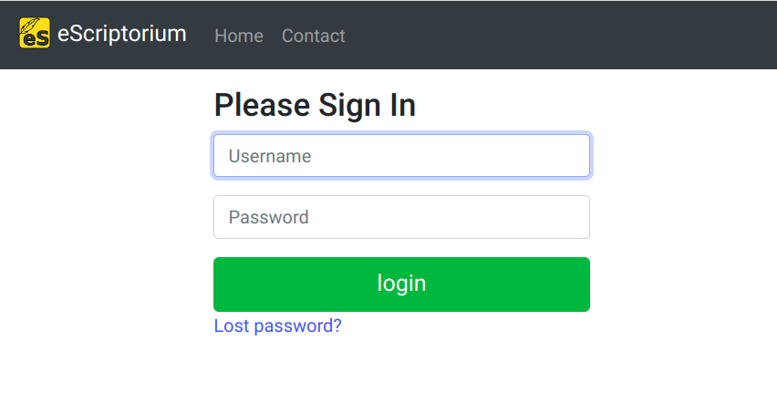
</figure>

After logging in, a list (table) of the user's projects is visible. These can be projects created by the person logged in or shared by other users. In the middle column of the project table, you can see - for each project - the username of its creator. In the last column, you can see the number of documents in a project. A project may have multiple documents, and each document may contain multiple images. The first column on the left is the title of the respective project.
<figure>
  
</figure>

Above the list of projects you can see the main application menu:
- menu 'My Models' displays the list of models available to the user,
- the 'Hello {USER}' menu provides, among other things, the possibility to change the password, edit the user profile, and view the status of tasks. Tasks such as model training, or transcription of a large number of files can be time-consuming, the Task monitoring or Task report commands allow the status of tasks to be checked. Depending on your permissions, you can also find here the function to manage the settings of the eScriptorium application. This menu also includes the option to log out of the system.
- 'My Projects' menu - displays the list (table) of projects.
- the 'Contact' menu - allows communication with the administrators of a given eScriptorium instance, if this option has been configured.
- Home' menu - displays the main window of the application, with information about its capabilities, version, etc.
<figure>
  
</figure>

## How to create a new project

The 'Create new Project' button is visible in the top right corner of the screen (above the projects table) allows you to create a new project. The only field that can and should be filled in is the project title - up to 512 characters. Note: in the version described here, you cannot change the name of a project once it has been created, so it is worth entering a clever title that will allow you to search for our project from many others in the future.
<figure>
  
</figure>

The application displays a notification (green message box in the top right corner) indicating that the project has been created correctly, which will also appear immediately in the project list.
<figure>
  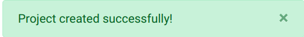
</figure>

## How to create a new document

Once created, a project can be opened by clicking on the title. The project is something like a container for documents. You can group documents containing, for example, scans of various books of a given historical source. Creating a new document starts with clicking the green 'Create new Document' button - in the upper right corner of the screen.
<figure>
  
</figure>

The document window is much more complex than the project window. The information is divided into six tabs: Description, Ontology, Images, Edit, Models, and Reports (some are initially inaccessible). To add and save a new document, first of all, you need to fill in the fields in the first tab (Description), starting with the name of the document e.g. 'Book vol. 23' (unlike for projects, you can rename the document later). Then select from the list the type of script (main script) - for example:  'Latin', 'Cyrillic' or 'Cyrillic (Old Church Slavonic variant)'. It should also be determined whether the order of the elements in the document is 'Left to right' or 'Right to left' (the direction of the script itself is determined by the choice of main script).

In the next field, indicate the position of the line to the polygon (shape) of the text line: 'Baseline', 'Topline', 'Centered'. The application optionally displays the degree of confidence for individual fragments of the automatic transcription; if you want to display such information, tick the 'Show confidence visualizations' checkbox (the visualization will appear in the 'Transcription' panel in the scan/image editing mode).

The Metadata section allows you to enter your metadata describing the document (you can enter information concerning, for example, the chronological period or geographical origin). Once you have completed entering this basic data, the 'Create' button at the bottom of the window will create our new document, displaying an appropriate message (notification) in the top right of the screen.
All the information entered will be available for future additions and corrections.
Saving the document unlocks access to the primary tab: 'Images' - this is where the processed scans of manuscripts and prints will be located.
<figure>
  
</figure>

### Image import

The 'Images' tab consists of three main elements:
 -the box for importing images/scans at the top (a white box surrounded by a dashed line, with the words 'Drop images here or click to Upload'),
- a toolbar in the middle
- and a list of scans that can be scrolled (horizontally) when the number of scans exceeds the width of the screen. For a new document, the scan list is not yet visible.
<figure>
  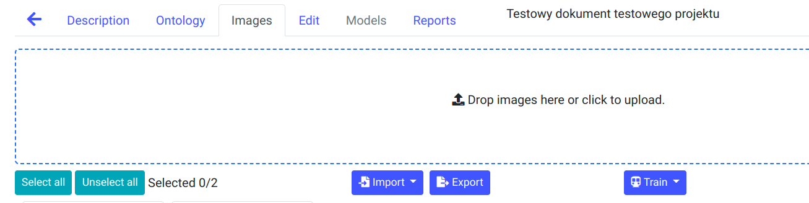
</figure>

The simplest method of importing images is to select a file or group of files in any application for managing files in your operating system (Explorers in Windows, or Files in Ubuntu) and dragging them into the scan import box area. This action will start the import process - the scans will appear in the import field and gradually move into the list of scans. You can import quite large collections in this way, even several hundred images.
You can also click within the import field, which will trigger the standard system dialog with the possibility of selecting files. Typical image file formats are supported, for example JPEG, PNG, TIFF.

### Import of transcripts and images

Additional import possibilities are provided by the Import button visible on the toolbar. The button unfolds providing three commands:
- import images from an external server via the **IIIF protocol**, which is useful if you already have a collection of scans in a repository that supports this protocol. Example IIIF manifest: `https://digitalcollections.universiteitleiden.nl/iiif_manifest/item%3A1603568/manifest` (Book of hours (Dutch) - Bibliotheca Publica Latina).
<figure>
  
</figure>

- import of images **from a pdf file** - each page of the file will be imported as a separate image
<figure>
  
</figure>

- import of transcriptions **in XML** format (e.g. ALTO v.4 or PAGE XML). This option allows importing transcriptions and segmentation to previously loaded scans, the transcriptions can be a group of XML files or can be packed as a **zip file**. This function also allows you to import a zip file containing both scans and XML transcriptions. The application will then extract the images and place them in the list of scans while simultaneously loading the information from the XML files - transcription, segmentation, etc. Note: by default, the maximum size of the imported zip file cannot exceed 150 MB. In the case of importing files originating from e.g. Transkribus (the PAGE format is then recommended), line masks must be corrected after import (segmentation with the 'only line mask' option).
<figure>
  
</figure>

When importing images via the IIIF protocol, the metadata of the imported collection is usually also downloaded from the server, which can be viewed in the 'Description' tab of the document.
<figure>
  
</figure>

## Document tags

You can assign user-defined tags to a document. Tags are a type of labels describing a document and allow for quick filtering of documents, e.g. you can add the 'IIIF' tag to all project documents imported via this protocol to later filter out only documents of this type. Adding a tag to a document is supported by a blue icon (with a label symbol) in the list of documents. A similar icon, but in the toolbar above the list of documents (next to the button for creating a new document) displays the tag management window, where you can change the name of the tag or the color assigned to it.
<figure>
  
</figure>

## Document tabs

The document window is the place of the application that is most often displayed when working with eScriptorium. It consists of 6 tabs:
- _Description_ - where you can find basic information and metadata describing the document.
- _Ontology_ - with definitions of types, labels and annotations for text and image.
- _Images_ - where you can add and delete scans, import transcriptions, carry out the most important operations such as segmentation or automatic transcription, train HTR/OCR models and finally export data.
- _Edit_ - in which the user works with a specific image/scan.
- _Models_ - containing a list of models related to a given document (models used to create the transcript or models trained on the basis of this document).
- _Reports_ - reports tab about the current document, e.g. information about the number of images in the document, the average transcription confidence factor or the frequency of characters in the transcription.

## List of images

The image list, visible in the 'Images' tab of the document, is the main place to quickly browse the collection of images in the document. Image processing is also invoked from the image list: binarisation, segmentation or transcription. Images are displayed as thumbnails; if there are more than a few and they do not fit on the screen, the application displays a horizontal scroll bar.
<figure>
  
</figure>

A toolbar is visible above the image list. The first two buttons on the bar allow all images to be marked (selected) or deselected - image processing operations are performed only on the selected images. The next buttons are responsible for import and export, training - it is possible to train a segmentation model or a transcription model. The availability of the 'Train' button depends on user rights. A group of buttons on the right-hand side of the toolbar allows the processing of scans: binarisation, segmentation, transcription and automatic alignment (Align) with the indicated text (e.g. manual transcription).
<figure>
  
</figure>

Each image displayed as a thumbnail has a set of icons/buttons that indicate the status of a particular scan and allow certain operations to be performed on it. For example, the checkbox in the upper-left corner of the thumbnail selects a particular scan, while the small cross icon (in the upper-right corner) allows you to delete a scan from a document. The green box/button in the centre of the thumbnail allows you to enter edit mode, and the icons below the thumbnail indicate whether any of the processing operations have been carried out on the scan, in which case they turn green. For example, the round black/white icon is for binarisation, the icon with schematic lines is for segmentation, the icon which is a white empty rectangle is for transcription and the icon which looks like a file/document symbol corresponds to the Align function (automatic text alignment). By grabbing a thumbnail with the mouse and moving it within the image list, you can change the order of the images in the document.

## Binarisation

In the current version of the application, binarization is not recommended. The system warns that this may even lead to a deterioration in the quality of the results.
<figure>
  
</figure>

## Segmentation

Before running automatic image transcription (OCR/HTR), it is necessary to correctly divide the manuscript into regions and lines. For individual small images, this procedure can be done manually, but for a larger collection of images, this would be too time-consuming. The eScriptorium has an automatic segmentation mechanism using a deep learning model. To activate it, select one or more images in the list and then click the 'Segment' button in the toolbar. A window with segmentation options will be displayed, where you select the model, the scope of work, the layout of elements on the page, etc.
<figure>
  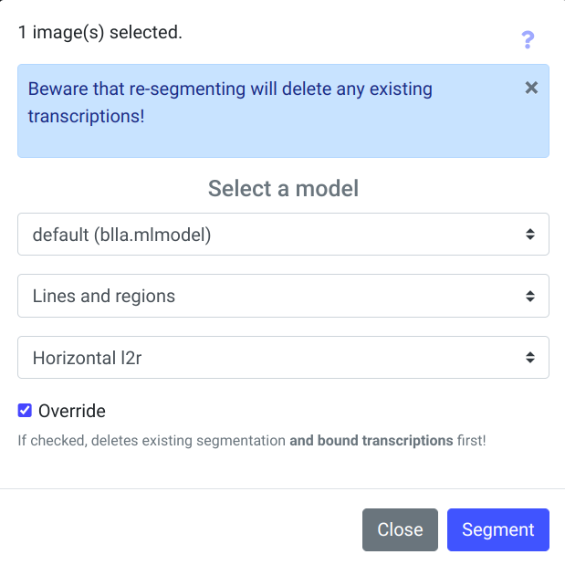
</figure>

In the current version of the application, one segmentation model is available: blla.mlmodel, giving otherwise very good results. The default range set:
- 'Lines and regions' - determines baselines, line masks (polygons), and regions.
You can change the segmentation range by expanding the list below the model name field. Additional options will then appear:
- 'Lines Baselines and mask' (designates only lines and line masks),
-'only line Mask' - only line masks (this function recalculates the shape of the masks - polygons from scratch and does not use the model),
- 'Regions' - designates regions, without modifying baselines and line masks.

The third field of the segmentation parameters window specifies the layout of the text on the pages, by default 'Horizontal l2r' is selected, 'Horizontal r2l', 'Vertical l2r' and 'Vertical r2l' are also available. The 'Override' checkbox at the bottom of the window means that any pre-existing segmentation for the images will be removed, the transcription will also be removed.

The segmentation procedure can be time-consuming. During the process, the application displays a discrete animation for the images being processed - a small icon with lines (the scan segmentation icon) blinks on the images selected for processing (below the thumbnail). A yellow button against the thumbnail is also displayed, allowing the user to cancel the segmentation currently being carried out. When the procedure is complete, a notification is displayed in the top right-hand corner of the screen and the icon turns green. This also acts as a button - segmentation can be started by clicking on the small icon below the thumbnail.

Note: when importing scans and transcriptions from Transkribus (PAGE XML format preferred), segmentation is recommended, but only using the 'only line Mask' option.

### Image editing window, segmentation correction, transcription editing

To see the image segmentation created by the model, enter edit mode for the image in question - if you hover the mouse cursor over a scan thumbnail, a bar will appear with a white icon symbolizing editing, and a balloon with a prompt 'Edit', clicking on the bar will open the scan in edit mode. Alternatively, one of the tabs in the document is the 'Edit' tab, which launches the edit mode for the first image in the document, the edit mode can navigate to the next/previous scan (arrow icons at the top of the screen), by moving left/right you can find the correct scan (navigation is also possible using the keyboard: Crtl + left/right arrow or Page Down/Page Up keys).

The image editing window can display between 1 and 5 panels. Panels can be switched on and off via the icons in the upper right corner of the window.
<figure>
  
</figure>

- 'Text'(?)- Page/scan metadata, where the page title, comment, and metadata can be stored in the form of key-value pairs.
<figure>
  
</figure>
- 'Source Image' - Original image. The icons in the panel's toolbar allow you to rotate the image (90 degrees left/right), and to download the image file.
<figure>
  
</figure>
- 'Segmentation' - Segmentation, where manual or automatic segmentation is visible: baselines, line masks, and regions. Icons in the image panel are tools for editing segmentation: curved arrows undo or redo editing operations, and a drop-down 'Editor settigns' icon displays colors assigned to a region or line type. A green icon with four white squares enables/disables region mode (R hotkey), an icon with a down arrow and numbers displays the line order (L key), and an icon with a mask symbol - enables the display of the mask shape (M key). The yellow icon with the scissors symbol is the cutting tool, which enables e.g. trimming of baselines.
<figure>
  
</figure>
- 'Transcription' - When an automatic transcription is performed, this panel displays the results in graphical form. Optionally, it can also display 'confidence visualisations' - if enabled in the document parameters (Description tab), by coloring the rows from orange through yellow to shades of green - the higher the confidence of the transcription, the closer it is to a luscious green. A slider control allows you to adjust the sensitivity of the degree of certainty - moving more to the right will emphasize differences more strongly.
<figure>
  
</figure>
- 'Text' - Text of manual or automatic transcriptions (if the scan in question has already been recognized by the model(s)), at the top of the window you can select from a drop-down list which version of the transcription is to be displayed. An icon with white triangles in the panel's toolbar allows you to enable row-sorting mode. If annotations labels have been defined for the text in the 'Ontology' tab of the document, they will be visible in the toolbar as on/off buttons.
<figure>
  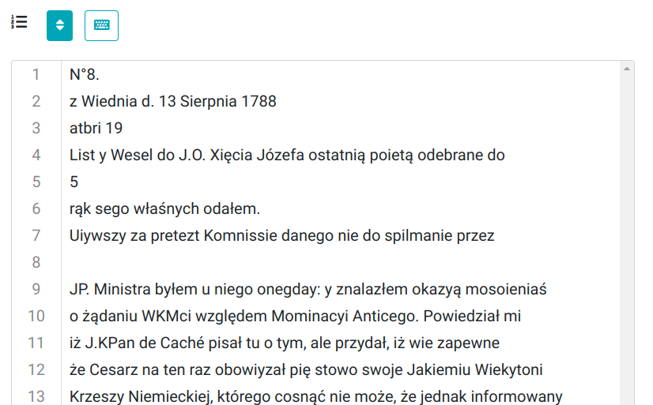
</figure>

### Verification and correction of segmentation

Although it is possible to correct both baselines and line masks, the manual correction of masks is not recommended. A better solution is to correct the length and shape of the baselines, and the line masks are then (usually with a 1-2 second delay) automatically adjusted by the application.
<figure>
  
</figure>

In case of problems with selecting the correct line node, you can use the so-called **lasso** - with the Shift key pressed and the left mouse button pressed, select the area with the node of interest to us. The selected node will turn black and can be moved, the mouse cursor positioned over such a node changes to a 'hand' shape.
<figure>
  
</figure>

It is possible to add nodes to existing baselines by selecting the line and double-clicking at the desired point on the line. The new line node can be moved. The selected node can also be deleted - when editing a segmentation, an additional toolbar is visible, and one of the tools is a yellow icon with a basket symbol, which is used precisely to delete nodes.
<figure>
  
</figure>

For selected lines it is possible to change their reading direction. In the auxiliary toolbar an icon with a horizontal line and arrows at both ends changes the reading direction when used - the vertical line marking the beginning of the line moves to the other end. Using the tool again restores the original situation.
<figure>
  
</figure>

Another tool visible in the auxiliary toolbar is the icon for linking (or disconnecting) a line to a region (icon with a node symbol - 'Link/Unlink').
<figure>
  
</figure>

However, if there is a need to modify the line mask, note that editing the mask works a little differently. After enabling visibility of line masks, selecting the line to be modified, click not so much on the mask node as on its vicinity, and moving the mouse cursor you will see that the line mask node follows it.
<figure>
  
</figure>

A useful tool when modifying segmentation is the 'Cut through lines' tool (icon with a scissors symbol on a yellow background). When activated (the colour of the icon changes to green), it allows you to select a rectangular area that trims parts of lines (or removes whole lines).
<figure>
  
</figure>

Low-quality input images, e.g. with numerous soils, artefacts resulting from scanning old microfilms with damage, damage to the scanned or photographed documents themselves have a negative impact on the quality of segmentation. Recognition of sets of damage or dirt as regions, sometimes false recognition of non-existent lines, can be expected.
<figure>
  
</figure>

The eScriptorium allows group operations in the segmentation editing window. It is possible to use the function of the so-called.
**lasso** (SHIFT + selecting an area with the mouse cursor) to select a group of line or line nodes and, for example, move them in groups (with the CRTL key pressed, grab one of the nodes via the mouse cursor and move), changing the shape of the lines or lengthening/shortening them.
<figure>
  
</figure>

It is also possible to delete selected lines in groups - either with the tool from the toolbar (red icon with bin) or with the shortcut key - DELETE.

When at least two lines are selected, a new icon appears in the pop-up toolbar, associated with the line gluing tool. When clicked, the application tries to merge the selected lines into one.
<figure>
  
</figure>

## Defining types and annotations for image elements

In the Ontology tab of the document, labels can be defined to describe image elements - region and line types, as well as image annotations and text annotations. The application suggests several standard region types ('Main', 'Title'), but you can add your types. Only those with tick boxes will be visible when editing the image. Similarly, for line types, a couple of standard ones are available ('Numbering', 'Signature'), and using the edit box at the bottom of the 'Line types' section and the green plus icon, you can add your line types. Again - only the selected ones will be visible when working in the image editor.
<figure>
  
</figure>

Further in the 'Ontology' window, annotation definitions can be created for both image and text. During creation, the color that distinguishes the individual annotations is determined, as well as whether it will be possible to add user comments to the annotations.

### Assigning types to segmentation elements

To assign a type to a region or line, you must first select an element. For example, when working in the Images tab with a specific image of a manuscript page, you should display the 'Segmentation' panel, turn on the region operation mode (green icon with four squares above the scan) and then click on the selected region. In the upper left corner of the image, a toolbar will be displayed with two icons: a red one indicating deletion of the region, and a green one with a T, which allows you to assign a type to a region from the list. Once a region type has been selected, the application will assign the color associated with the type to that region.
<figure>
  
</figure>

In addition to highlighting with color, the type of region will now be displayed in the upper right corner of the screen when you move the mouse over the region.
<figure>
  
</figure>

In baselines mode (regions mode off, baselines on - with or without masks), types can be assigned to lines. For example, when a line with a signature ('Corticelli' in the image below) is selected, a toolbar is displayed, as for regions
with an icon for setting the line type (green icon with a T). When the line type 'Signature' is selected, it will be assigned to a line (or several if more than one is selected). The colour associated with the line type will henceforth be a vertical (usually) line drawn to indicate the start of the line and its height.
<figure>
  
</figure>

As with regions, the line type will be visible in the upper right corner of the image as you move your mouse over the line.
<figure>
  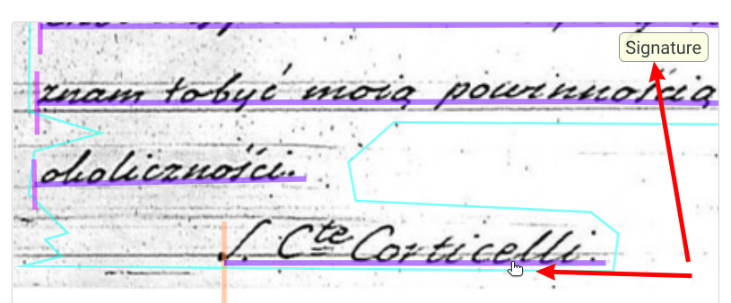
</figure>

### Assigning labels to text passages

When working in panel 4 - 'Text', it is possible to annotate parts of the transcription text with labels previously defined in the 'Ontology' tab of the document. If labels have been defined the appearance of the toolbar above the text box changes, and toggle buttons corresponding to the labels appear. Activating such a button allows the selected text fragment to be selected, after which a dialog box appears  in which a comment can be entered (if so defined in the tag definition) and save the changes.
<figure>
  
</figure>

Text with an assigned label will be marked with the color chosen when defining the label in question.
<figure>
  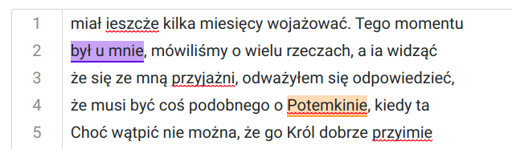
</figure>

**Note:** in the current version there is (probably) no possibility to use text annotation - labels are not exported, neither in TXT nor XML format.

### Assigning labels to parts of the image

Image fragments can also be annotated. Panel 1 - 'Source image' should be displayed and if annotation labels were defined in the 'Ontology' tab, they will appear as toggle buttons. Once you have selected one of these, you can select an image fragment (depending on the definition, as a rectangle or polygon) and optionally annotate it. In this way, it is possible to mark, for example, parts of the scan that are not part of the original manuscript, microfilm damage not present on the original document, etc.
<figure>
  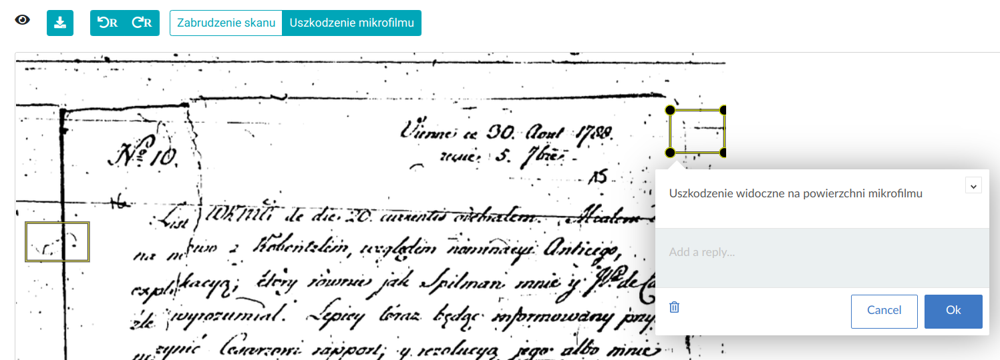
</figure>

## Entering a manual transcription

eScriptorium can be used as an environment for preparing training material (_ground truth_) which is necessary to create a new model. For this purpose, good quality images (scans) of manuscripts and texts read from manuscripts by experts are necessary. Having such materials, you can load a series of images into a new document, then complete the 'manual' transcription layer for each image - preparing the text data corresponding to the page of the scan, with the division into lines according to the division in the manuscript. In edit mode for the image, panel 3 = 'Segmentation' and panel 4 - 'Text' should be displayed, where you can enter the text of the page. For the manuscript image, segmentation should be carried out beforehand so that regions and lines of text and their order are delineated. It is important to agree on the correct line layout, so that the line text in the Text panel corresponds to the correct manuscript line determined by the segmentation.

The most convenient way to check this is to turn on the browse mode and edit individual lines of the transcription -> in the segmentation panel, click on any line, then a fragment of the manuscript scan with the given line and an editable text field will be displayed.
<figure>
  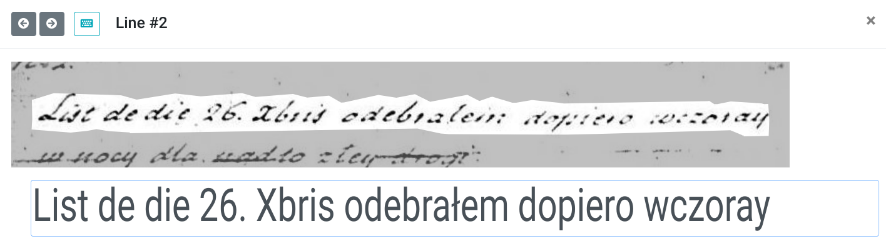
</figure>

Within a page, the arrow icons at the top of the window allow you to move between successive lines. If the active element is an editing text field, the up/down arrow keys also navigate between the previous and next lines of text, and the Enter key (which also triggers the saving of changes) moves you to the next line.

The window for editing a single line of the transcription additionally contains information about the last author and the date of changes, and allows the entire history of changes to a given line to be displayed by clicking on the 'Toggle history' link (the link will only appear if a given line has been modified). Once the change history is displayed, the user can restore one of the previous states of the line using the green icons to the right of the change list.
<figure>
  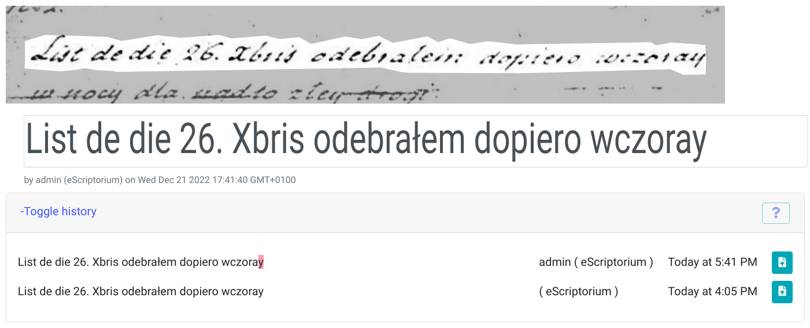
</figure>

### Virtual keyboard

The virtual keyboard function was introduced to make it easier to enter special characters in the application. The keyboard can be activated while editing a transcription line (or in the 'Text' panel), using the button with the keyboard symbol icon, which displays an additional window showing the defined characters ready for insertion. The same icon is used to deactivate the virtual keyboard. You can also change to a different keyboard definition, add your own, or modify an existing one.
<figure>
  
</figure>

### Order of lines

The order of the rows determined automatically can be displayed in the segmentation panel, via the icon in the panel toolbar (icon with arrow symbol and numbers).
<figure>
  
</figure>

The order of the rows can be modified in the 'Text' panel after activating the sorting mode (with the arrow icon). The application then allows you to move the lines in the text panel using the mouse cursor. Note that eScriptorium tends to automatically correct the order when lines are added manually by the user, and accidentally adding lines happens quite easily.
<figure>
  
</figure>

## Models, import of publicly available models

Once installed, eScriptorium has no default OCR/HTR model. You can train your own model based on the materials you have (_ground truth_ - collections of images and matching 100% verified texts). Collections of publicly available material under open licenses can be found in [HTR-United](https://htr-united.github.io/), similar collections but mainly for OCR material have been collected at [OCR and Ground Truth Resources](https://cneud.github.io/ocr-gt/).

There is, however, a collection of pre-trained models stored at [zenodo.org](https://zenodo.org/communities/ocr_models?page=1&size=20). Currently, there are several models available, from models for Arabic, Hebrew or Vietnamese manuscripts to those designed for Latin and French medieval writing of the 8th-15th centuries, or trained on French manuscripts from the 18th-20th centuries. The collection also includes OCR models for old Persian or Ottoman prints. All are available free of charge, usually under a Creative Commons Attribution 4.0 International license. You can, of course, also make your model available in this catalogue, as long as it is useful to other users.

Each model in the collection has its own sub-page, often with information about the collection of manuscripts on which it was trained. For example, the model 'HTR-United - Manu McFrench V1 (Manuscripts of Modern and Contemporaneous French)' (https://zenodo.org/record/6657809#.Y6LfDtLMJKs) was prepared based on the 17th- to 21st-century French collection from the aforementioned HTR-United collection, with the addition of a small sample of 19th-century Spanish letters and 20th-century English manuscripts.

The models are stored in binary files with the extension *.mlmodel (a format introduced by Apple as part of the CoreML framework, for integrating machine learning methods into applications, see https://apple.github.io/coremltools/mlmodel/index.html) and can be downloaded from the 'Files' section of the model's subpage. The size of the model is usually between a dozen and a few tens of megabytes. Once downloaded to a local drive, such a model can be imported into eScriptorium using the 'Upload a model' function in the model list window visible when navigating to the 'My Models' menu at the top of the application screen.

When used directly, Kraken has built-in support for downloading models from the zenodo repository, using the `kraken list', `kraken show' and `kraken get' commands, described in the documentation under [Model Repository](https://kraken.re/master/advanced.html#querying-and-model-retrieval).

### Menu My Models

In the main application menu (upper right corner of the window), the 'My Models' menu opens a window with a list of models available to the user (imported, trained by the user, or shared with the user). The large green 'Upload a model' button is used to import a model downloaded, for example, from the zenodo.org service (file in *.mlmodel format). **Note**: The application suggests a model name by default, based on the file name. You can modify it, but once the import is confirmed, you can no longer change it (in the current version of eScriptorium).

The list of models displays basic information about each of them: type (the model can be used for transcription 'Recognize', or segmentation 'Segmentation'), size in megabytes, whether it is an already trained model (or training is in progress), and its best accuracy ('Accuracy'). For models trained in a given eScriptorium instance, the number of incorrect/total characters determined during validation after training is also visible. The last column indicates whether the model is the 'property' of the current user ('Owner') or has been shared with them ('User', 'Public'). Beyond the columns with information, there are tool icons whose number depends on whether it is 'our' model and whether it was trained in eScriptorium:

- the green icon with the file symbol allows you to download the model to your local disk (the *.mlmodel file)
- the blue icon with a curved arrow allows you to share 'our' model with other users
- the red icon with a trash bin allows you to delete the model - but not a shared one
- the sea-blue icon enables - only for models trained in a given eScriptorium instance - to switch to another version of the model (one of the intermediate versions created during training)

### The Models tab in the document

The 'Models' tab in the document displays a similar list to the one in the 'My Models' menu. However, only models related to the current document are visible there, e.g., used for automatic transcription or trained based on files from the document. You cannot delete models in this window, but there is a yellow icon with a trash bin symbol - this tool only removes the model from the document's models list.
<figure>
  
</figure>

## Automatic transcription

After importing files with images (scans), performing segmentation, verifying segmentation, and assuming that there is a model (imported or trained) suitable for the manuscripts in the images, you can proceed to use one of eScriptorium's most important features - automatic transcription. The application uses the Kraken program for this purpose. To perform the transcription, you must first select at least one image from the list of images in the current document. The 'Transcribe' button in the toolbar starts the procedure, displaying a dialog box with transcription parameters - actually, just one parameter, as you need to choose one from the list of available models.
<figure>
  
</figure>

The transcription process, depending on the scope (one or several hundred images), may take a longer time and is performed in the background on the eScriptorium server. After the transcription is completed, the application displays a notification in the top right corner of the screen.
To assess the quality of the transcription, you should then enter the image editing mode (through the icon on the thumbnail background) or go to the Edit tab in the document window. The new transcription will be visible in panel 3 - 'Transcription' and as text in panel 4 - 'Text'.
In the top right corner of the screen, above the icons for enabling/disabling panels, there is a list of transcription versions. If a different version is displayed by default, you can find and set the newly prepared transcription here.
<figure>
  
</figure>

### Transcription versions

The button with the gear symbol located next to the list of transcription versions displays the transcription version management window, from which you can delete selected versions. Note: you cannot delete manual transcriptions ('manual') or the current, currently displayed transcription. Deleting transcription versions applies to all document images, not just the current image.
<figure>
  
</figure>

Selecting multiple checkboxes in the same window (to the left of the transcription version name) will allow you to display a comparison of transcriptions (on a line-by-line basis). After closing the version window and clicking on the selected line of transcription (in the transcription panel), the line editor will be displayed, this time with the 'Toggle transcription comparison' option visible in the lower part of the editor window. Turning it on will display the current line variants from the transcriptions previously selected.
<figure>
  
</figure>

## Automatic alignment

The Align function is a novelty introduced in version 0.13 of eScriptorium and is still being refined, so it should be considered as a beta version. It uses David Smith's PASSIM program to compare the provided txt file with the selected OCR/HTR layer. Based on the page divisions and line divisions in the OCR layer, this function is able to match the txt file to the scans/images, divide it into lines according to the manuscript's layout, and save the result as another OCR layer. With sufficiently good OCR/HTR results, you can use this method to load, for example, text from a critical edition of a manuscript as a layer, even when the text does not retain the original manuscript layout.
<figure>
  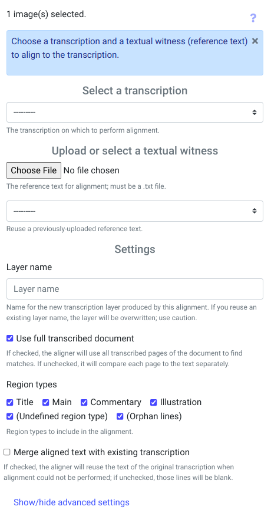
</figure>

Before starting the function, you should first select 1 or more scans that will be subject to processing; otherwise, clicking the 'Align' button on the toolbar will trigger a reminder message. The parameters window for the 'Align' function is one of the more extensive ones in the eScriptorium application. You need to indicate the transcription layer that will be compared to the text file, specify the local text file (or select it from the list if it has already been used - eScriptorium remembers files). In the 'Settings' section of the window, you must enter the name of the new layer, and the 'Use full transcribed document' parameter determines whether the entire content of the transcription layer will be compared or each page individually. You can also specify which types of scan regions will be considered (by default, all are included).

By default, the 'Merge aligned text with existing transcription' option is unchecked, which results in the output layer being supplemented with the text from the specified transcription layer if the system fails to match the appropriate segments (if the option is not used, such unmatched text lines will be empty). It is possible to limit the analysis to specified region types - by default, all are selected. The window also has a group of hidden, advanced parameters: clicking 'Show/hide advanced settings' displays a block of technical parameters for the Align function, with a brief description below each one in the same window. For additional information, refer to the Passim program documentation (https://github.com/dasmiq/passim).
<figure>
  
</figure>

It is worth noting that the 'aligned' text, for example from a critical edition, may not only fail to maintain the division into pages and lines but also contain more text than the processed scans. For instance, when processing a scan of Corticelli's letter subjected to transcription by a model with 89% accuracy and 'aligned' with text manually prepared by experts containing the content of many letters, the Align function matched the appropriate fragment almost perfectly and also correctly divided it into lines.
<figure>
  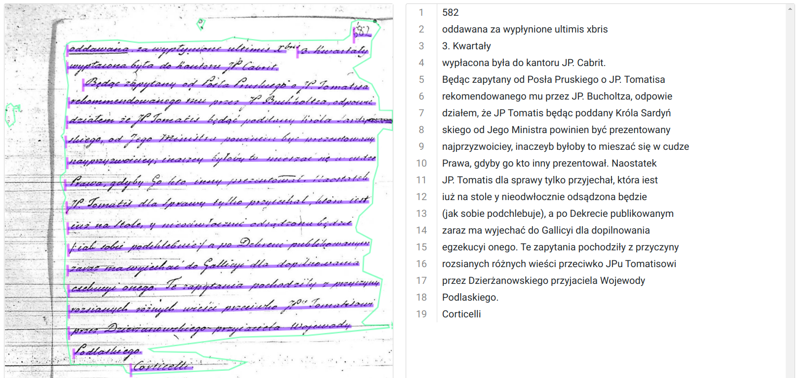
</figure>

**Note**: Since this functionality is in the 'beta' phase, it is not available automatically. To make the Align function visible and working correctly, you need to set the environment variable `TEXT_ALIGNMENT=True` and run an additional Docker container: celery-jvm.

## Strategy for training models

Creating and training a new model from scratch requires a substantial amount of training material, as well as a considerable amount of time and computing power to carry out the learning process. Typical, publicly available handwritten text models have been created based on tens of thousands of lines of 'ground truth' (see [lectaurep](https://github.com/lectaurep/lectaurep_base_model)). Preparing such material (with 100% accuracy verified by experts) is the most labor-intensive stage of working on a model.

The learning process can be easier if we have access to a model trained on material similar to our manuscripts. In this case, it is possible to train based on an existing model, using the so-called transfer learning mechanism (see https://en.wikipedia.org/wiki/Transfer_learning), with a much smaller number of ground truth lines - e.g., from several hundred to a few thousand. Fine-tuning (otherwise known as adjusting) the model is (to some extent) also effective in cases where there are differences in the alphabet between the base model and the training material used to fine-tune the model when the model must 'learn' entirely new characters during training. The fine-tuning process is much faster than training a model from scratch.

> "Using pre-trained models is the most important method by which we can train subsequent, more accurate models, while the entire operation takes place faster, using less data and in a shorter time, as well as at a lower cost."
>
> Jeremy Howard, Sylvain Gugger, _Deep Learning dla programistów_, 2021, str. 52

However, if there is no model that could serve as a base model for the processed manuscripts, the path of training 'from scratch' remains. Since working directly with Kraken allows for modifying learning parameters, which cannot be done at the eScriptorium level, it seems that such a training method is a better approach. However, this requires mastering the command line interface of Kraken, getting familiar with the documentation of the [ketos train command](https://kraken.re/master/ketos.html), and acquainting oneself with the description of [VGSL](https://kraken.re/master/vgsl.html#vgsl) concerning neural network architecture. A very interesting read will also be a two-part article describing experiences during the training of a model based on French notarial manuscripts from the years 1742-1928: [part 1](https://lectaurep.hypotheses.org/475), [part 2](https://lectaurep.hypotheses.org/488).

## Training your own model in eScriptorium

eScriptorium is integrated with the Kraken program and allows not only for the recognition of writing using pre-prepared models but also for the creation of entirely new models or fine-tuning of existing ones. The training process can be started in the document window, in the editing tab. One of the visible toolbar buttons - 'Train', launches the training of a segmentation model (Train -> Segmentator) or - more commonly used - a transcription model (Train -> Recognizer). The first step is to select at least one scan. Choosing the Train -> Recognizer tool displays the transcription model training parameters window. Note: The 'Train' tool may not be visible to all users, and its availability depends on the permissions granted in the administrative panel (see [System Administration](#administracja-systemem-escriptorium)).

<figure>
  
</figure>

In this window, you should indicate the transcription layer that will be used in the learning process, the base model (if we want to rely on an existing model that will be fine-tuned), and the name of the resulting model. Training from within eScriptorium does not allow for setting more advanced learning options that are available when training directly in the Kraken application.

## Training the model directly in the Kraken application

Apart from training the model from within eScriptorium, it is possible to launch this process using the Kraken program directly from the command line. However, it should be noted that Kraken works on Linux and macOS systems (on x64 and ARM processors, although in the case of new Apple computers with M1 processors, i.e., ARM architecture, Kraken cannot yet utilize their graphics processor). For Windows systems, you can potentially try WSL - Windows Subsystem for Linux.

Kraken is an application written in Python and requires an installed version 3 of the interpreter (preferably 3.8 or newer) to function. The installation is described on the program's website: https://kraken.re/master/index.html

After installation, the user has access to the commands `kraken` and `ketos` for OCR/HTR recognition and model training.

Training data can be downloaded from eScriptorium (scans and XML files) or obtained from Transkribus - in this case, the recommended format is PAGE XML, and before training, it is recommended to process the segmentation in eScriptorium (Segmentation steps option = 'Only Line Mask').

To slightly speed up the learning process from XML files and scans, you can prepare a so-called binary dataset using the `ketos compile` command (the `--random-split` parameter determines the random division of the sample - 80% learning, 10% validation during learning, 10% test; the `-f page` parameter informs about the input file format: PAGE XML; the `--workers` parameter specifies how many threads - CPU cores can be occupied by the compilation process, multi-threaded work significantly speeds up processing):

    ketos compile --workers 3 --random-split 0.8 0.1 0.1 -f page -o name_dataset.arrow *.xml

assuming that the command is run in the directory with XML files and scans.

The prepared *.arrow file can be used, for example, for fine-tuning (https://kraken.re/4.2.0/ketos.html#fine-tuning) an existing model (the `-i` parameter indicates the name of the base model file; without specifying this parameter, Kraken will train a model from scratch; the `--resize` parameter is significant in case of differences in the alphabet between the base model and the training data, informing Kraken what to do when encountering unknown characters in the training material):

    ketos train -i base_model.mlmodel --resize add --workers 3 --output new_model_name -f binary name_dataset.arrow

<figure>
  
</figure>

In the screenshot above, you can see the successive iterations - training epochs (an epoch is a full processing of the training data set) along with validation after the learning process. The training continues as long as the results improve; if 5 consecutive epochs (this parameter can be controlled) do not bring improvement, Kraken ends the learning procedure, returning the best model so far under the name `{new_model_name}_best.mlmodel`, where 'new_model_name' is the name provided by the user through the `--output` parameter.

To test the model, you can use the command: `ketos test`, providing the model for testing and training data, for example, in the form of a binary dataset - a *.arrow file created above (such a data set usually contains both training, validation, and test data, not used during training):

    ketos test -m name_model.mlmodel -f binary name_dataset.arrow

Example of result:
``
    === report  ===
    84685     Characters
    1142      Errors
    98.65%    Accuracy``

Where 'Accuracy' is an indicator measuring the recognition quality of the model - the percentage of correctly recognized characters. The same indicator is given after each epoch of model training (val_accuracy) during the verification of results on a validation data sample (there in the form of a fraction, e.g., 0.83).

The command to start training a model from scratch, with modification of the neural network architecture (the `-s` parameter) and learning rate (the `-r` parameter) based on an example from the [article](https://lectaurep.hypotheses.org/488):

    ketos train --augment -u NFD -s '[1,120,0,1 Cr3,13,32 Do0.1,2 Mp2,2 Cr3,13,32 Do0.1,2 Mp2,2 Cr3,9,64 Do0.1,2 Mp2,2 Cr3,9,64 Do0.1,2 S1(1x0)1,3 Lbx200 Do0.1,2 Lbx200 Do.1,2 Lbx200 Do]' --output poniatowski_from_scratch --lag 5 --workers 2 -r 0.0001 -f binary poniatowski.arrow

A detailed description of the training process and parameters can be found at:
https://kraken.re/master/training.html

A model trained directly in Kraken (a *.mlmodel file) can later be imported into eScriptorium. If you have a high-quality model that is worth sharing publicly, you can also place it in the zenodo.org repository. Kraken allows you to publish a model from the command line with the command: `ketos publish`. The procedure requires having an account on the Zenodo service and is described at: https://kraken.re/master/advanced.html

## Cooperation with other users

The application has the ability to share both projects and documents or models with other users.

### Sharing projects

To share a project with another user, you need to find the blue 'Share this Project' icon in the top right corner of the project window. A dialog box will then be displayed, in which you need to enter the username of the person you want to share the project with. After confirmation, the system will display a notification of successful sharing, and the target user should see the project on their list.
<figure>
  
</figure>

Alternatively, if user groups have been created in our eScriptorium instance, instead of sharing the project with individual people, you can share it with an entire group (creating groups and assigning users to groups is available in the application's administrative panel).

A user can opt out of a project that has been shared with them. On the list of projects, those created by someone else and shared have a yellow icon with a black trash can symbol ('Remove from list') on the right side. Using this tool will not delete the project entirely but will only remove it from our list of projects.

### Sharing the document

It is also possible to share a specific document. In the document window (if the Description tab is active!), icons related to performing operations on the current document are visible in the top right corner of the screen. One of them is the icon for sharing the document with other users. Clicking on it displays the sharing dialog box.
<figure>
  
</figure>

In this window, you need to indicate user groups or specific users who should have access to our document.
<figure>
  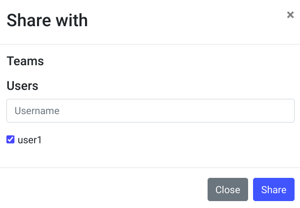
</figure>

### Moving a document to another project

An interesting option is the ability to move a document to another project. In the top right corner of the document screen (while working in the Description tab), next to the icon for initiating document sharing, there is an icon for the document moving tool ('Migrate to another project'). In the migration dialog box, there are two fields. In the first field with a dropdown list, you need to indicate the target project, while the checkbox below determines whether to move the document's tags along with it (referring to the tags assigned at the document level using the Assign Tag tool visible on the project's document list - a blue icon with labels).
<figure>
  
</figure>

After confirming with the 'Migrate' button, the application will display an appropriate notification about the successful completion of the operation, and our document will now be part of another project.

<figure>
  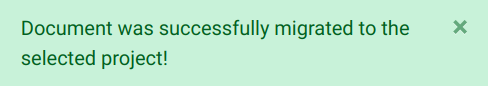
</figure>

### Export, sharing, and deleting a model

Models stored in eScriptorium can be exported, for example, to be placed in the zenodo.org repository or used directly in the Kraken program. On the list of models (menu 'My Models'), there are colorful icons on the right side of the window that allow you to export (download) the model - a green file icon with a downward arrow, delete the model - a red icon with a trash symbol, and share the model - a blue icon with a curved arrow. Note: Deleting a model occurs immediately, without additional questions, and similarly, downloading (exporting) a model immediately initiates the *.mlmodel file download procedure.
<figure>
  
</figure>

In turn, sharing a model displays an additional program window in which you can decide which users or groups of users to share our model with, and you can also remove sharing for a given user/group.
<figure>
  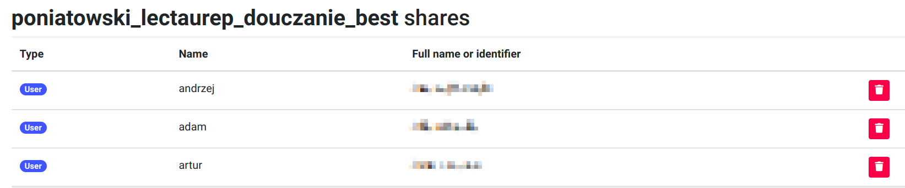
</figure>

## Exporting transcriptions

Transcriptions prepared in eScriptorium can be saved as XML files in ALTO or PAGE formats, as well as in the form of a plain TXT file. Exporting is available while working with a document in the 'Images' tab after selecting at least one scan/image. The 'Export' button in the toolbar (above the list of scan thumbnails) displays a dialog window in which you need to specify the transcription layer (scans could have been recognized by multiple OCR/HTR models), the expected data format (ALTO, PAGE, TXT), and whether the export should include the original scans/images. After confirming the window, the system will generate a zip package with files and display a notification in the top right corner of the screen. The notification will contain a link to download the zip file with data. If the system has been correctly configured, eScriptorium will also send the user an email with information about the prepared zip file and a download link (for larger scan collections, preparing data may take longer).
<figure>
  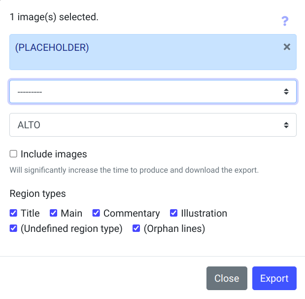
</figure>

## Reports

Both projects and documents have 'Reports' tabs with statistical information about the content of the project or document. They concern, for example, the number of images, the number of recognized regions and lines, the number of words and characters in transcriptions. A separate section is the Vocabulary section, where after refreshing, the current frequency of occurrence of individual characters is displayed. In the 'Reports' tab for the document, the average transcription confidence is also provided.
<figure>
  
</figure>

## eScriptorium system administration

The eScriptorium administrator and any user with appropriate permissions have access to the system administration panel through the 'Hello {USER}' -> Site administration menu in the upper right corner of the eScriptorium window. Launching this function displays a typical panel for applications created in Django technology, in which you can manage system users, their permissions, create new accounts, user groups, tokens for cooperation with eScriptorium via the API. The administrator can grant or revoke permissions to OCR/HTR models and to documents with scans and transcriptions from the panel, and can also delete documents and projects.
<figure>
  
</figure>

## API (REST) eScriptorium
eScriptorium has an API interface (using Django REST framework), which is visible at https://{SERVER}/api/ (where {SERVER} is the domain or IP address of the server running eScriptorium). A working version of the API documentation is available in the form of a Google document: https://docs.google.com/document/d/1tl48eXHq36KJ1zyXq0dMwYEzdnQYUm_MKfzMat9vjPc/edit#heading=h.j2ygnbgnoruv

A user with permissions and a generated token (in the application administration panel) can run some eScriptorium functions through the API, for example, using a connector for the Python language (https://gitlab.com/sofer_mahir/escriptorium_python_connector). Examples are provided in the aforementioned documentation.
<figure>
  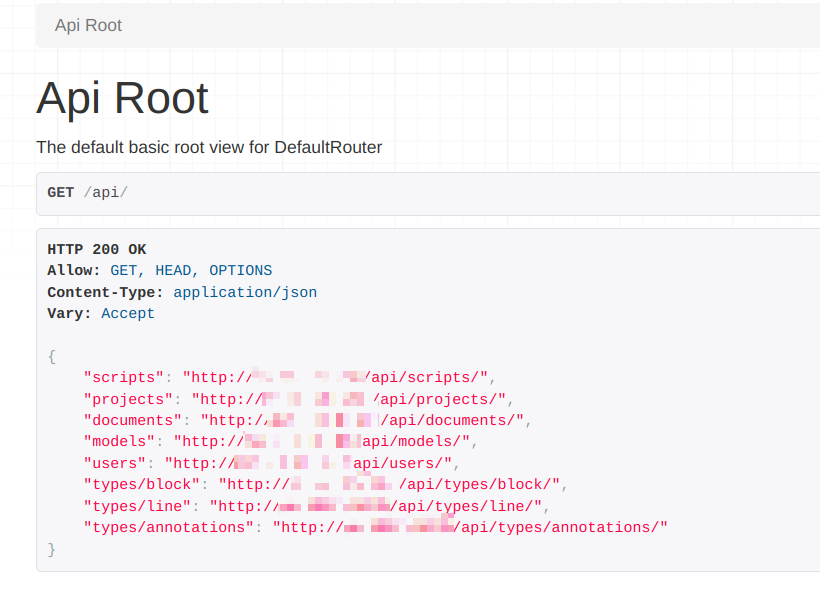
</figure>

## Discussion forums, source codes, licenses

The technical eScriptorium forum, more related to the development of this application, is available on Gitter:
https://gitter.im/escripta/escriptorium, although quite often there are questions (and answers) from regular users of the system.

The source code of the application is stored on GitLab - https://gitlab.com/scripta/escriptorium/, where you can also find a list of errors and development proposals: https://gitlab.com/scripta/escriptorium/-/issues/?sort=created_date&state=opened&first_page_size=100

eScriptorium has been released under an open proprietary license (https://gitlab.com/scripta/escriptorium/-/blob/develop/LICENSE).

The Kraken program is developed on a different platform - GitHub: https://github.com/mittagessen/
and has been released under the Apache 2.0 license.

## Additional information

The screenshots presented in this introduction come from eScriptorium version 0.13.2. Fragments of manuscript scans visible in some screenshots come from tests of the eScriptorium and Kraken applications conducted in 2022 at the Institute of History of the Polish Academy of Sciences, related to attempts to prepare HTR models for 18th-century manuscripts in Polish, based on the correspondence of King Stanisław August Poniatowski.

For those interested in the correspondence itself, it is recommended to refer to the publication released a few years ago: "Korespondencja polityczna Stanisława Augusta. Wiedeń" (Political Correspondence of Stanisław August. Vienna), (volume I 1788-1790, volume II 1791-1792), edited by Monika Jusupović and Adam Danilczyk, Warsaw 2016, available on [RCIN](https://rcin.org.pl/dlibra/publication/158432/edition/128045). The original correspondence is kept in the collections of The Central Archives of Historical Records in Warsaw (https://agad.gov.pl/).

**Disclaimer**: I quickly realized that GPT4 is a better translator than I am, so most of this English version is the work of AI.