# eScriptotium - Tutorial

eScriptorium jest webową aplikacją przeznaczoną do pracy nad historycznymi rękopisami i drukami. Aplikacja jest zintegrowana z programem Kraken, narzędziem wykorzystującym algorytmy uczenia głębokiego do rozpoznawania tekstów (OCR i HTR). eScriptorium to projekt prowdzony przez eScripta, zespół z Université Paris Sciences et Lettres.

## Wersja

Aktualna wersja aplikcji to 0.13.2 i taką opisuje niniejszy tutorial (stan na 16.12.2022).

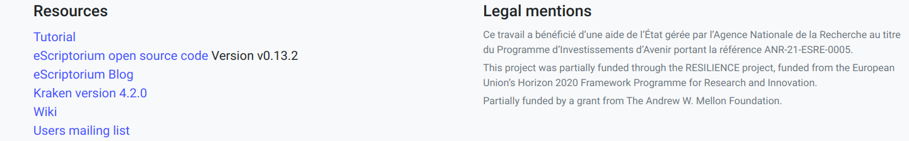
*Wersja aplikacji eScriptorium i silnika OCR/HTR - Kraken*

## Logowanie i główne okno aplikacji

Logowanie do instancji eScriptorium wymaga podania loginu i hasła, okno logowania jest wyświetlane po wybraniu przycisku Login w górnym prawym rogu ekranu aplikacji.

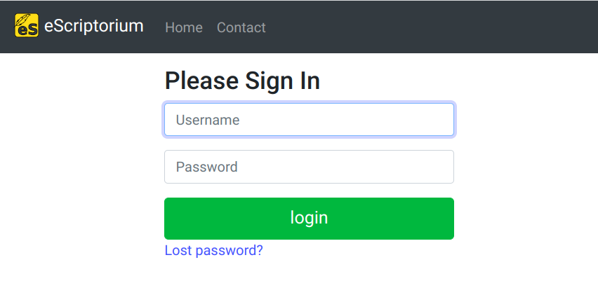

Po zalogowaniu widoczna jest lista (tabela) projektów użytkownika. Mogą to być projekty utworzone przez zalogowaną osobę lub udostępnione przez innych użytkowników, w środkowej kolumnie tabeli projektów można zobaczyć dla każdego z nich login jego twórcy. W ostatniej kolumnie widoczna jest liczba dokumentów w danym projekcie. Projekt może mieć wiele dokumentów a dokument wiele skanów/zdjęć. Pierwsza kolumna po lewej to tytuł danego projektu.

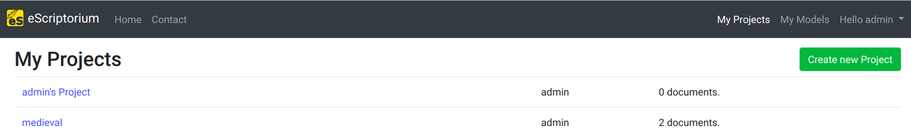
*Główny ekran eScriptorium*

Powyżej listy projektów widoczne jest podstawowe menu aplikacji:
- menu 'My Models' wyświetla listę modeli dostępnych dla użytkownika,
- menu 'Hello {USER}' udostępnia m.in. możliwość zmiany hasła, edycji profilu użytkownika, podglądu stanu zadań (zadania np. trenowania modelu, lub transkrycji dużej liczby plików mogą być czasochonne, polecenia Task monitoring czy Task report umożliwiają sprawdzenie stanu zadań). Zależnie od uprawnień, można tu również znaleźć funkcję zarządzania ustawieniami aplikacji eScriptorium, w tym menu znajduje się też możliwość wylogowania z systemu.
- menu 'My Projects' - wyświetla właśnie listę (tabelę) projektów
- menu 'Contact' - umożliwia komunikację z administratorami danej instancji eSCriptorium, o ile taka opcja została skonfigurowana.
- menu 'Home' wyświetla główne okno programu, z informacjami o jego możliwościach, wersji itd.

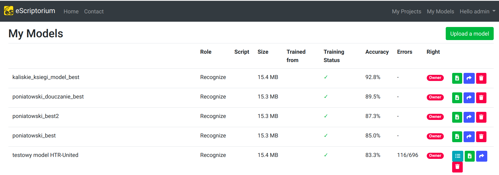
*Modele*

## Utworzenie nowego projektu

Widoczny w górnym prawym rogu ekranu, powyżej tabeli projektów przcisk 'Create new Project'
pozwala na utworzenie nowego projektu. Jedynym polem które można i należy wypełnić jest tytuł projektu - maksymalnie 512 znaków, uwaga: w opisywanej wersji nie można zmienić nazwy projektu po jego utworzeniu, warto więc wprowadzić tytuł przeyślany, który łatwo pozwoli na wyszukanie naszego projektu z wielu innych.

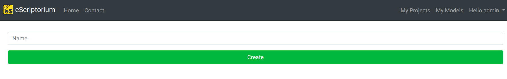
*Utworzenie nowego projektu*

Aplikacja wyświetla notyfikację (zielony komunikat w górnym lewym rogu) z informacją o prawidłowym utworzeniu projektu, który pojawi się też od razu na liście projektów.

 
*Powiadomienie o utworzeniu nowego projektu*

## Utworzenie nowego dokumentu

Po utworzeniu projektu można go otworzyć klikając w tytuł. Projekt jest czymś w rodzaju kontenera na dokumenty, można w nim zgrupować dokumenty zawierające np. skany różnych ksiąg danego źródła historycznego. Tworzenie dokumentu rozpoczyna się od kliknięcia zielonego przycisku 'Create new Document', tradycyjnie w górnym prawym rogu ekranu.

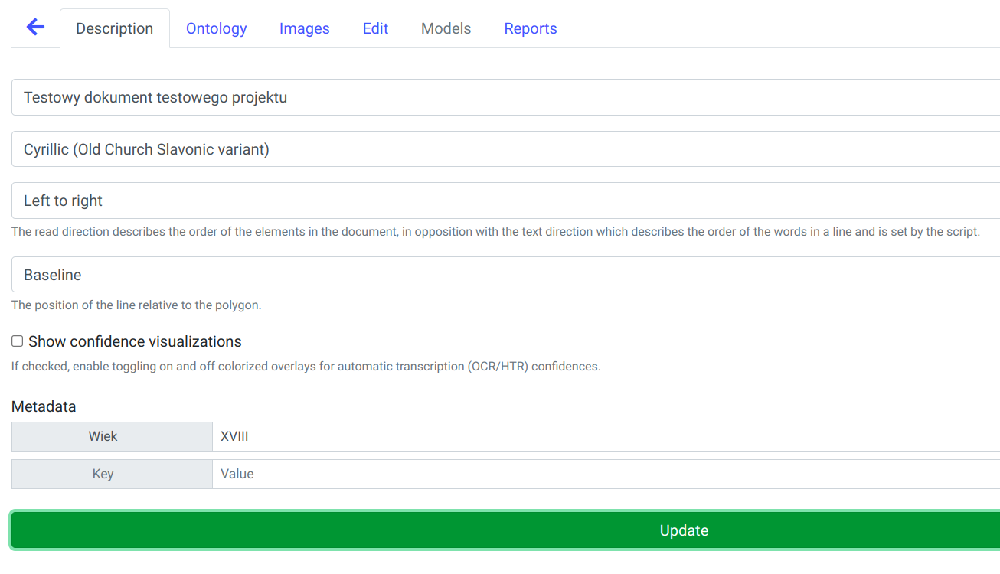
*Utworzenie nowego dokumentu*

Okno definiowania dokumentu zawiera dużo więcej pól niż w przypadku projektu, pola podzielone są na 6 zakładek: Description, Ontology, Images, Edit, Models i Reports. Aby dodać i zapisać nowy dokument należy przede wszystkim podać nazwę (Name) dokumentu np. 'Księgi kaliskie t. 23' (inaczej niż dla projektów, w przypadku dokumentów można później edytować i zmienić jego nazwę). Następnie wybrać z listy rodzaj pisma (main script) - w przypadku dokumentów przetwarzanych w IH PAN będzie to zapewne 'Latin', 'Cyrillic' lub 'Cyrillic (Old Church Slavonic variant)', oraz czy porządek ułożenia elementów w dokumencie do 'Left to right' czy 'Right to left' (kierunek pisma jest określony przez wybór rodzaju pisma).

Należy również określić pozycję linii w stosunku do wielokąta (kształtu) wiersza tesktu: 'baseline', 'Topline', 'Centered'. Aplikacja pozwala opcjonalnie na wyświetlanie stopnia zafania dla poszczególnych fragmentów automatycznej transkrypcji, jeżeli chcemy wyświetlać taką informację należy zaznaczyć pole wyboru 'Show confidence visualizations'.

Sekcja Metadata pozwala na wprowadzenie własnych metadancyh opisujących dokument. Po zakończeniu wprowadzania tych podstawowych informacji przycisk 'Create' na dole okna utworzy nasz nowy dokument, wyświetlając stosowny komunikat w górnym prawym roku ekranu.
Wszystkie wprowadzone informacje będą mogły być w przyszłości uzupełnione i poprawione.
Zapisanie dokumentu odbezpiecza dostęp do podstawowej zakładki Images - tam będą znajdować się przetwarzane skany rękopisów i druków.

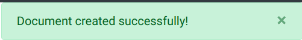 
*Powiadomienie o utworzeniu nowego dokumentu*

### Import skanów

Zakładka 'Images' składa się z trzech podstawowych elementów: pola do importu obrazów/skanów na górze (białe pole otoczone przerywaną linią z napisem 'Drop images here or click do Upload'), paska z narzędziami pośrodku oraz listy skanów, którą można przewijać - poziomo - gdy liczba skanów przekroczy szerokość ekranu. W przypadku nowego dokumentu lista skanów nie jest jeszcze widoczna.

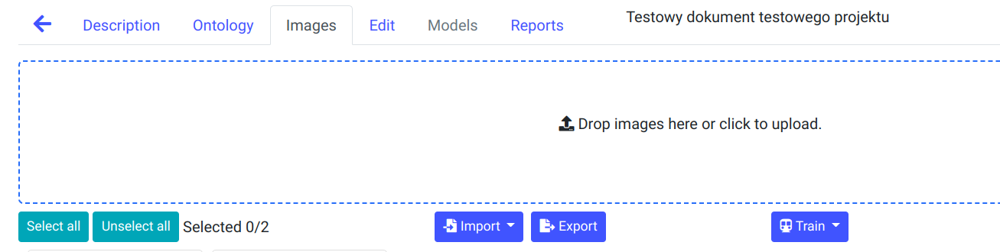 
*Pole importu obrazów*

Najprostszą metodą importu jest zaznaczenie pliku lub grupy plików w dowolnej aplikacji
zarządzającej plikami w danym systemie operacyjnym (Explorator w Windows, czy Files w Ubuntu) i przeciągnięcie ich na obszar pola importu skanów. Spowoduje to uruchomienie procesu importowania - skany pojawią się w polu importu i stopniowo będą przechodzić do listy skanów. Można w ten sposób importować całkiem duże kolekcje, nawet kilkaset obrazów.
Można także klinać w obrębie pola importu, co wywoła standardowy dla danego systemu
operacyjnego dialog z możliwością wskazanie plików. Obsługiwane są standardowe formaty plików graficznych np. jpeg, png, tiff. 
 
### Import transkrypcji i skanów

Dodatkowe możliwości importu daje przycisk Import widoczny na pasku narzędzi, przycisk rozwija się udostępniając 3 polecenia:
- import obrazów z zewnętrznego serwera poprzez protokół IIIF, co jest przydatne gdy posiadamy już kolekcję skanów w repozytorium obsługującym ten protokół,
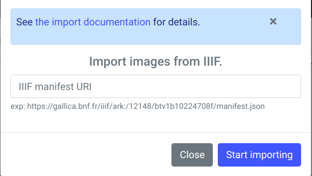 
*Import poprzez protokół IIIF*

- import obrazów z pliku pdf - każda strona pliku zostanie zaimportowana jako osobny obraz
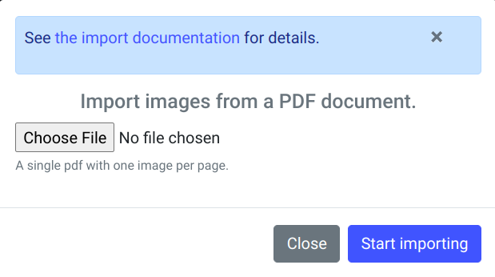 
*Import z pliku PDF*

- import transkrypcji w formacie xml (np. ALTO v. 4 lub PAGE XML), te nwariant umożliwia importowanie transkrypcji manualnej do wczytanych wcześniej skanów, w formie plików xml lub paczki zip zawierającej zestaw takich plików. Funkcja ta pozwala także na import pliku zip, zawierającego zarówno skany jak i transkrypcje xml, aplikacja rozpakuje wówczas obrazy i umieści na liście skanów, wczytując jednocześnie informację z plików xml - transkrypcję, segmentację itd. Uwaga: domyślnie maksymalna wielkość importowanego pliku zip nie może przekroczyć 150 MB.
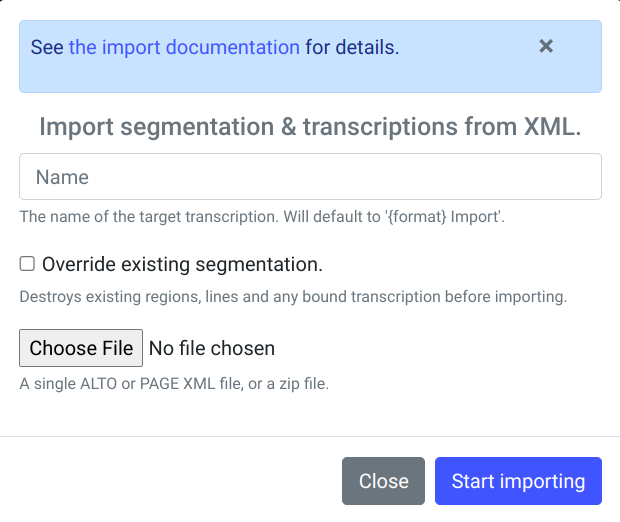 
*Import plików XML*

## Lista obrazów/skanów

## Segmentacja

Przed uruchomieniem automatycznej transkrypcji skanów (OCR/HTR) niezbędne jest prawidłowe podzielenie pisma lub druku na regiony i wiersze. Można to zrobić manualnie, jednak w przypadku większej kolekcji skanów byłby to zbyt czasochłonne. eScriptorium posiada mechanizm automatycznej segmentacji, wykorzystujący model uczenia głębokiego. Aby go uruchomić należy najpierw zaznaczyć jeden lub więcej obrazów na liście a następnie kliknąć przycisk 'Segment' na pasku narzędzi. Wyświetlone zostanie okno z opcjami segmentacji, w którym należy wybrać model, zakres pracy, układ elementów na stronie itp.

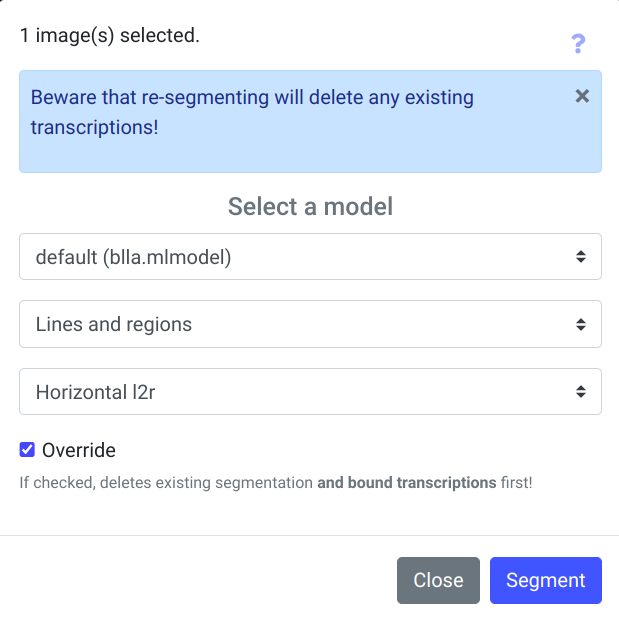
*Segmentacja*

W obecnej wersji dostępny jest jeden domyślny model: blla.mlmodel, dający skądinąd bardzo dobre rezultaty. Domyślnie segmentacja wyznacza linie i regiony ('Lines and regions'), można zmienić zakres zadania segmentacji rozwijając listę poniżej pola z nazwą modelu.
Pojawią się wówczas opcje: 'Lines Baselines and mask' (wyznaczanie linii i masek linii),
'only line Mask' - tylko maski wierszy, 'Regions' - wyznaczanie regionów.

Trzecie z pól okna parametrów segmentacji określa układ elementów na stronach, domyślnie wybrany jest 'Horizontal l2r', dostępne są także 'Horizontal r2l', 'Vertical l2r' oraz 'Vertical r2l'. Pole wyboru 'Override' u dołu okna oznacza, że istnejąca wcześniej segmentacja dla przetwarzanych skanów zostanie usunięta, usunięta zostanie także transkrypcja.

Procedura segmentacji może być czasochłonna, w jej trakcie aplikcja wyświetla dyskretną animację dla przetwarzanych obrazów - na zaznaczonych do przetworzenia skanach (poniżej miniaturki skanu) mruga mała ikonka z liniami. Po zakończeniu procedury wyświetlane jest powiadomienie w górnym prawym roku ekranu. Można także uruchomić segmentację dla konkretnego skanu, klikając właśnie tą małą ikonkę pod miniaturą.

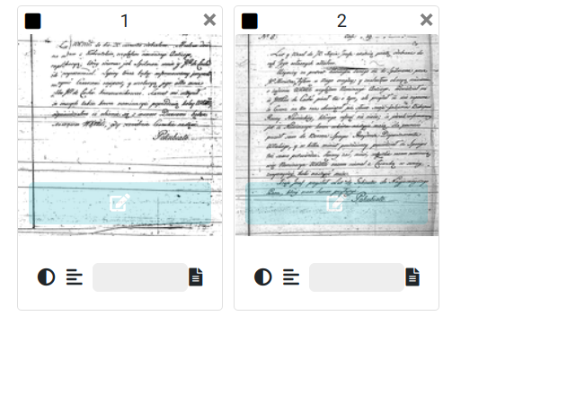 
*Miniatury skanów*

Aby zobaczyć utworzoną przez model segmentację strony/skanu, należy wejść w edycję danej strony - po najechaniu kursorem myszy na miniaturkę skau wyświetli się niebieski pasek z białą ikoną symbolizującą edycję, oraz dymek z podpowiedzią 'Edit', kliknięcie w pasek otworzy skan w trybie edycji. Alternatywnie, jedna z zakładek w dokumencie do zakładka 'Edit', która uruchamia tryb edycji dla pierwszego skanu z dokumentu, tryb edycji posiada możliwość nawigacji do kolejnego/poprzedniego skanu, można więc odnaleźć właściwy skan.

## Okno edycji skanu, segmentacji, transktypcji

## Weryfikacja i korekta segmentacji

## Wprowadzanie transkrypcji manualnej

## Modele, import modeli dostępnych publicznie

## Transkrypcja automatyczna istnjejącym modelem

## Trenowanie własnego modelu w eScriptorium

## Trenowanie modelu bezpośrednio w Krakenie

## Eksport modelu z eScriptorium

## Eksport transkrypcji z eScriptorium

## eScriptorium API