# eScriptorium i Kraken - wprowadzenie

eScriptorium jest webową aplikacją przeznaczoną do pracy nad historycznymi rękopisami i drukami - przygotowywaniem manualnych i automatycznych transkrypcji. Aplikacja jest zintegrowana z programem Kraken, narzędziem wykorzystującym algorytmy uczenia głębokiego do rozpoznawania tekstów (OCR i HTR). eScriptorium to projekt prowadzony przez eScripta, zespół z Université Paris Sciences et Lettres.

## Spis treści

- [Podziękowania](podziękowania)
- [Wersja](#wersja)
- [Logowanie i główne okno aplikacji](#logowanie-i-g%C5%82%C3%B3wne-okno-aplikacji)
- [Utworzenie nowego projektu](#utworzenie-nowego-projektu)
- [Utworzenie nowego dokumentu](#utworzenie-nowego-dokumentu)
  - [Import skanów](#import-skan%C3%B3w)
  - [Import transkrypcji i skanów](#import-transkrypcji-i-skan%C3%B3w)
- [Zakładki dokumentu](#zak%C5%82adki-dokumentu)
- [Lista obrazów/skanów](#lista-obraz%C3%B3wskan%C3%B3w)
- [Binaryzacja](#binaryzacja)
- [Segmentacja](#segmentacja)
  - [Okno edycji skanu, segmentacji, transkrypcji](#okno-edycji-skanu-segmentacji-transkrypcji)
  - [Weryfikacja i korekta segmentacji](#weryfikacja-i-korekta-segmentacji)
- [Definiowanie tagów dla skanów - elementów dokumentu](#definiowanie-tag%C3%B3w-dla-skan%C3%B3w---element%C3%B3w-dokumentu)
  - [Przypisywane tagów do elementów segmentacji](#przypisywane-tag%C3%B3w-do-element%C3%B3w-segmentacji)
  - [Przypisywanie tagów do fragmentów tekstu](#przypisywanie-tag%C3%B3w-do-fragment%C3%B3w-tekstu)
  - [Przypisywanie tagów do fragmentów obrazu](#przypisywanie-tag%C3%B3w-do-fragment%C3%B3w-obrazu)
- [Wprowadzanie transkrypcji manualnej](#wprowadzanie-transkrypcji-manualnej)
  - [Wirtualna klawiatura](#wirtualna-klawiatura)
  - [Kolejność wierszy](#kolejno%C5%9B%C4%87-wierszy)
- [Modele, import modeli dostępnych publicznie](#modele-import-modeli-dost%C4%99pnych-publicznie)
  - [Menu My Models](#menu-my-models)
  - [Zakładka Models w dokumencie](#zak%C5%82adka-models-w-dokumencie)
- [Transkrypcja automatyczna](#transkrypcja-automatyczna)
- [Automatic alignment - funkcja wyrównywania tekstu](#automatic-alignment---funkcja-wyr%C3%B3wnywania-tekstu)
- [Trenowanie własnego modelu w eScriptorium](#trenowanie-w%C5%82asnego-modelu-w-escriptorium)
- [Trenowanie modelu bezpośrednio w Krakenie](#trenowanie-modelu-bezpo%C5%9Brednio-w-krakenie)
- [Strategia trenowania modeli](#strategia-trenowania-modeli)
- [Współpraca z innymi użytkownikami](#wsp%C3%B3%C5%82praca-z-innymi-u%C5%BCytkownikami)
  - [Udostępnianie projektów](#udost%C4%99pnianie-projekt%C3%B3w)
  - [Udostępnianie dokumentu](#udost%C4%99pnianie-dokumentu)
  - [Przenoszenie dokumentu do innego projektu](#przenoszenie-dokumentu-do-innego-projektu)
  - [Eksport, udostępnienie i usunięcie modelu](#eksport-udost%C4%99pnienie-i-usuni%C4%99cie-modelu)
- [Eksport transkrypcji](#eksport-transkrypcji)
- [Raporty](#raporty)
- [Administracja systemem eScriptorium](#administracja-systemem-escriptorium)
- [API (REST) eScriptorium](#api-rest-escriptorium)
- [Fora dyskusyjne, kody źródłowe, licencje](#fora-dyskusyjne-kody-%C5%BAr%C3%B3d%C5%82owe-licencje)

## Podziękowania

Stworzenie tego opisu nie byłoby możliwe bez lektury wcześniej powstałych materiałów i
tutoriali np. [eScriptorium Tutorial (en)](https://lectaurep.hypotheses.org/documentation/escriptorium-tutorial-en), bez obejrzenia licznych materiałów video dostępnych w serwisach [vimeo](https://vimeo.com/user130532566) i [youtube](https://www.youtube.com/watch?v=tut007D6w3o) czy wreszcie bez przeczytania artykułów na stronie [LECTAUREP](https://lectaurep.hypotheses.org/articles). Wiele cennych informacji zostało także zaczerpniętych z dokumentacji systemu Kraken - [Training](https://kraken.re/master/ketos.html). Podziękowania należą się oczywiście przede wszystkim osobom rozwijającym aplikacje eScriptorium i Kraken, za przygotowanie i udostępnienie na otwartych licencjach narzędzi otwierających nowe możliwości w dziedzinie cyfrowej humanistyki.

## Wersja

Aktualna wersja aplikacji to 0.13.2 i taką opisuje niniejszy tutorial (stan na 16.12.2022).
<figure>
  
</figure>

## Logowanie i główne okno aplikacji

Logowanie do instancji eScriptorium wymaga podania loginu i hasła, okno logowania jest wyświetlane po wybraniu przycisku Login w górnym prawym rogu ekranu aplikacji.
<figure>
  
</figure>

Po zalogowaniu widoczna jest lista (tabela) projektów użytkownika. Mogą to być projekty utworzone przez zalogowaną osobę lub udostępnione przez innych użytkowników, w środkowej kolumnie tabeli projektów można zobaczyć dla każdego z nich login jego twórcy. W ostatniej kolumnie widoczna jest liczba dokumentów w danym projekcie. Projekt może mieć wiele dokumentów a dokument wiele skanów/zdjęć. Pierwsza kolumna po lewej to tytuł danego projektu.
<figure>
  
</figure>

Powyżej listy projektów widoczne jest podstawowe menu aplikacji:
- menu 'My Models' wyświetla listę modeli dostępnych dla użytkownika,
- menu 'Hello {USER}' udostępnia m.in. możliwość zmiany hasła, edycji profilu użytkownika, podglądu stanu zadań (zadania np. trenowania modelu, lub transkrypcji dużej liczby plików mogą być czasochłonne, polecenia Task monitoring czy Task report umożliwiają sprawdzenie stanu zadań). Zależnie od uprawnień, można tu również znaleźć funkcję zarządzania ustawieniami aplikacji eScriptorium. W tym menu znajduje się też możliwość wylogowania z systemu.
- menu 'My Projects' - wyświetla właśnie listę (tabelę) projektów
- menu 'Contact' - umożliwia komunikację z administratorami danej instancji eSCriptorium, o ile taka opcja została skonfigurowana.
- menu 'Home' wyświetla główne okno programu, z informacjami o jego możliwościach, wersji itd.
<figure>
  
</figure>

## Utworzenie nowego projektu

Widoczny w górnym prawym rogu ekranu (powyżej tabeli projektów) przycisk 'Create new Project'
pozwala na utworzenie nowego projektu. Jedynym polem, które można i należy wypełnić jest tytuł projektu - maksymalnie 512 znaków. Uwaga: w opisywanej wersji nie można zmienić nazwy projektu po jego utworzeniu, warto więc wprowadzić tytuł przemyślany, który w przyszłości pozwoli na wyszukanie naszego projektu z wielu innych.
<figure>
  
</figure>

Aplikacja wyświetla notyfikację (powiadomienie, zielony komunikat w górnym lewym rogu) z informacją o prawidłowym utworzeniu projektu, który pojawi się też od razu na liście projektów.
<figure>
  
</figure>

## Utworzenie nowego dokumentu

Po utworzeniu projektu można go otworzyć klikając w tytuł. Projekt jest czymś w rodzaju kontenera na dokumenty, można w nim zgrupować dokumenty zawierające np. skany różnych ksiąg danego źródła historycznego. Tworzenie dokumentu rozpoczyna się od kliknięcia zielonego przycisku 'Create new Document' - tradycyjnie w górnym prawym rogu ekranu.
<figure>
  
</figure>

Okno definiowania dokumentu zawiera dużo więcej pól niż w przypadku projektu. Pola podzielone są na 6 zakładek: Description, Ontology, Images, Edit, Models i Reports. Aby dodać i zapisać nowy dokument należy przede wszystkim wypełnić pierwszą z nich, zaczynając od nazwy (Name) dokumentu np. 'Księgi kaliskie t. 23' (inaczej niż dla projektów w przypadku dokumentów można później edytować i zmienić jego nazwę). Następnie wybrać z listy rodzaj pisma (main script) - w przypadku dokumentów przetwarzanych w Instytucie Historii PAN będzie to zapewne 'Latin', 'Cyrillic' lub 'Cyrillic (Old Church Slavonic variant)'. Należy również ustalić czy porządek ułożenia elementów w dokumencie to 'Left to right' czy 'Right to left' (kierunek samego pisma jest określony przez wybór rodzaju pisma).

W kolejnym polu należy wskazać pozycję linii w stosunku do wielokąta (kształtu) wiersza tekstu: 'Baseline', 'Topline', 'Centered'. Aplikacja pozwala opcjonalnie na wyświetlanie stopnia zaufania dla poszczególnych fragmentów automatycznej transkrypcji, jeżeli chcemy wyświetlać taką informację należy zaznaczyć pole wyboru 'Show confidence visualizations' (wizualizacja pojawi się w panelu Transcription w trybie edycji skanu/obrazu).

Sekcja Metadata pozwala na wprowadzenie własnych metadanych opisujących dokument (można wprowadzić informacje dotyczące np. okresu chronologicznego czy pochodzenia geograficznego). Po zakończeniu wprowadzania tych podstawowych danych przycisk 'Create' na dole okna utworzy nasz nowy dokument, wyświetlając stosowny komunikat (powiadomienie) w górnym prawym roku ekranu.
Wszystkie wprowadzone informacje będą mogły być w przyszłości uzupełnione i poprawione.
Zapisanie dokumentu odbezpiecza dostęp do podstawowej zakładki: 'Images' - tam będą znajdować się przetwarzane skany rękopisów i druków.
<figure>
  
</figure>

### Import skanów

Zakładka 'Images' składa się z trzech głównych elementów: pola do importu obrazów/skanów na górze (białe pole otoczone przerywaną linią z napisem 'Drop images here or click do Upload'), paska z narzędziami pośrodku oraz listy skanów, którą można przewijać (poziomo) gdy liczba skanów przekroczy szerokość ekranu. W przypadku nowego dokumentu lista skanów nie jest jeszcze widoczna.
<figure>
  
</figure>

Najprostszą metodą importu jest zaznaczenie pliku lub grupy plików w dowolnej aplikacji
zarządzającej plikami w danym systemie operacyjnym (Explorator w Windows, czy Files w Ubuntu) i przeciągnięcie ich na obszar pola importu skanów. Spowoduje to uruchomienie procesu importowania - skany pojawią się w polu importu i stopniowo będą przechodzić do listy skanów. Można w ten sposób importować całkiem duże kolekcje, nawet kilkaset obrazów.
Można także kliknąć w obrębie pola importu, co wywoła standardowy dla danego systemu
operacyjnego dialog z możliwością wskazanie plików. Obsługiwane są typowe formaty plików graficznych np. jpeg, png, tiff. 
 
### Import transkrypcji i skanów

Dodatkowe możliwości importu daje przycisk Import widoczny na pasku narzędzi, przycisk rozwija się udostępniając 3 polecenia:
- import obrazów z zewnętrznego serwera poprzez protokół IIIF, co jest przydatne gdy posiadamy już kolekcję skanów w repozytorium obsługującym ten protokół. Przykładowy manifest IIIF: `https://digitalcollections.universiteitleiden.nl/iiif_manifest/item%3A1603568/manifest` (Book of hours (Dutch) - Bibliotheca Publica Latina).
<figure>
  
</figure>

- import obrazów z pliku pdf - każda strona pliku zostanie zaimportowana jako osobny obraz
<figure>
  
</figure>

- import transkrypcji w formacie xml (np. ALTO v.4 lub PAGE XML), ten wariant umożliwia importowanie transkrypcji i segmentacji do wczytanych wcześniej skanów, transkrypcje mogą być grupą plików xml lub mogą być spakowane w formie pliku zip. Funkcja ta pozwala także na import pliku zip, zawierającego zarówno skany jak i transkrypcje xml, aplikacja rozpakuje wówczas obrazy i umieści na liście skanów, wczytując jednocześnie informacje z plików xml - transkrypcję, segmentację itd. Uwaga: domyślnie maksymalna wielkość importowanego pliku zip nie może przekroczyć 150 MB. W przypadku importu plików pochodzących np.  Transkribusa (zaleca się wówczas format PAGE) należy po imporcie przeprowadzić korektę masek linii (segmentację z opcją 'only line mask'). 
<figure>
  
</figure>

## Zakładki dokumentu

Okno dokumentu jest tym miejscem aplikacji, które jest najcześciej wyświetlane podczas pracy z eScriptorium. Składa się z 6 zakładek:
- _Description_ - gdzie znajdują się podstawowe informacje i metadane opisujące dokument.
- _Ontology_ - z definicjami tagów i adnotacji dla tekstu i obrazu.
- _Images_ - gdzie można dodawać i usuwać skany, importować transkrypcje, przeprowadzać najważniejsze operacje jak segmentacja czy transkrypcja automatyczna, trenować modele HTR/OCR a w wreszcie także eksportować dane.
- _Edit_ - w której użytkownik pracuje z konkretnym obrazem/skanem
- _Models_ - zawierającym listę modeli związanych z danym dokumentem (modeli wykorzystanych do utworzenia transkrypcji lub modeli wytrenowanych na bazie tego dokumentu)
- _Reports_ - zakładka raportów na temat bieżącego dokumentu, np. informacje o liczbie obrazów w dokumencie, średnim współczynniku pewności transkrypcji czy częstotliwości występowania znaków w transkrypcji.

## Lista obrazów/skanów

Lista obrazów/skanów widoczna w zakładce 'Images' dokumentu jest głównym miejscem szybkiego przeglądania kolekcji skanów
w dokumencie, z poziomu listy skanów wywoływane jest też ich przetwarzanie: binaryzacja, segmentacja czy transkrypcja. Skany wyświetlane są w formie miniatur, jeżeli jest ich więcej niż kilka i nie mieszczą się na ekranie, aplikacja wyświetla poziomy pasek przewijania.

<figure>
  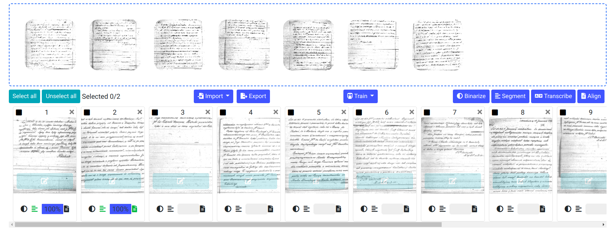
</figure>

Powyżej listy skanów widoczny jest pasek narzędzi. Pierwsze dwa przyciski na pasku pozwalają na zaznaczenie (wybranie) lub odznaczenie wszystkich skanów - operacje przetwarzania skanów przeprowadzane są tylko na zaznaczonych obrazach. Kolejne przyciski odpowiadają za import i eksport, trenowanie (możliwe jest trenowanie modelu segmentacji lub modelu transkrypcji), grupa przycisków z prawej strony pozwala na przetwarzanie skanów: binaryzację, segmentację, transkrypcję oraz automatycznie wyrównanie (Align) ze wskazanym tekstem (np. transkrypcją manualną).

<figure>
  
</figure>

Każdy obraz/skan wyświetlany w formie miniatury posiada zestaw ikon/przycisków informujących o stanie danego skanu i pozwalających na wykonanie pewnych operacji na nim, na przykład pole wyboru w górnym lewym rogu miniatury zaznacza dany skan, mała ikonka z krzyżykiem (w górnym prawym rogu) umożliwia usunięcie skanu z dokumentu, zielone pole/przycisk na środku miniatury wyświetla skan w trybie edycji, ikony pod miniaturą informują czy dla skanu przeprowadzono jedną z operacji przetwarzania, wówczas przybierają kolor zielony. Np. okrągła czarno-biała ikona odpowiada za binaryzację, ikona ze schematycznymi liniami za segmentację, ikona będąca białym pustym prostokątem dotyczy transkrypcji zaś ikona wyglądająca jak symbol pliku/dokumentu odpowiada funkcji Align (automatycznemu wyrównaniu tekstu). Chwycenie i przemieszczenie całej miniatury pozwala natomiast zmienić kolejność skanów w dokumencie.

## Binaryzacja

Binaryzacja jest w obecnej wersji procedurą niezalecaną do przeprowadzania, dokumentacja systemu ostrzega że może to prowadzić nawet do pogorszenia jakości wyników.
<figure>
  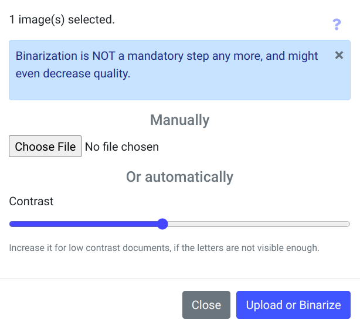
</figure>

## Segmentacja

Przed uruchomieniem automatycznej transkrypcji skanów (OCR/HTR) niezbędne jest prawidłowe podzielenie pisma lub druku na regiony i wiersze. Można to zrobić manualnie, jednak w przypadku większej kolekcji skanów byłby to zbyt czasochłonne. eScriptorium posiada mechanizm automatycznej segmentacji wykorzystujący model uczenia głębokiego. Aby go uruchomić należy najpierw zaznaczyć jeden lub więcej skanów/obrazów na liście a następnie kliknąć przycisk 'Segment' na pasku narzędzi. Wyświetlone zostanie okno z opcjami segmentacji, w którym należy wybrać model, zakres pracy, układ elementów na stronie itp.
<figure>
  
</figure>

W obecnej wersji dostępny jest jeden domyślny model: blla.mlmodel, dający skądinąd bardzo dobre rezultaty. Domyślnie segmentacja wyznacza linie bazowe, maski linii (wielokąty)  i regiony ('Lines and regions'), można zmienić zakres zadania segmentacji rozwijając listę poniżej pola z nazwą modelu.
Pojawią się wówczas opcje: 'Lines Baselines and mask' (wyznaczanie tylko linii i masek linii),
'only line Mask' - tylko maski wierszy (ta funkcja przelicza od nowa kształt masek - wielokątów i nie wykorzystuje modelu), 'Regions' - wyznaczanie regionów, bez modyfikacji linii bazowych i masek linii.

Trzecie z pól okna parametrów segmentacji określa układ tekstu na stronach, domyślnie wybrany jest 'Horizontal l2r', dostępne są także 'Horizontal r2l', 'Vertical l2r' oraz 'Vertical r2l'. Pole wyboru 'Override' u dołu okna oznacza, że istniejąca wcześniej segmentacja dla przetwarzanych skanów zostanie usunięta, usunięta zostanie także transkrypcja.

Procedura segmentacji może być czasochłonna, w jej trakcie aplikacja wyświetla dyskretną animację dla przetwarzanych obrazów - na zaznaczonych do przetworzenia skanach (poniżej miniaturki skanu) mruga mała ikonka z liniami (ikona segmentacji skanu). Wyświetlany jest także żółty przycisk na tle miniatury skanu, pozwalający na rezygnację z przeprowadzanej właśnie segmentacji. Po zakończeniu procedury wyświetlane jest powiadomienie w górnym prawym roku ekranu, a wspomniana ikona przybiera kolor zielony. Pełni ona jednocześnie rolę przycisku - można uruchomić segmentację klikając właśnie tą małą ikonkę pod miniaturą.

Uwaga: w przypadku importu skanów i transkrypcji z programu Transkribus w zalecanym formacie PAGE XML, zalecane jest przeprowadzenie segmentacji, ale tylko z użyciem opcji 'only line Mask'.

### Okno edycji skanu, segmentacji, transkrypcji

Aby zobaczyć utworzoną przez model segmentację strony/skanu, należy wejść w edycję danej strony - po najechaniu kursorem myszy na miniaturkę skanu wyświetli się pasek z białą ikoną symbolizującą edycję, oraz dymek z podpowiedzią 'Edit', kliknięcie w pasek otworzy skan w trybie edycji. Alternatywnie, jedna z zakładek w dokumencie to zakładka 'Edit', która uruchamia tryb edycji dla pierwszego skanu z dokumentu, tryb edycji posiada możliwość nawigacji do kolejnego/poprzedniego skanu, przesuwając się w lewo/prawo można odnaleźć właściwy skan.

Okno edycji skanu może wyświetlać od 1 do 5 paneli. Panele mogą być włączane i wyłączane poprzez ikony w górnym prawym rogu okna.
<figure>
  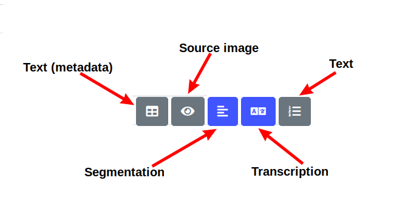
</figure>

- 'Text'(?)-  Metadane strony/skanu, gdzie można zapisać tytuł strony, komentarz oraz metadane w formie par klucz - wartość.
<figure>
  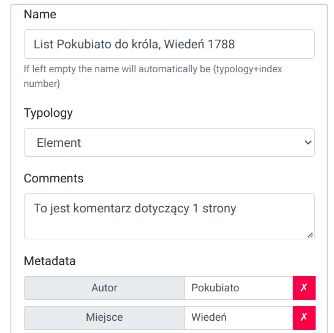
</figure>
- 'Source Image' - Oryginalny obraz/skan. Ikony w pasku narzędzi panelu pozwalają na obracanie obrazu (o 90 stopni w lewo/prawo), oraz na pobranie pliku z obrazem.
<figure>
  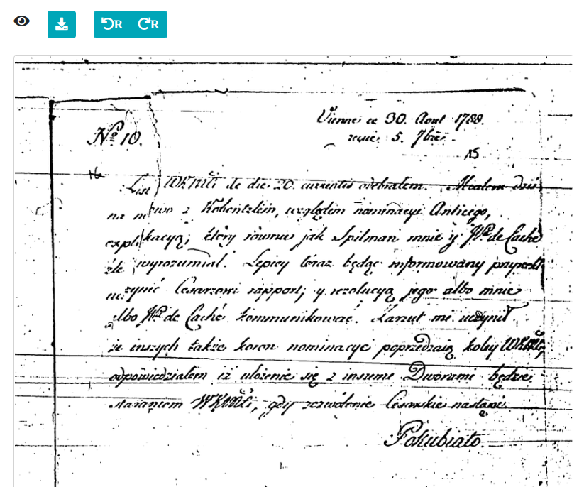
</figure>
- 'Segmentation' - Segmentacja, gdzie widoczna jest manualna lub automatyczna segmentacja: linie bazowe, maski linii i regiony. Ikony w panelu obrazu to narzędzia umożliwiające edycję segmentacji, zakrzywione strzałki cofają lub ponawiają operacje edycji, rozwijana ikona 'Editor settigns' wyświetla kolory przypisane do typów regionów czy linii. Zielona ikona z 4 białymi kwadratami włącza/wyłącza tryb regionów (klawisz skrótu R), ikona ze strzałką w dół i cyframi wyświetla kolejność linii (klawisz L), ikona z symbolem maski - włącza wyświetlanie kształtu maski (klawisz M). Żółta ikona z symbolem nożyc to narzędzie cięcia, które umożliwia np. przycinanie linii bazowych.
<figure>
  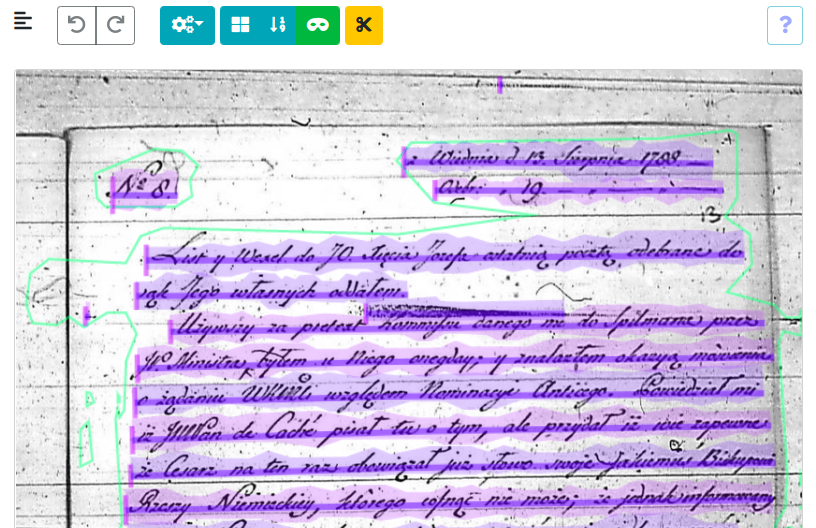
</figure>
- 'Transcription' - Transkrypcja, po przeprowadzaniu automatycznej transkrypcji panel ten wyświetla jej wyniki w graficznej formie, opcjonalne może też wyświetlać 'confidence visualizations' - jeżeli zostało to włączone w parametrach dokumentu (zakładka Description), poprzez kolorowanie wierszy od pomarańczowego poprzez żółty do odcieni zieleni - im większa pewność transkrypcji tym bliżej do soczystej zieleni. Kontrolka z suwakiem pozwala regulować czułość stopnia pewności.
<figure>
  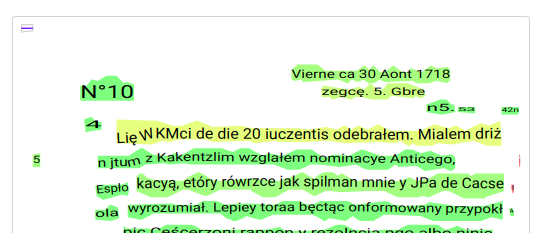
</figure>
- 'Text' - Tekst transkrypcji manualnej lub automatycznych (jeżeli dany skan był już rozpoznawany przez model/modele), u góry okna można wybrać z listy rozwijanej, która transkrypcja ma być wyświetlana. Ikona z białymi trójkątami w pasku narzędzi panelu pozwala na włączenie trybu sortowania wierszy. Jeżeli w zakładce 'Ontology' dokumentu zdefiniowano adnotacje dla tekstu, w pasku narzędzi będą one widoczne w formie przycisków włączania/wyłączania.
<figure>
  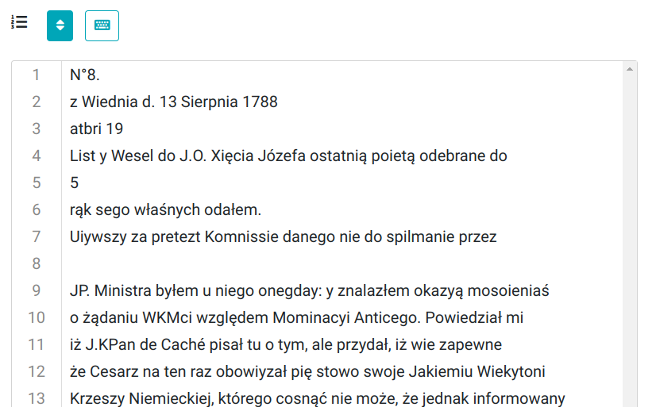
</figure>

### Weryfikacja i korekta segmentacji

Aczkolwiek możliwe jest korygowanie zarówno linii bazowych jak i masek linii, ręczna
korekta masek nie jest zalecana, raczej należy starać się poprawiać długość i kształt linii bazowych, zaś maski linii są wówczas (zwykle z 1-2 sekundowych opóźnieniem) automatycznie dostosowywane przez aplikację.

<figure>
  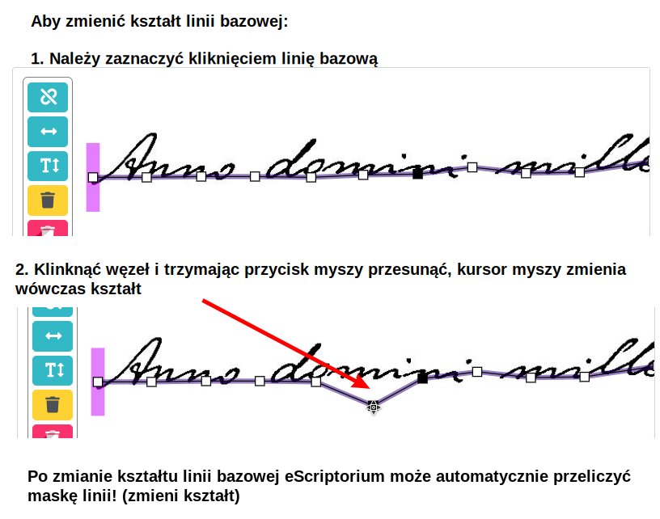
</figure>

W przypadku problemów z zaznaczeniem właściwego węzła, można skorzystać z tzw. **lassa**,
czyli z wciśniętym klawiszem Shift i lewym przyciskiem myszy zaznaczyć obszar z interesującym nas węzłem. Zaznaczony węzeł zmieni kolor na czarny i można go przesunąć, kursor myszy ustawiony nad takim węzłem zmienia kształt na 'łapkę'.
<figure>
  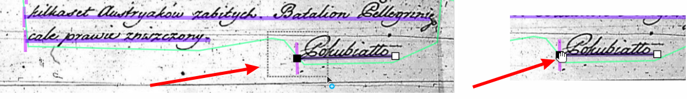
</figure>

Jeżeli jednak zaistnieje potrzeba modyfikacji maski linii, należy zwrócić uwagę że edycja maski działa nieco inaczej, po włączeniu widoczności masek linii, zaznaczeniu linii do modyfikacji należy kliknąć nie tyle w węzeł maski co w jego pobliże a przesuwając kursor myszy zobaczymy, iż podąża za nim węzeł maski linii.
<figure>
  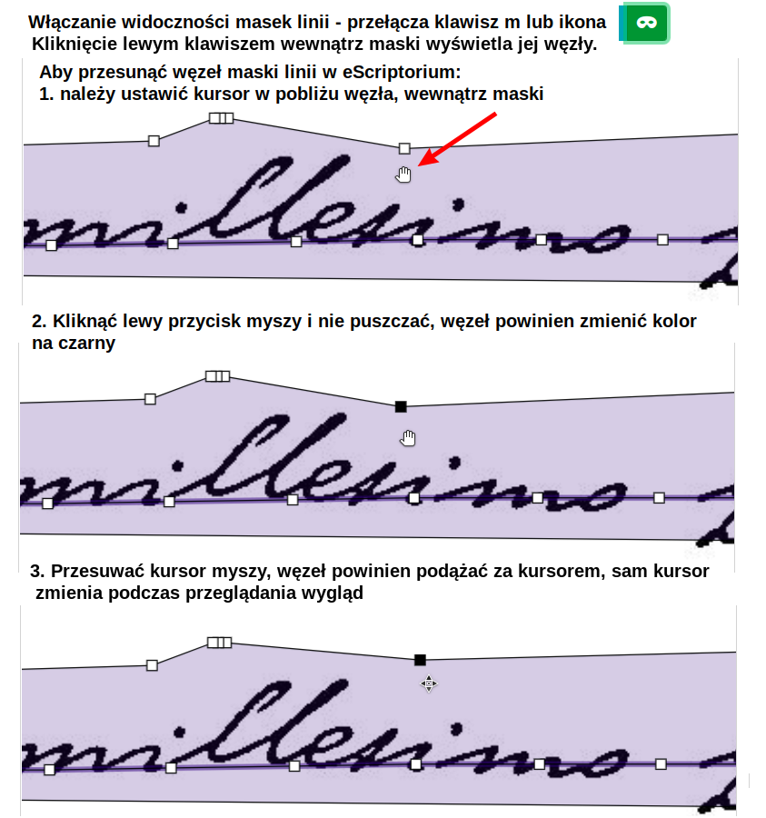
</figure>

Przydatnym narzędziem podczas modyfikowania segmentacji jest  narzędzie cięcia 'Cut through lines' (ikona z symbolem nożyczek na żółtym tle), Po włączeniu (kolor ikony zmienia się na zielony) pozwala zaznaczyć prostokątny obszar, który przycina części linii (lub całe linie).
<figure>
  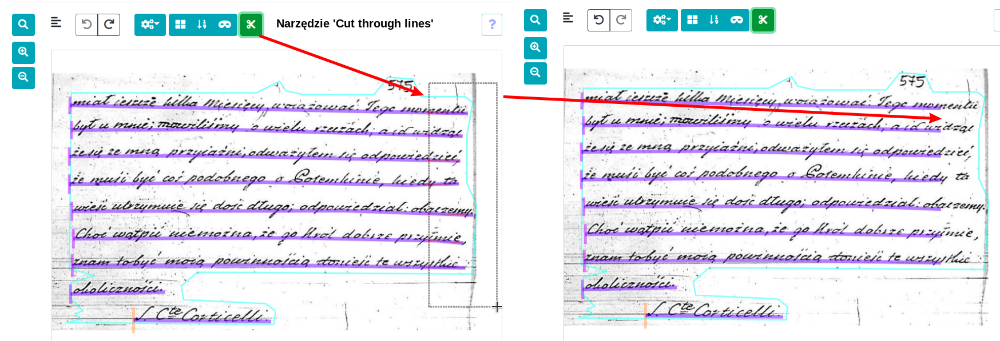
</figure>

## Definiowanie tagów dla skanów - elementów dokumentu

W zakładce Ontology dokumentu można zdefiniować tagi opisujące elementy obrazu  - typy regionów i linii, a także adnotacje dla obrazu i adnotacje tekstowe. Aplikacja proponuje kilka standardowych typów regionów ('Main', 'Title'), można jednak dodać własne typy. Tylko typy z zaznaczonymi polami wyboru będą widoczne podczas edycji obrazu. Podobnie w przypadku typów linii, dostępnych jest parę standardowych ('Numbering', 'Signature') a korzystając z pola edycyjnego u dołu sekcji 'Line types' i zielonej ikony z plusem można dodawać własne typy linii. Znów tylko zaznaczone typy będą widoczne podczas pracy w edytorze obrazu.
<figure>
  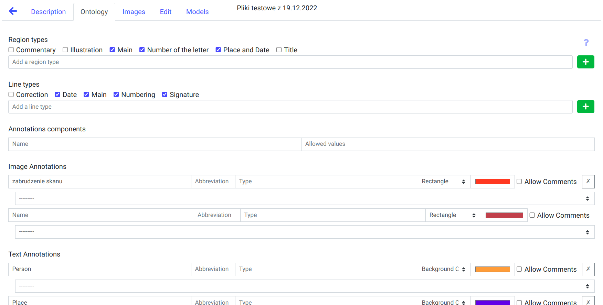
</figure>

W dalszej części okna 'Ontology' można stworzyć definicje adnotacji zarówno dla obrazu jak i dla tekstu. Podczas definiowania ustalany jest kolor wyróżniający poszczególne adnotacje, a także czy możliwe będzie dodawanie komentarzy użytkownika do adnotacji.

### Przypisywane typów do elementów segmentacji

Aby przypisać typ do regionu lub linii należy najpierw zaznaczyć wybrany element. Np. pracując w zakładce Images z konkretnym skanem rękopisu należy wyświetlić panel 'Segmentation', w nim włączyć tryb operacji na regionach (zielona ikona z 4 kwadracikami, nad skanem) następnie kliknąć na wybrany region. W górnym lewym roku obrazy wyświetli się wówczas pasek narzędzi w którym widoczne będą 2 ikony, czerwona oznaczająca usuwanie regionu, oraz zielona z literą T, która pozwala na przypisanie typu do regionu z listy. Po wybraniu typu regionu aplikacja przypisze temu regionowi kolor związany z danym typem.
<figure>
  
</figure>

Oprócz wyróżnienia kolorem typ regionu będzie od tej pory widoczny w górnym prawym roku ekranu w momencie przesuwania kursora myszy nad danym regionem.
<figure>
  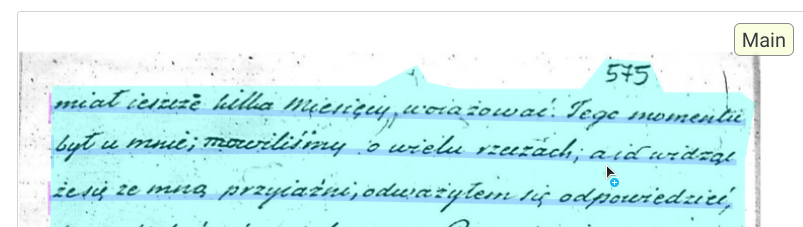
</figure>

W trybie pracy z liniami bazowymi (wyłączony tryb regionów, włączone linie bazowe - z maskami lub bez) można przypisywać typy do linii. Na przykład po zaznaczeniu linii z podpisem ('Corticelli' na poniższym obrazie) wyświetlany jest, podobnie jka dla regionów, pasek narzędzi
z ikoną ustawiania typu linii (zielona ikona z literą T). Po wybraniu typu linii 'Signature' będzie ona przypisana do danej linii (lub kilku jeżeli zaznaczono więcej niż jedną). Kolorem związanym z typem linii będzie od tej pory rysowana pionowa (zwykle) kreska oznaczająca początek linii i jej wysokość.
<figure>
  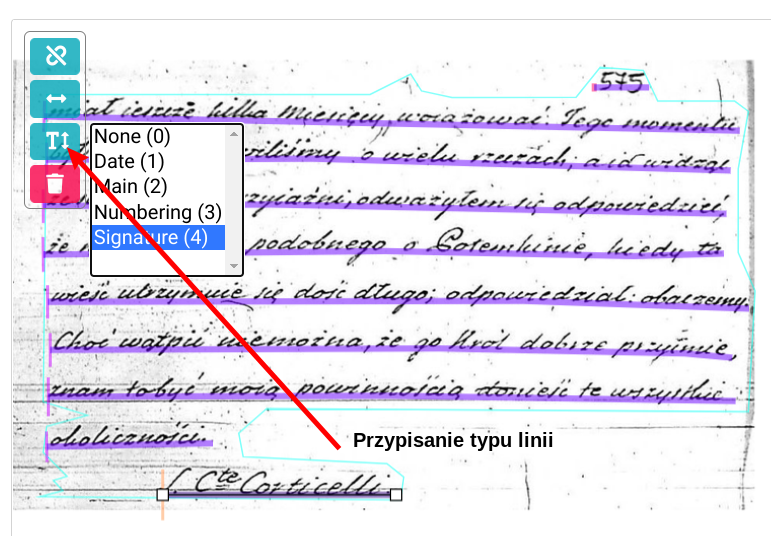
</figure>

Podobnie jak w przypadku regionów, typ linii będzie widoczny w górnym prawym roku obrazu/skanu w momencie przesuwania kursora myszy nad daną
linią.
<figure>
  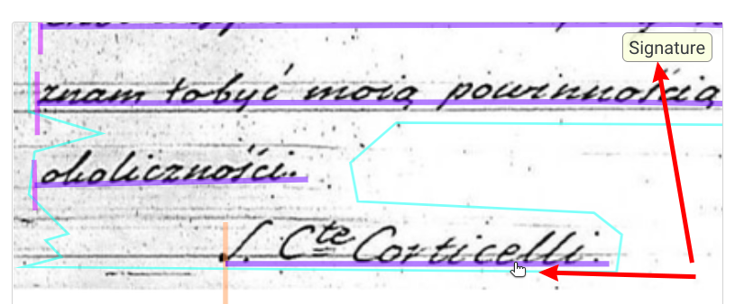
</figure>

### Przypisywanie tagów do fragmentów tekstu

Podczas pracy w panelu 4 - 'Text' możliwe jest adnotowanie fragmentów tekstu transkrypcji zdefiniowanymi wcześniej w zakładce 'Ontology' dokumentu tagami. Jeżeli tagi zostały zdefiniowane zmienia się wygląd paska narzędzi nad polem tekstowym, pojawiają się przyciski przełączania odpowiadające tagom. Włączenie takiego przycisku pozwala na zaznaczenie wybranego tekstu, po czym pojawia się okienko dialogowe pozwalające na wprowadzenie komentarza (jeżeli tak zdefiniowano w definicji tagu) i zapisanie zmian.
<figure>
  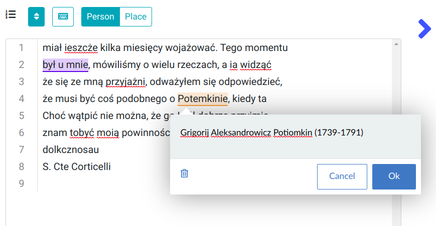
</figure>

Otagowany tekst będzie oznaczony kolorem wybranym podczas definiowania danego tagu.
<figure>
  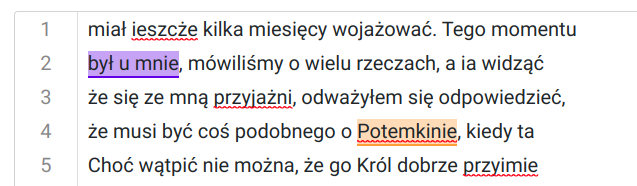
</figure>

**Uwaga:** w obecnej wersji nie zauważyłem możliwości wykorzystania otagowanego tekstu - tagi nie są eksportowane, ani w formacie TXT, ani XML.

### Przypisywanie tagów do fragmentów obrazu

Adnotacji podlegać mogą też fragmenty obrazów/skanów. Należy wyświetlić panel 1 - 'Source image', jeżeli w zakładce 'Ontology' były zdefiniowane tagi do adnotacji, pojawią się one w formie przycisków przełączania. Po wybraniu jednego z nich można zaznaczyć fragment obrazu (zależnie od definicji, w formie prostokąta lub wielokąta) i opcjonalnie przypisać do niego komentarz, można w ten sposób oznaczyć fragmenty skanu nie będące częścią oryginalnego rękopisu, uszkodzenia mikrofilmu będącego źródłem obrazu a nie występujące na oryginalne dokumentu itp.
<figure>
  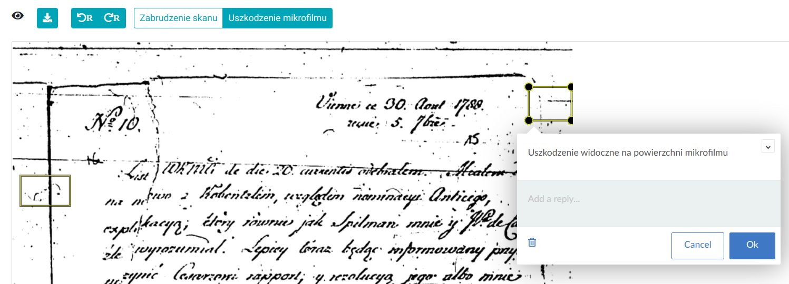
</figure>

## Wprowadzanie transkrypcji manualnej

eScriptorium może posłużyć jako środowisko przygotowania materiału treningowego (_ground truth_) do stworzenia nowego modelu. Wymaga to posiadania obrazów (skanów) rękopisów w dobrej jakości, oraz tekstów odczytanych z rękopisów przez ekspertów. Mając takie materiały można wczytać serię skanów do nowego dokumentu, następnie dla każdego ze skanów uzupełnić warstwę transkrypcji 'manual' - przygotowując odpowiednio dane tekstowe odpowiadające stronie skanu, z podziałem na wiersze zgodnym z podziałem w rękopisie. W trybie edycji dla obrazu należy wyświetlić panel 3 = 'Segmentation' oraz panel 4 - 'Text', w którym można wprowadzić tekst danej strony. Dla skanu rękopisu należy wcześniej przeprowadzić segmentację, tak by były wyznaczone regiony i linie tekstu oraz ich kolejność. Ważne jest uzgodnienie właściwego układu wierszy, tak by tekst wiersza w panelu Text odpowiadał właściwemu wierszowi rękopisu wyznaczonemu przez segmentację.

Kontrolę taką najwygodniej przeprowadzić włączając tryb przeglądania i edycji pojedynczych wierszy transkrypcji -> w panelu segmentacji należy kliknąć w dowolną linię, wyświetlony zostanie wówczas fragment skanu rękopisu z danym wierszem oraz edytowalne pole tekstowe.
<figure>
  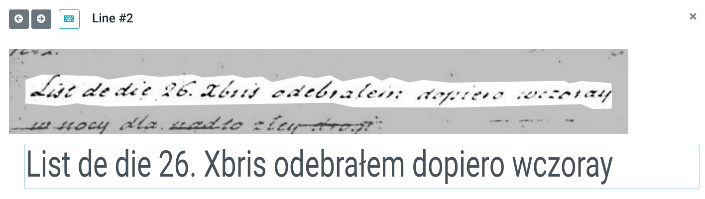
</figure>

Między kolejnymi wierszami w obrębie strony można przemieszczać się dzięki ikonom strzałek widocznym w górnej części okna. Jeżeli aktywnym elementem jest edycyjne pole tekstowe nawigację między poprzednią i kolejną stroną zapewniają też klawisze strzałek góra/dół, do kolejnego wiersza przenosi nas także klawisz Enter (który także wywołuje zapis zmian).

Okno pojedynczego wiersza transkrypcji zawiera dodatkowo informacje o ostatnim autorze i dacie zmian, oraz pozwala na wyświetlenie całej historii zmian danego wiersza, po kliknięciu na link 'Toggle history' (link pojawi się tylko wówczas gdy dana linia była modyfikowana). Po wyświetleniu historii zmian użytkownik może przywrócić jeden z poprzednich stanów wiersza za pomocą zielonych ikonek z prawej strony listy zmian.
<figure>
  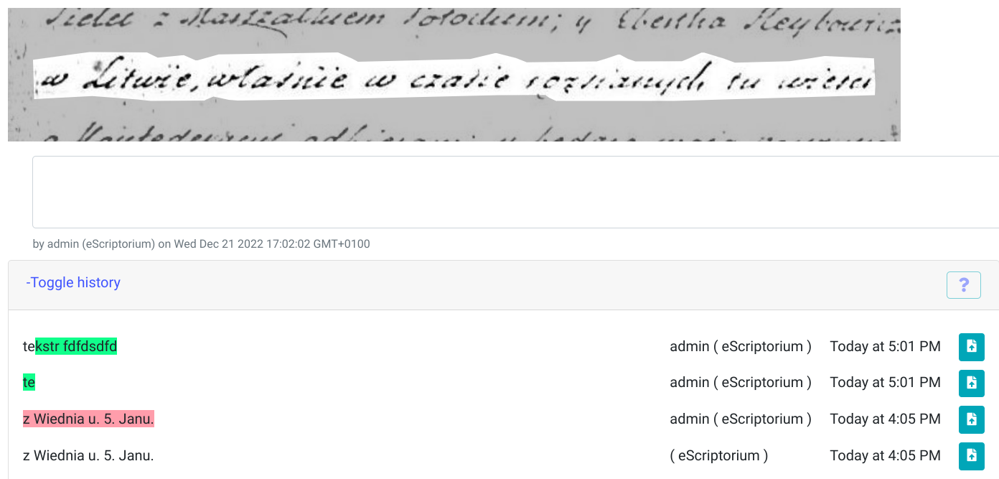
</figure>

### Wirtualna klawiatura

Aby ułatwić wprowadzanie znaków specjalnych w aplikacji wprowadzoną funkcję wirtualnej klawiatury,
którą można uruchomić podczas edycji wiersza transkrypcji (lub w panelu 'Text'). Klawiaturę taką włącza (i wyłącza) ikona z symbolem klawiatury, wyświetlane jest wówczas dodatkowe okienko gdzie widoczne są zdefiniowane znaki gotowe do wstawienia, można też zmienić definicję klawiatury na inną, dodać własną, zmodyfikować istniejącą.
<figure>
  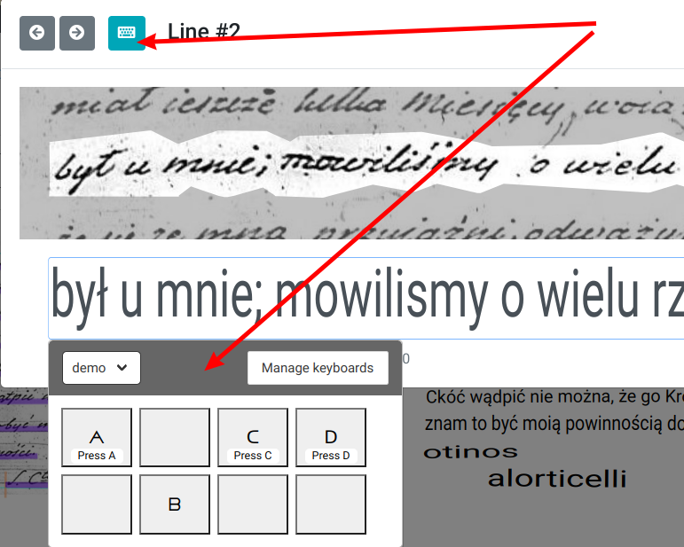
</figure>

### Kolejność wierszy

Kolejność wierszy wyznaczona automatycznie może być wyświetlona w panelu segmentacji przez ikonę ze strzałką w dół i cyframi 1-9.
<figure>
  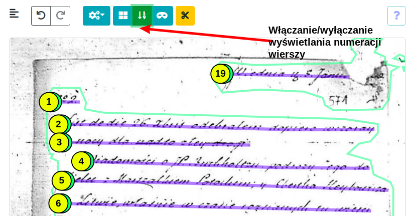
</figure>

Kolejność wierszy można modyfikować po włączeniu trybu sortowania ikoną ze strzałkami w panelu 4 - Text. Aplikacja umożliwia wówczas przesuwanie wierszy w panelu tekstowym za pomocą myszy. Należy zwrócić uwagę, że eScriptorium ma skłonność do automatycznego korygowania kolejności po dodaniu linii manualnie przez użytkownika, a przypadkowe dodanie linii zdarza się dość łatwo.
<figure>
  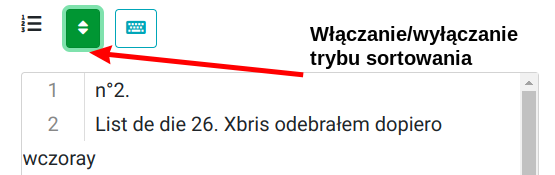
</figure>

## Modele, import modeli dostępnych publicznie

Po zainstalowaniu eScriptorium nie posiada żadnego domyślnego modelu OCR/HTR. Można na podstawie posiadanych materiałów (_ground truth_ - kolekcji obrazów i pasujących do nich w 100% zweryfikowanych tekstów) wytrenować własny. Kolekcje publicznie dostępnych materiałów na otwartych licencjach można znaleźć w katalogu [HTR-United](https://htr-united.github.io/), podobne kolekcje lecz głównie dla materiałów OCR zebrane zostały na stronie [OCR and Ground Truth Resources](https://cneud.github.io/ocr-gt/).

Istnieje jednakże kolekcja gotowych wytrenowanych modeli przechowywanych w serwisie [zenodo.org](https://zenodo.org/communities/ocr_models?page=1&size=20). Obecnie dostępnych jest kilkanaście modeli, od łacińskiego i francuskiego pisma średniowiecznego VIII-XV w., poprzez modele wytrenowane na rękopisach francuskich z XVIII-XX wieku, do modeli dla rękopisów arabskich, hebrajskich czy wietnamskich. Wśród modeli znajdują się też modele OCR dla starych druków perskich czy otomańskich. Wszystkie dostępne są bezpłatnie, zwykle na licencji Creative Commons Attribution 4.0 International. Można oczywiście także udostępnić w tym katalogu swój model, jeżeli tylko będzie on przydatny dla innych użytkowników.

Każdy model w kolekcji posiada swoją podstronę, często z informacjami na temat zbioru rękopisów na bazie których został wytrenowany. Np. model 'HTR-United - Manu McFrench V1 (Manuscripts of Modern and Contemporaneous French)' (https://zenodo.org/record/6657809#.Y6LfDtLMJKs) został przygotowany na podstawie francuskiej kolekcji z lat XVII-XXI wieku ze wspomnianego wyżej zbioru HTR-United, z dodatkiem małej próbki hiszpańskich listów z XIX wieku i XX wiecznych rękopisów angielskich.

Modele przechowywane są w plikach binarnych z rozszerzeniem *.mlmodel (format wprowadzony przez Apple w ramach frameworku CoreML, do integracji metod uczenia maszynowego w aplikacjach, zob. https://apple.github.io/coremltools/mlmodel/index.html) i można je pobrać z sekcji 'Files' podstrony danego modelu. Wielkość modelu to zazwyczaj od kilkunastu do parudziesięciu megabajtów. Po pobraniu na dysk lokalny można taki model zaimportować do eScriptorium, korzystając z funkcji 'Upload a model' w oknie z listą modeli widoczną po przejściu do menu 'My Models' u góry ekranu aplikacji.

W przypadku bezpośredniego korzystania z programu Kraken posiada on wbudowaną obsługę pobierania modeli z repozytorium zenodo, służą do tego polecenia `kraken list`, `kraken show` i `kraken get`, opisane w dokumentacji w sekcji [Model Repository](https://kraken.re/master/advanced.html#querying-and-model-retrieval).

### Menu My Models

W głównym menu aplikacji (górny prawy róg okna), menu 'My Models' otwiera okno z listą modeli dostępnych dla użytkownika (zaimportowanych, wytrenowanych przez użytkownika lub udostępnionych użytkownikowi). Duży zielony przycisk 'Upload a model' służy właśnie do zaimportowania modelu pobranego np. z serwisu zenodo.org (plik w formacie *.mlmodel). **Uwaga:** aplikacja domyślnie proponuje nazwę modelu zgodną z nazwą pliku, można ją zmodyfikować, ale po zatwierdzeniu importu (w obecnej wersji eScriptorium) nie można już jej zmienić.

Lista modeli wyświetla podstawowe informacje o każdym z nich: typie (model może służyć do transkrypcji 'Recognize', lub segmentacji 'Segmentation'), wielkości w megabajtach, czy jest to model już wytrenowany (czy trwa trenowanie), jaka jest jego najlepsza dokładność ('Accuracy'). W przypadku modeli trenowanych w danej instancji eScriptorium widoczna jest także liczba błędych/wszystkich znaków określona podczas walidacji po trenowaniu. Ostatnia kolumna informuje czy jest to model będący 'własnością' bieżącego użytkownika ('Owner') czy też został mu udostępniony ('User', 'Public'). Za kolumnami z informacjami znajdują się ikony narzędzi, których liczba zależy właśnie od tego czy jest to 'nasz' model i czy był trenowany w eScriptorium:

- zielona ikona z symbolem pliku pozwala na pobranie modelu na dysk lokalny (plik *.mlmodel)
- niebieska ikona z zakrzywioną strzałką pozwala na udostępnienie 'naszego' modelu innym użytkownikom
- czerwona ikona z koszem na śmieci pozwala na usunięcie modelu - ale nie modelu udostępnionego
- ikona w niebieskim-morskim kolorze umożliwia - tylko dla modeli trenowanych w danej instancji eSCriptorium - na przełączenie na inną wersję modelu (jedną z wersji pośrednich stworzonych podczas uczenia)

### Zakładka Models w dokumencie

Zakładka 'Models' w dokumencie wyświetla podobną listę do tej z menu 'My Models'. Są tam jednak widoczne tylko modele związane z bieżącym dokumentem. Np. użyte do transkrypcji automatycznej, czy wytrenowane na bazie plików z dokumentu. W tym oknie nie można usuwać modeli, widoczna jest jednak żółta ikona z symbolem kosza na śmieci - to narzędzie powoduje jedynie usunięcie modelu z listy modeli dokumentu.
<figure>
  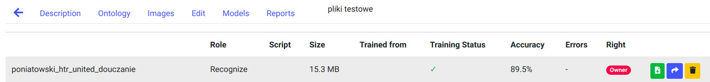
</figure>

## Transkrypcja automatyczna

Po zaimportowaniu plików z obrazami (skanami), wykonaniu segmentacji, zweryfikowaniu segmentacji i zakładając że istnieje model (zaimportowany lub wytrenowany) pasujący do rękopisów w obrazach, można przystąpić do wykorzystania jednej z najważniejszych funkcji eScriptorium czyli automatycznej transkrypcji. Aplikacja wykorzystuje w tym celu program Kraken. Do przeprowadzenia transkrypcji należy uprzednio zaznaczyć choć jeden obraz z listy obrazów bieżącego dokumentu. Przycisk 'Transcribe' w pasku narzędzi uruchamia procedurę wyświetlając okno dialogowe z parametrami transkrypcji - właściwie jednym parametrem, należy bowiem wybrać jeden z listy dostępnych modeli.
<figure>
  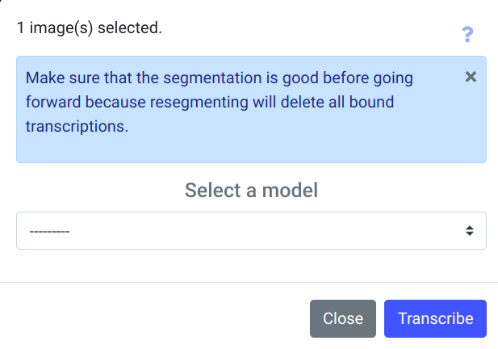
</figure>

Proces transkrypcji, zależnie od zakresu (jeden czy kilkaset obrazów) może zająć dłuższą chwilę i odbywa się w tle, na serwerze z eScritptorium. Po zakończeniu transkrypcji aplikacja wyświetla odpowiednie powiadomienie w górnym prawym rogu ekranu.
Aby ocenić jakość transkrypcji należy wówczas wejść w tryb edycji obrazu (poprzez ikonę na tle miniatury skanu) lub wejść w zakładkę Edit w oknie dokumentu. Nowa transkrypcja będzie widoczna w panelu 3 - Transciption oraz jako tekst w panelu 4 - Text.
W górnym prawym rogu ekranu, powyżej ikon włączających/wyłączających panele widoczna jest lista transkrypcji, jeżeli domyślnie wyświetlona została inna, można tu odnaleźć i ustawić nowo przygotowaną transkrypcję.
<figure>
  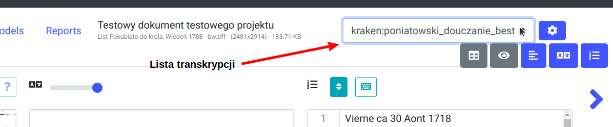
</figure>

## Automatic alignment - funkcja wyrównywania tekstu

Funkcja Align jest nowością wprowadzoną w wersji 0.13 eScriptorium, mechanizm ten jest jeszcze dopracowywany, dlatego należy traktować go jako wersję beta. Wykorzystuje program PASSIM Davida Smitha do porównywania dostarczonego pliku txt z wybraną warstwą OCR/HTR. Na podstawie podziału na strony i podziału na linie w warstwie OCR funkcja ta jest w stanie dopasować plik txt do skanów/obrazów, podzielić na wiersze zgodnie z podziałem w rękopisie i zapisać wynik jako kolejną warstwę OCR. Mając wystarczająco dobre wyniki OCR/HTR można w ten sposób wykorzystać je do wczytania jako warstwy np. tekstu z opracowania krytycznego danego rękopisu, nawet gdy tekst ten nie zachowuje oryginalnego układu z rękopisu.
<figure>
  
</figure>

Przed uruchomieniem funkcji należy przede wszystkim zaznaczyć 1 lub więcej skanów, które będą podlegały przetwarzaniu, w innym przypadku kliknięcie przycisku 'Align' na pasku narzędzi wywoła przypominający o tym komunikat. Okno parametrów funkcji 'Align' jest jednym z bardziej rozbudowanych w aplikacji eScriptorium. Należy w nim wskazać warstwę transkrypcji, z którą będzie porównywany plik tekstowy, wskazać lokalny plik tekstowy (lub wybrać z listy jeżeli był już użyty - eScriptorium zapamiętuje pliki). W sekcji 'Settings' okna należy wprowadzić nazwę nowej warstwy, parametr 'Use full transcribed document' określa czy porównywana będzie cała zawartość warstwy transkrypcji, czy każda strona osobo. Można też wskazać jakie typy regionów skanu będą brane pod uwagę (domyślnie wszystkie). Domyślnie odznaczona jest opcja 'Merge aligned text with existing transcription', która powoduje uzupełnienie wynikowej warstwy tekstem wskazanej warstwy transkrypcji gdy system nie zdoła dopasować odpowiednich fragmentów (jeżeli opcja nie jest użyta takie niedopasowane wiersze tekstu będą puste). Możliwe jest ograniczenie analizy do wskazanych typów regionów - domyślnie wybrane są wszystkie. Okno posiada jeszcze grupę parametrów ukrytych - zaawansowanych: kliknięcie 'Show/hide advanced settigns' wyświetla blok technicznych parametrów funkcji Align, ich krótki opis znajduje się w tym samym oknie poniżej każdego z nich, dodatkowych informacji należy szukać w dokumentacji programu Passim (https://github.com/dasmiq/passim).
<figure>
  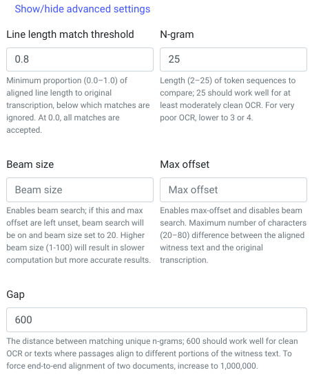
</figure>

Warto zauważyć, że 'wyrównywany' tekst np. z edycji krytycznej może nie tylko nie zachowywać podziału na strony i wiersze, ale również zawierać więcej tekstu niż poddane przetwarzaniu skany. Np. przy przetwarzaniu skanu z listem Corticellego poddanego transkrypcji modelem o 89% dokładności i 'wyrównywanego' z tekstem przygotowanym manualnie przez ekspertów zawierającym treść wielu listów, funkcja _Align_ dopasowała praktycznie idealnie właściwy fragment, podzieliła go też poprawnie na wiersze.
<figure>
  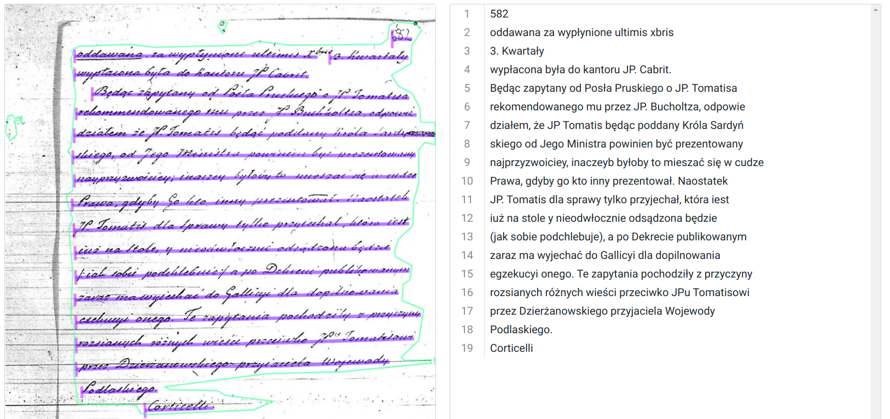
</figure>

**Uwaga:** ponieważ jest to funkcjonalność w fazie 'beta' nie jest dostępna automatycznie, aby funkcja Align była widoczna i działała poprawnie należy ustawić zmienną środowiskową `TEXT_ALIGNMENT=True` oraz uruchomić dodatkowy kontener dockera: celery-jvm.

## Trenowanie własnego modelu w eScriptorium

eScriptorium zintegrowane jest z programem Kraken i pozwala nie tylko na rozpoznawanie pisma przygotowanymi wcześniej modelami, ale także na utworzenie całkowicie nowego modelu, lub douczenie (fine tuning) istniejącego. Proces trenowania można uruchomić w oknie dokumentu, w zakładce edycji. Jeden z widocznych w pasku narzędzi przycisków - 'Train', uruchamia trenowanie modelu segmentacji, lub - co jest częściej wykorzystywane - modelu transkrypcji. Pierwszym krokiem jest zaznaczenie co najmniej jednego skanu. Wybór narzędzia
Train -> Recognizer wyświetla okno parametrów trenowania modelu transkrypcji.

<figure>
  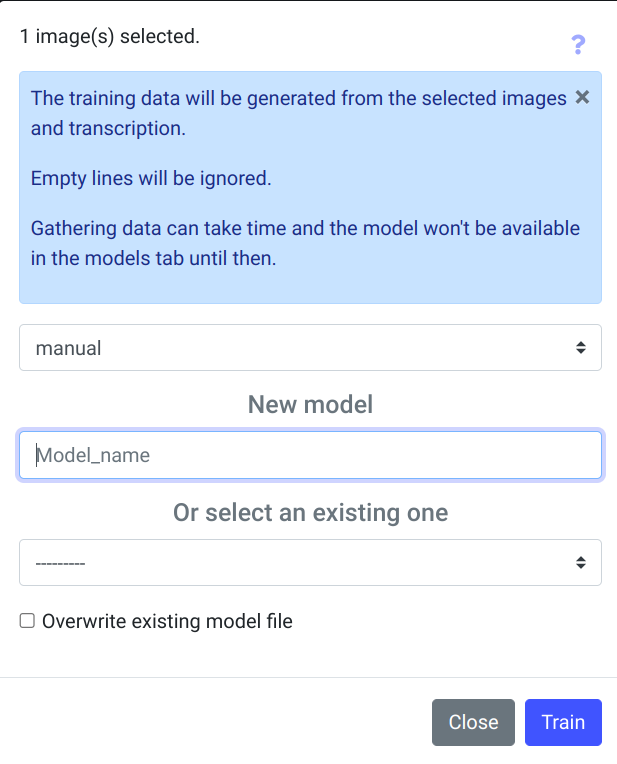
</figure>

Należy w nim wskazać warstwę transkrypcji, która będzie użyta w procesie uczenia,
model bazowy (jeżeli chcemy oprzeć się na istniejącym modelu, który będzie douczany) oraz nazwę wynikowego modelu. Trenowanie z poziomu eScriptorium nie pozwala na ustawienie bardziej zaawansowanych opcji uczenia, które są dostępne podczas trenowania bezpośrednio w aplikacji Kraken.

## Trenowanie modelu bezpośrednio w Krakenie

Oprócz trenowania modelu z poziomu eScriptorium możliwe jest uruchomienie tego procesu z bezpośrednim użyciem programu Kraken z linii komend. Trzeba jednak pamiętać, że Kraken działa na systemach Linux i MacOS (na procesorach x64 i ARM, aczkolwiek w przypadku nowych komputerów Apple z procesorami M1 czyli z architekturą ARM Kraken nie umie na razie wykorzystać ich procesora graficznego), w przypadku systemu Windows można ewentualnie wypróbować WSL - Windows Subsystem for Linux.

Kraken jest aplikacją napisaną w języku Python i potrzebuje do działania zainstalowanej wersji 3 tego interpretera (najlepiej 3.8 lub nowszą). Instalacja opisana została na stronie programu: https://kraken.re/master/index.html

Po zainstalowaniu użytkownik dysponuje poleceniami: `kraken` i `ketos` do rozpoznawania OCR/HTR i trenowania modeli.

Dane do uczenia można pobrać z eScriptorium (skany oraz pliki XML), mogą też pochodzić z Transkribusa - w tym przypadku zalecany format to PAGE XML a przed trenowaniem zalecane jest przetworzenie segmentacji w eScriptorium (opcja Segmentation steps = 'Only Line Mask')

Aby nieco przyspieszyć proces uczenia z plików xml i skanów można przygotować tzw. binarny dataset poleceniem `ketos compile` (parametr `--random-split` decyduje o losowym podziale próbki - 80% uczenie, 10% walidacja podczas uczenia, 10% test; parametr `-f page` informuje o formacie plików wejściowych: PAGE XML; parametr `--workers` określa ile wątków - rdzeni CPU może być zajęte przez proces kompilacji, praca wielowątkowa znacznie przyspiesza przetwarzanie):

    ketos compile --workers 3 --random-split 0.8 0.1 0.1 -f page -o name_dataset.arrow *.xml

zakładając, że polecenie uruchamiane jest w katalogu z plikami xml i skanami.

Przygotowany w ten sposób plik *.arrow posłuży np. do douczania (fine tuning - https://kraken.re/4.2.0/ketos.html#fine-tuning) istniejącego modelu (parametr `-i` wskazuje nazwę pliku z modelem bazowym, bez podania tego parametru kraken będzie trenował model od podstaw; parametr `--resize` jest istotny w przypadku różnicy alfabetu między modelem bazowym a danymi treningowymi, informuje Krakena co zrobić w przypadku napotkania nieznanych znaków w materiale treningowym):

    ketos train -i base_model.mlmodel --resize add --workers 3 --output new_model_name -f binary name_dataset.arrow

<figure>
  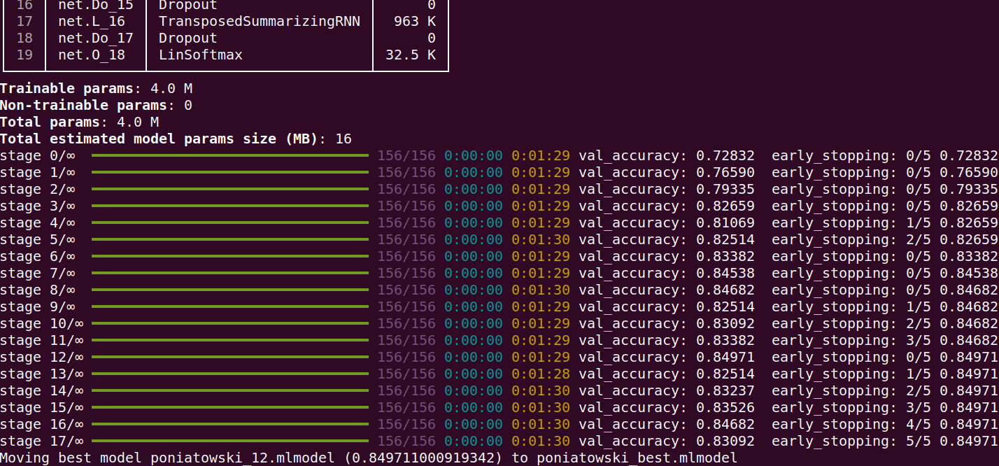
</figure>

Na ekranie powyżej widoczne są kolejne iteracje - epoki treningowe (_epoka_ to pełne przetworzenie treningowego zbioru danych) wraz z walidacją po procesie uczenia, uczenie trwa dopóki wyniki się poprawiają, jeżeli 5 kolejnych epok (tym parametrem można sterować) nie przyniesie poprawy Kraken kończy procedurę uczenia zwracając najlepszy z dotychczasowych modeli.

Do przetestowania modelu można użyć polecenia: `ketos test`, podając jako parametry model do testów i dane trenowania np. w formie binarnego datasetu - pliku *.arrow utworzonego powyżej (taki zestaw danych zawiera zwykle zarówno dane treningowe, walidacyjne jak i dane testowe, nie używane podczas trenowania):

    ketos test -m name_model.mlmodel -f binary name_dataset.arrow

Przykładowy wynik:

    === report  ===
    84685     Characters
    1142      Errors
    98.65%    Accuracy``

Gdzie 'Accuracy' (dokładność) to wskaźnik mierzący jakość rozpoznania przez model - procent poprawnie rozpoznanych znaków. Ten sam wskaźnik jest podawany po każdej epoce trenowania modelu (val_accuracy)
podczas weryfikacji wyników na próbce walidacyjnej danych (tam w formie ułamka np. 0.83).

Szczegółowy opis procesu i parametrów trenowania znajduje się na stronie:
https://kraken.re/master/training.html

Model wytrenowany bezpośrednio w Krakenie (plik *.mlmodel) może zostać później zaimportowany do eScriptorium. Można też model dobrej jakości, który warto udostępnić publicznie, umieścić w repozytorium zenodo.org, Kraken umożliwia opublikowanie
modelu z poziomu linii komend poleceniem: `ketos publish`, procedura wymaga posiadania konta w serwisie zenodo i jest opisana na stronie: https://kraken.re/master/advanced.html

## Strategia trenowania modeli

Utworzenie i wytrenowanie nowego modelu od podstaw wymaga solidnej wielkości materiału treningowego a także sporej ilości czasu i mocy komputera do przeprowadzenia procesu uczenia. Typowe, dostępne publicznie modele pisma ręcznego zostały utworzone na podstawie kilkunastu do kilkudziesięciu tysięcy wierszy 'ground truth' (zob. [lectaurep](https://github.com/lectaurep/lectaurep_base_model)). Przygotowanie takiego materiału (o 100% poprawności zweryfikowanej przez ekspertów) jest najbardziej pracochłonnym etapem pracy nad modelem.

Proces uczenia może być łatwiejszy jeżeli posiadamy dostęp do modelu wytrenowanego na materiale zbliżonym do naszych rękopisów. Możliwe jest wówczas trenowanie na bazie istniejącego modelu, czyli wykorzystanie mechanizmu tzw. _transfer learning_ ('uczenie transferowe', zob. https://en.wikipedia.org/wiki/Transfer_learning), przy użyciu dużo mniejszej liczby wierszy _ground truth_ - np. od kilkuset do paru tysięcy. Douczanie (inaczej: dostrajanie) modelu jest (do pewnego stopnia) skuteczne także w przypadku różnic w alfabecie między modelem bazowym, a materiałem treningowym którym douczamy ten model, kiedy to w trakcie uczenia model musi 'poznać' zupełnie nowe znaki. Proces douczania - fine tuning - jest znacznie szybszy niż uczenie modelu od podstaw.
> "Korzystanie z wcześniej wytrenowanych modeli jest najważniejszą metodą, dzięki której możemy trenować kolejne, dokładniejsze modele, przy czym cała operacja odbywa się szybciej, z użyciem mniejszej ilości danych oraz w krótszym czasie, a także przy mniejszym poziomie kosztów"
>
> Jeremy Howard, Sylvain Gugger, _Deep Learning dla programistów_, 2021, str. 52

Jeżeli jednak nie istnieje żaden model, który mógłby pełnić rolę modelu bazowego dla przetwarzanych rękopisów, pozostaje ścieżka trenowania 'od zera'. Ponieważ praca bezpośrednio z Krakenem daje możliwości modyfikacji parametrów uczenia, czego nie można zrobić z poziomu eScriptorium, wydaje się że taki sposób trenowania jest lepszym podejściem. Wymaga to jednak opanowania obsługi Krakena z linii komend, czyli zapoznania się z dokumentacją polecenia [ketos train](https://kraken.re/master/ketos.html), czy zapoznania się z opisem [VGSL](https://kraken.re/master/vgsl.html#vgsl) dotyczącym architektury sieci neuronowych. Bardzo ciekawą lekturą będzie też dwuczęściowy artykuł opisujący doświadczenia podczas trenowania modelu opartego na francuskich rękopisach notarialnych z lat 1742-1928: [część 1](https://lectaurep.hypotheses.org/475), [część 2](https://lectaurep.hypotheses.org/488).

## Współpraca z innymi użytkownikami

Aplikacja posiada możliwość współdzielenia zarówno projektów jak i dokumentów czy modeli z innymi użytkownikami.

### Udostępnianie projektów

Aby udostępnić projekt innemu użytkownikowi należy w oknie projektu odnaleźć niebieską ikonę 'Share this Project' w górnym prawym rogu okna. Wyświetlone zostanie wówczas okno dialogowe, w którym należy wprowadzić login użytkownika, któremu chcemy udostępnić projekt. Po zatwierdzeniu system wyświetli powiadomienie o udanym udostępnieniu a docelowy użytkownik powinien zobaczyć projekt na swojej liście.
<figure>
  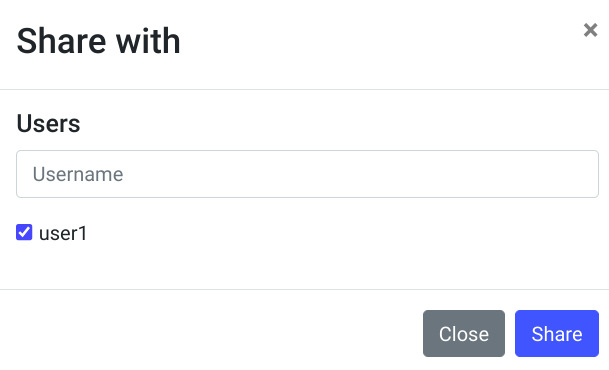
</figure>

Alternatywnie, jeżeli w naszej instancji eScriptorium utworzone zostały grupy użytkowników, zamiast udostępniać projekt pojedynczym osobom można udostępnić go całej grupie (tworzenie grup i przypisywanie użytkowników do grup jest dostępne w panelu administracyjnym aplikacji).

Użytkownik może zrezygnować z projektu który został mu udostępniony. Na liście projektów te stworzone przez inną osobę i udostępnione posiadają z prawej strony żółtą ikonę z czarnym symbolem koszta na śmieci ('Remove from list'). Użycie tego narzędzia nie spowoduje usunięcia projektu w ogóle, ale usunie jedynie projekt z naszej listy projektów.

### Udostępnianie dokumentu

Możliwe jest także udostępnienie konkretnego dokumentu. W oknie dokumentu (jeżeli aktywna jest zakładka Description!) w górnym prawym rogu ekranu widoczne są ikony dotyczące wykonywania operacji na bieżącym dokumencie. Jedną z nich jest ikona udostępniania dokumentu innym użytkownikom. Kliknięcie na nią wyświetla okno dialogowe udostępniania.
<figure>
  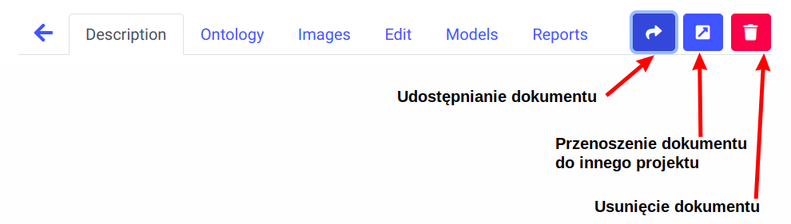
</figure>

W oknie tym należy wskazać grupy użytkowników lub konkretnych użytkowników, którzy mają mieć dostęp do naszego dokumentu.
<figure>
  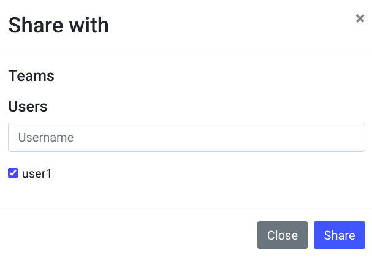
</figure>

### Przenoszenie dokumentu do innego projektu

Ciekawą opcją jest możliwość przeniesienia dokumentu do innego projektu. W górnym prawym rogu ekranu dokumentu (podczas pracy w zakładce Description), obok ikony uruchamiającej udostępnianie dokumentu widoczna jest ikona narzędzia przenoszenia dokumentu ('Migrate to another project'). W oknie dialogowym przenoszenia widoczne są dwa pola, w pierwszym polu z listą rozwijaną należy wskazać docelowy projekt, zaś widoczne poniżej pole wyboru decyduje o tym czy wraz z dokumentem przenieść jego tagi (chodzi o tagi przypisane na poziomie dokumentu narzędziem Assign Tag widocznym na liście dokumentów projektu - niebieska ikona z etykietami).
<figure>
  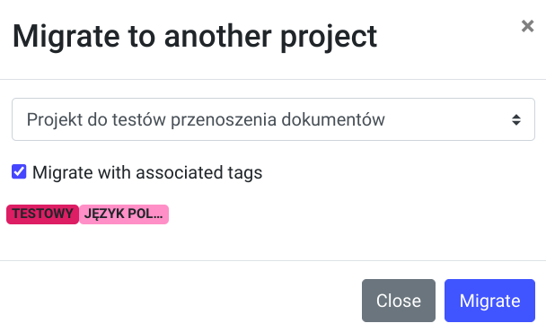
</figure>

Po potwierdzeniu przyciskiem 'Migrate' aplikacja wyświetli odpowiednie powiadomienie o skutecznym zakończeniu operacji a nasz dokument będzie o tej pory częścią innego projektu.

<figure>
  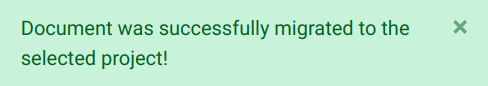
</figure>

### Eksport, udostępnienie i usunięcie modelu

Modele przechowywane w eScriptorium można wyeksportować, np. w celu umieszczenia w repozytorium zenodo.org lub użycia bezpośrednio w programie Kraken. Na liście modeli (menu 'My Models'), z prawej strony okna widoczne są kolorowe ikony pozwalające na eksport (pobranie) modelu - zielona ikona pliku ze strzałką w dół, usunięcie modelu - czerwona ikona z symbolem kosza, oraz udostępnienie modelu - niebieska ikona z zakrzywioną strzałką. Uwaga: usuwanie modelu następuje natychmiast, bez dodatkowego pytania, podobnie pobranie (eksport) modelu od razy uruchamia procedurę pobierania pliku *.mlmodel.
<figure>
  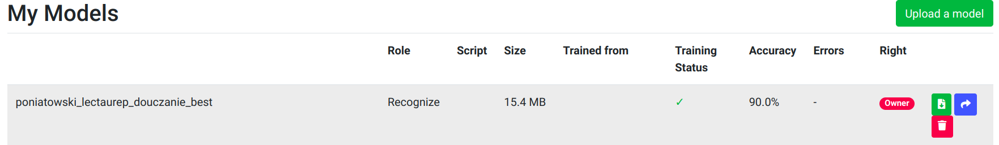
</figure>

Z kolei udostępnianie modelu wyświetla dodatkowe okno programu, w którym można zdecydować którym użytkownikom lub grupom użytkowników udostępniamy nasz model, można też udostępnienie dla danego użytkownika/grupy usunąć.
<figure>
  
</figure>

## Eksport transkrypcji

Przygotowane w eScriptorium transkrypcje skanów można zapisać w formie plików XML, w formatach ALTO lub PAGE, a także w postaci zwykłego pliku TXT. Eksport dostępny jest podczas pracy z dokumentem, w zakładce 'Images' po zaznaczeniu choć jednego skanu/obrazu. Przycisk 'Export' w pasku narzędzi (powyżej listy miniatur skanów) wyświetla okno dialogowe, w którym należy określić warstwę transkrypcji (skany mogły być rozpoznawane przez wiele modeli OCR/HTR), oczekiwany format danych (ALTO, PAGE. TXT), czy eksport ma zawierać oryginalne skany/obrazy. Po zatwierdzeniu okna system wygeneruje paczkę zip z plikami i wyświetli w górnym prawym roku ekranu powiadomienie. Powiadomienie będzie zawierało link do pobrania pliku zip z danymi. Jeżeli system został poprawnie skonfigurowany eScriptorium wyśle także użytkownikowi e-mail z informacją o przygotowaniu pliku zip i linkiem do pobrania (w przypadku większych kolekcji skanów, przygotowanie danych może zająć dłuższą chwilę).
<figure>
  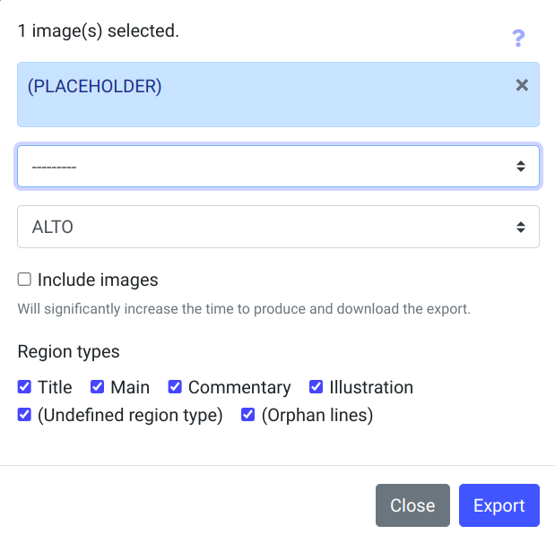
</figure>

## Raporty

Zarówno projekty jak i dokumenty posiadają zakładki 'Reports' z informacjami statystycznymi na temat zawartości projektu czy dokumentu. Dotyczą one np. liczby obrazów, liczby rozpoznanych regionów  i wierszy, liczby słów i znaków w transkrypcjach. Osobną część stanowi sekcja Vocabulary gdzie po odświeżeniu wyświetlana jest aktualna częstotliwość występowania poszczególnych znaków. W zakładce 'Reports' dla dokumentu podawana jest także przeciętna pewność transkrypcji.
<figure>
  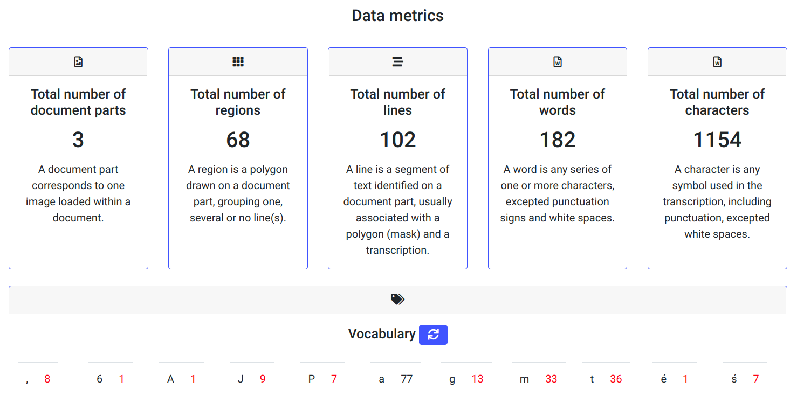
</figure>

## Administracja systemem eScriptorium

Administrator eScriptorium i każdy użytkownik o odpowiednich uprawnieniach ma dostęp do panelu administracyjnego systemu poprzez menu 'Hello {USER}' -> Site administration w górnym prawym rogu okna eScriptorium. Uruchomienie tej funkcji wyświetla typowy dla aplikacji stworzonych w technologii Django panel w którym można zarządzać użytkownikami systemu, ich uprawnieniami, tworzyć nowe konta, grupy użytkowników, tokeny do współpracy z eScriptorium przez API. Administrator z poziomu panelu może nadawać lub odbierać uprawnienia do modeli OCR/HTR a także do dokumentów ze skanami i transkrypcjami, może również usuwać dokumenty i projekty.
<figure>
  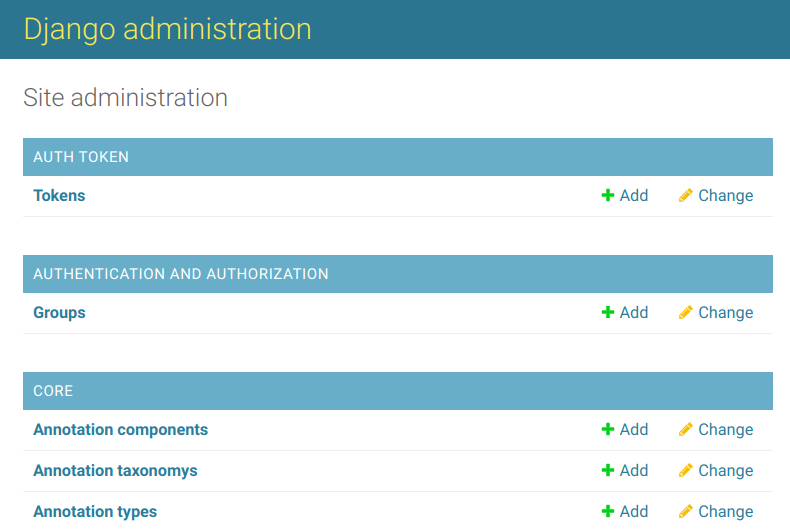
</figure>

## API (REST) eScriptorium

eScriptorium posiada interfejs API (wykorzystuje Django REST framework), który widoczny jest pod adresem https://{SERWER}/api/ (gdzie {SERWER} to domena lub ip serwera, na którym działa eScriptorium). Robocza wersja dokumentacji API dostępna jest w formie dokumentu google: https://docs.google.com/document/d/1tl48eXHq36KJ1zyXq0dMwYEzdnQYUm_MKfzMat9vjPc/edit#heading=h.j2ygnbgnoruv

Użytkownik posiadający uprawnienia i wygenerowany token (w panelu administracyjnym aplikacji) może poprzez API, np. z wykorzystaniem connectora dla języka python (https://gitlab.com/sofer_mahir/escriptorium_python_connector) uruchomić niektóre funkcje eScriptorium. Przykłady we wspomnianej wyżej dokumentacji. 
<figure>
  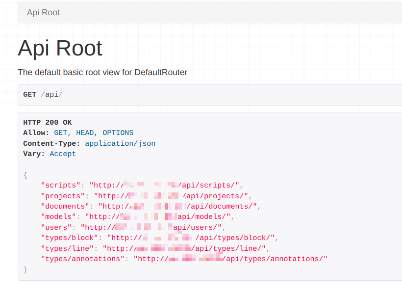
</figure>

## Fora dyskusyjne, kody źródłowe, licencje

Techniczne forum eScriptorium, związane bardziej z rozwojem tej aplikacji, dostępne jest na gitterze:
https://gitter.im/escripta/escriptorium , dość często jednak zdarzają się tam pytania (i odpowiedzi) zwykłych użytkowników systemu.

Kod źródłowy aplikacji przechowywany jest w serwisie gitlab - https://gitlab.com/scripta/escriptorium/ , tam też znajduje się lista błędów i propozycji rozwojowych: https://gitlab.com/scripta/escriptorium/-/issues/?sort=created_date&state=opened&first_page_size=100

eScriptorium udostępnione zostało na otwartej licencji własnej (https://gitlab.com/scripta/escriptorium/-/blob/develop/LICENSE).

Program Kraken rozwijany jest na innej platformie - github: https://github.com/mittagessen/
a udostępniony został na licencji Apache 2.0.
