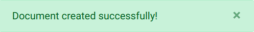
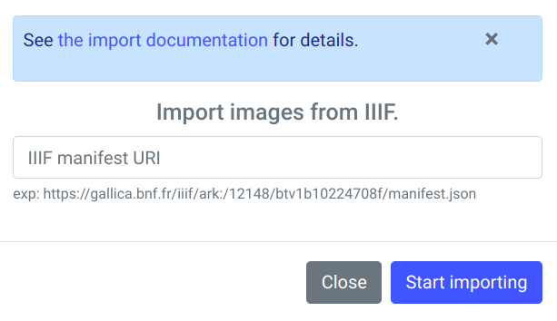
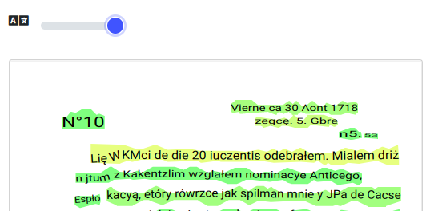

# eScriptorium - Tutorial

eScriptorium jest webową aplikacją przeznaczoną do pracy nad historycznymi rękopisami i drukami. Aplikacja jest zintegrowana z programem Kraken, narzędziem wykorzystującym algorytmy uczenia głębokiego do rozpoznawania tekstów (OCR i HTR). eScriptorium to projekt prowadzony przez eScripta, zespół z Université Paris Sciences et Lettres.

## Podziękowania

Stworzenie tego opisu nie byłoby możliwe bez lektury wcześniej powstałych materiałów i
tutoriali np. [eScriptorium Tutorial (en)](https://lectaurep.hypotheses.org/documentation/escriptorium-tutorial-en), bez obejrzenia licznych materiałów video dostępnych w serwisach [vimeo](https://vimeo.com/user130532566) i [youtube](https://www.youtube.com/watch?v=tut007D6w3o) czy wreszcie bez przeczytania artykułów na stronie [LECTAUREP](https://lectaurep.hypotheses.org/articles). Wiele cennych informacji zostało także zaczerpniętych z dokumentacji systemu Kraken - [Training](https://kraken.re/master/ketos.html).

## Wersja

Aktualna wersja aplikacji to 0.13.2 i taką opisuje niniejszy tutorial (stan na 16.12.2022).
<figure>
  
</figure>

## Logowanie i główne okno aplikacji

Logowanie do instancji eScriptorium wymaga podania loginu i hasła, okno logowania jest wyświetlane po wybraniu przycisku Login w górnym prawym rogu ekranu aplikacji.
<figure>
  
</figure>

Po zalogowaniu widoczna jest lista (tabela) projektów użytkownika. Mogą to być projekty utworzone przez zalogowaną osobę lub udostępnione przez innych użytkowników, w środkowej kolumnie tabeli projektów można zobaczyć dla każdego z nich login jego twórcy. W ostatniej kolumnie widoczna jest liczba dokumentów w danym projekcie. Projekt może mieć wiele dokumentów a dokument wiele skanów/zdjęć. Pierwsza kolumna po lewej to tytuł danego projektu.
<figure>
  
</figure>

Powyżej listy projektów widoczne jest podstawowe menu aplikacji:
- menu 'My Models' wyświetla listę modeli dostępnych dla użytkownika,
- menu 'Hello {USER}' udostępnia m.in. możliwość zmiany hasła, edycji profilu użytkownika, podglądu stanu zadań (zadania np. trenowania modelu, lub transkrypcji dużej liczby plików mogą być czasochłonne, polecenia Task monitoring czy Task report umożliwiają sprawdzenie stanu zadań). Zależnie od uprawnień, można tu również znaleźć funkcję zarządzania ustawieniami aplikacji eScriptorium. W tym menu znajduje się też możliwość wylogowania z systemu.
- menu 'My Projects' - wyświetla właśnie listę (tabelę) projektów
- menu 'Contact' - umożliwia komunikację z administratorami danej instancji eSCriptorium, o ile taka opcja została skonfigurowana.
- menu 'Home' wyświetla główne okno programu, z informacjami o jego możliwościach, wersji itd.
<figure>
  
</figure>

## Utworzenie nowego projektu

Widoczny w górnym prawym rogu ekranu (powyżej tabeli projektów) przcisk 'Create new Project'
pozwala na utworzenie nowego projektu. Jedynym polem, które można i należy wypełnić jest tytuł projektu - maksymalnie 512 znaków. Uwaga: w opisywanej wersji nie można zmienić nazwy projektu po jego utworzeniu, warto więc wprowadzić tytuł przemyślany, który w przyszłości pozwoli na wyszukanie naszego projektu z wielu innych.
<figure>
  
</figure>

Aplikacja wyświetla notyfikację (powidomienie, zielony komunikat w górnym lewym rogu) z informacją o prawidłowym utworzeniu projektu, który pojawi się też od razu na liście projektów.
<figure>
  
</figure>

## Utworzenie nowego dokumentu

Po utworzeniu projektu można go otworzyć klikając w tytuł. Projekt jest czymś w rodzaju kontenera na dokumenty, można w nim zgrupować dokumenty zawierające np. skany różnych ksiąg danego źródła historycznego. Tworzenie dokumentu rozpoczyna się od kliknięcia zielonego przycisku 'Create new Document' - tradycyjnie w górnym prawym rogu ekranu.
<figure>
  
</figure>

Okno definiowania dokumentu zawiera dużo więcej pól niż w przypadku projektu. Pola podzielone są na 6 zakładek: Description, Ontology, Images, Edit, Models i Reports. Aby dodać i zapisać nowy dokument należy przede wszystkim wypełnić pierwszą z nich, zaczynając od nazwy (Name) dokumentu np. 'Księgi kaliskie t. 23' (inaczej niż dla projektów w przypadku dokumentów można później edytować i zmienić jego nazwę). Następnie wybrać z listy rodzaj pisma (main script) - w przypadku dokumentów przetwarzanych w Instytucie Historii PAN będzie to zapewne 'Latin', 'Cyrillic' lub 'Cyrillic (Old Church Slavonic variant)'. Należy również ustalić czy porządek ułożenia elementów w dokumencie to 'Left to right' czy 'Right to left' (kierunek samego pisma jest określony przez wybór rodzaju pisma).

W kolejnym polu należy wskazać pozycję linii w stosunku do wielokąta (kształtu) wiersza tekstu: 'Baseline', 'Topline', 'Centered'. Aplikacja pozwala opcjonalnie na wyświetlanie stopnia zaufania dla poszczególnych fragmentów automatycznej transkrypcji, jeżeli chcemy wyświetlać taką informację należy zaznaczyć pole wyboru 'Show confidence visualizations' (wizualizacja pojawi się w panelu Transcription w trybie edycji skanu/obrazu).

Sekcja Metadata pozwala na wprowadzenie własnych metadanych opisujących dokument (można wprowdzić informacje dotyczące np. okresu chronologicznego czy pochodzenia geograficznego). Po zakończeniu wprowadzania tych podstawowych danych przycisk 'Create' na dole okna utworzy nasz nowy dokument, wyświetlając stosowny komunikat (powiadomienie) w górnym prawym roku ekranu.
Wszystkie wprowadzone informacje będą mogły być w przyszłości uzupełnione i poprawione.
Zapisanie dokumentu odbezpiecza dostęp do podstawowej zakładki: 'Images' - tam będą znajdować się przetwarzane skany rękopisów i druków.
<figure>
  
</figure>

### Import skanów

Zakładka 'Images' składa się z trzech głównych elementów: pola do importu obrazów/skanów na górze (białe pole otoczone przerywaną linią z napisem 'Drop images here or click do Upload'), paska z narzędziami pośrodku oraz listy skanów, którą można przewijać (poziomo) gdy liczba skanów przekroczy szerokość ekranu. W przypadku nowego dokumentu lista skanów nie jest jeszcze widoczna.
<figure>
  
</figure>

Najprostszą metodą importu jest zaznaczenie pliku lub grupy plików w dowolnej aplikacji
zarządzającej plikami w danym systemie operacyjnym (Explorator w Windows, czy Files w Ubuntu) i przeciągnięcie ich na obszar pola importu skanów. Spowoduje to uruchomienie procesu importowania - skany pojawią się w polu importu i stopniowo będą przechodzić do listy skanów. Można w ten sposób importować całkiem duże kolekcje, nawet kilkaset obrazów.
Można także kliknać w obrębie pola importu, co wywoła standardowy dla danego systemu
operacyjnego dialog z możliwością wskazanie plików. Obsługiwane są typowe formaty plików graficznych np. jpeg, png, tiff. 
 
### Import transkrypcji i skanów

Dodatkowe możliwości importu daje przycisk Import widoczny na pasku narzędzi, przycisk rozwija się udostępniając 3 polecenia:
- import obrazów z zewnętrznego serwera poprzez protokół IIIF, co jest przydatne gdy posiadamy już kolekcję skanów w repozytorium obsługującym ten protokół
<figure>
  
</figure>

- import obrazów z pliku pdf - każda strona pliku zostanie zaimportowana jako osobny obraz
<figure>
  
</figure>

- import transkrypcji w formacie xml (np. ALTO v.4 lub PAGE XML), ten wariant umożliwia importowanie transkrypcji i segmentacji do wczytanych wcześniej skanów, transkrypcje mogą być grupą plików xml lub mogą być spakowane w formie pliku zip. Funkcja ta pozwala także na import pliku zip, zawierającego zarówno skany jak i transkrypcje xml, aplikacja rozpakuje wówczas obrazy i umieści na liście skanów, wczytując jednocześnie informacje z plików xml - transkrypcję, segmentację itd. Uwaga: domyślnie maksymalna wielkość importowanego pliku zip nie może przekroczyć 150 MB.
<figure>
  
</figure>

## Lista obrazów/skanów

Lista obrazów/skanów jest głównum miejscem szybkiego przeglądania kolekcji skanów
w dokumencie, z poziomu listy skanów wywoływane jest też ich przetwarzanie: binaryzacja, segmentacja czy transkrypcja. Skany wyświetlane są w formie miniatur, jeżeli jest ich więcej niż kilka i nie mieszczą się na ekranie, aplikacja wyświetla poziomy pasek przewijania.

<figure>
  
</figure>

Powyżej listy skanów widoczny jest pasek narzędzi. Pierwsze dwa przyciski na pasku pozwalają na zaznaczenie (wybranie) lub odznaczenie wszystkich skanów - operacje przetwarzania skanów przeprowadzane są tylko na zaznaczoncych obrazach. Kolejne przyciski odpowiadają za import i eksport, trenowanie (możliwe jest trenowanie modelu segmentacji lub modelu transkrypcji), grupa przycisków z prawej strony pozwala na przetwarzanie skanów: binaryzację, segmentację, transkrypcję oraz automatycznie wyrówananie (Align) ze wskazanym tekstem (np. transkrypcją manualną).

<figure>
  
</figure>

Każdy obraz/skan wyświetlany w formie miniatury posiada zestaw ikon/przycisków informujących o stanie danego skanu i pozwalających na wykonanie pewnych operacji na nim, na przykład pole wyboru w górnym lewym rogu miniatury zaznacza dany skan, mała ikonka z krzyżykiem (w górnym orawym rogu) umożliwia usunięcie skanu z dokumentu, zielone pole/przycisk na środku miniatury wyświetla skan w trybie edycji, ikony pod miniaturą informują czy dla skanu przeprowadzono jedną z operacji przetwarzania, wówczas przybierają kolor zielony. Np. okrągła czarno-biała ikona odpowiada za binaryzację, ikona ze schematycznymi liniami za segmentację, ikona będąca białym pustym prostokątem dotyczy transkrypcji zaś ikona wyglądająca jak symbol pliku/dokumetu odpowiada funkcji Align (automatycznemu wyrównaniu tekstu). Chwycenie i przemieszczenie całej miniatury pozwala natomiast zmienić kolejność skanów w dokumencie.

## Binaryzacja

Binaryzacja jest w obecnej wersji procedurą niezalecaną do przeprowadzania, dokumentacja systemu ostrzega że może to prowadzić nawet do pogorszenia jakości wyników. 
<figure>
  
</figure>

## Segmentacja

Przed uruchomieniem automatycznej transkrypcji skanów (OCR/HTR) niezbędne jest prawidłowe podzielenie pisma lub druku na regiony i wiersze. Można to zrobić manualnie, jednak w przypadku większej kolekcji skanów byłby to zbyt czasochłonne. eScriptorium posiada mechanizm automatycznej segmentacji wykorzystujący model uczenia głębokiego. Aby go uruchomić należy najpierw zaznaczyć jeden lub więcej skanów/obrazów na liście a następnie kliknąć przycisk 'Segment' na pasku narzędzi. Wyświetlone zostanie okno z opcjami segmentacji, w którym należy wybrać model, zakres pracy, układ elementów na stronie itp.
<figure>
  
</figure>

W obecnej wersji dostępny jest jeden domyślny model: blla.mlmodel, dający skądinąd bardzo dobre rezultaty. Domyślnie segmentacja wyznacza linie i regiony ('Lines and regions'), można zmienić zakres zadania segmentacji rozwijając listę poniżej pola z nazwą modelu.
Pojawią się wówczas opcje: 'Lines Baselines and mask' (wyznaczanie linii i masek linii),
'only line Mask' - tylko maski wierszy, 'Regions' - wyznaczanie regionów.

Trzecie z pól okna parametrów segmentacji określa układ elementów na stronach, domyślnie wybrany jest 'Horizontal l2r', dostępne są także 'Horizontal r2l', 'Vertical l2r' oraz 'Vertical r2l'. Pole wyboru 'Override' u dołu okna oznacza, że istniejąca wcześniej segmentacja dla przetwarzanych skanów zostanie usunięta, usunięta zostanie także transkrypcja.

Procedura segmentacji może być czasochłonna, w jej trakcie aplikacja wyświetla dyskretną animację dla przetwarzanych obrazów - na zaznaczonych do przetworzenia skanach (poniżej miniaturki skanu) mruga mała ikonka z liniami (ikona segmentacji skanu). Wyświetlany jest także źółty przycisk na tle miniatury skanu, pozwalający na rezygnację z przeprowadzanej właśnie segmentacji. Po zakończeniu procedury wyświetlane jest powiadomienie w górnym prawym roku ekranu, a wspomniana ikona przybiera kolor zielony. Pełni ona jednocześnie rolę przycisku - można uruchomić segmentację klikając właśnie tą małą ikonkę pod miniaturą.

Uwaga: w przypadku importu skanów i transkrypcji z programu Transkribus w zalecanym formacie PAGE XML, zalecane jest przeprowadzenie segmentacji, ale tylko z użyciem opcji 'only line Mask'.

## Okno edycji skanu, segmentacji, transkrypcji

Aby zobaczyć utworzoną przez model segmentację strony/skanu, należy wejść w edycję danej strony - po najechaniu kursorem myszy na miniaturkę skanu wyświetli się pasek z białą ikoną symbolizującą edycję, oraz dymek z podpowiedzią 'Edit', kliknięcie w pasek otworzy skan w trybie edycji. Alternatywnie, jedna z zakładek w dokumencie to zakładka 'Edit', która uruchamia tryb edycji dla pierwszego skanu z dokumentu, tryb edycji posiada możliwość nawigacji do kolejnego/poprzedniego skanu, przesuwając się w lewo/prawo można odnaleźć właściwy skan.

Okno edycji skanu może wyświetlać od 1 do 5 paneli. Panele mogą być włączane i wyłączane poprzez ikony w górnym prawym rogu okna.
<figure>
  
</figure>

- 'Text'(?)-  Metadane strony/skanu, gdzie można zapisać tytuł strony, komentarz oraz metadane w formie par klucz - wartość.
<figure>
  
</figure>
- 'Source Image' - Oryginalny obraz/skan
<figure>
  
</figure>
- 'Segmentation' - Segmentacja, gdzie widoczna jest manualna lub automatyczna segmentacja: linie bazowe, maski linii i regiony.
<figure>
  
</figure>
- 'Transcription' - Transkrypcja, po przeprowadzaniu automatycznej transkrypcji panel ten wyświela jej wyniki w graficznej formie, opcjonalne może też wyświetlać 'confidence visualizations' - jeżeli zostało to włączone w parametrach dokumentu (zakładka Description), poprzez kolorowanie wierszy od pomrańczowego poprzez żółty do odcieni zieleni - im większa pewność transkrypcji tym bliżej do soczystej zieleni.
<figure>
  
</figure>
- 'Text' - Tekst transkrypcji manualnej lub automatycznych (jeżeli dany skan był już rozpoznawany przez model/modele), u góry okna można wybrać z listy rozwijanej, która transkrypcja ma być wyświetlana.
<figure>
  
</figure>

## Weryfikacja i korekta segmentacji

Aczkolwiek możliwe jest korygowanie zarówno linii bazowych jak i masek linii, ręczna
korekta masek nie jest zalecana, raczej należy starać się poprawiać długość i kształt linii bazowych, zaś maski linii są wówczas (zwykle z 1-2 sekundowych opóźnieniem) automatycznie dostosowywane przez aplikację.

<figure>
  
</figure>

W przypadku problemów z zaznaczeniem właściwego węzła, można skorzystać z tzw. 'lassa',
czyli z wciśniętym klawiszem Shift i lewym przyciskiem myszy zaznaczyć obszar z interesującym nas węzłem. Zaznaczony węzeł zmieni kolor na czarny i można go przesunąć, kursor myszy ustawiony nad takim węzłem zmienia kształt na 'łapkę'.
<figure>
  
</figure>

Jeżeli jednak zaistnieje potrzeba modyfikacji maski linii, należy zwrócić uwagę że edycja maski działa nieco inaczej, po włączeniu widoczności masek linii, zaznaczeniu linii do modyfikacji należy kliknąć nie tyle w węzeł maski co w jego pobliże a przesuwając kursor myszy zobaczymy, iż podąża za nim węzeł maski linii.
<figure>
  
</figure>

## Wprowadzanie transkrypcji manualnej

## Modele, import modeli dostępnych publicznie

## Transkrypcja automatyczna

## Automatic alignment - funkcja wyrównywania tekstu

Funkcja Align jest nowością wprowadzoną w wersji 0.13 eScriptorium, mechanizm ten jest jeszcze dopracowywany, dlatego należy traktować go jako wersję beta. Wykorzystuje program PASSIM Davida Smitha do porównywania dostarczonego pliku txt z wybraną warstwą OCR/HTR. Na podstawie podziału na strony i podziału na linie w warstwie OCR funkcja ta jest w stanie dopasować plik txt do skanów/obrazów, podzielić na wiersze zgodnie z podziałem w rękopisie i zapisać wynik jako kolejną warstwę OCR. Mając wystarczająco dobre wyniki OCR/HTR można w ten sposób wykorzystać je do wczytania jako warstwy np. tekstu z opracowania krytycznego danego rękopisu, nawet gdy tekst ten nie zachowuje oryginalnego układu z rękopisu.
<figure>
  
</figure>

Przed uruchomieniem funkcji należy przede wszystkim zaznaczyć 1 lub więcej skanów, które będą podlegały przetwarzaniu, w innym przypadku kliknięcie przycisku 'Align' na pasku narzędzi wywoła przypominający o tym komunikat. Okno parametrów funkcji 'Align' jest jednym z bardziej rozbudowanych w aplikacji eScriptorium. Należy w nim wskazać warstwę transkrypcji, z którą będzie porównywany plik tekstowy, wskazać lokalny plik tekstowy (lub wybrać z listy jeżeli był już użyty - eScriptorium zapamiętuje pliki). W sekcji 'Settings' okna należy wprowadzić nazwę nowej warstwy, parametr 'Use full transcribed document' określa czy porównywana będzie cała zawartość warstwy transkrypcji, czy każda strona osobo. Można też wskazać jakie typy regionów skanu będą brane pod uwagę (domyślnie wszystkie). Domyślnie odznaczona jest opcja 'Merge aligned text with existing transcription', która powoduje uzupełnienie wynikowej warstwy tekstem wskazanej warstwy transkrypcji gdy system nie zdoła dopasować odpowiednich fragmentów (jeżeli opcja nie jest użyta takie niedopasowane wiersze tekstu będą puste). Możliwe jest ograniczenie analizy do wskazanych typów regionów - domyślnie wybrane są wszystkie. Okno posiada jeszcze grupę parametrów ukrytych - zaawansowanych: kliknięcie 'Show/hide advanced settigns' wyświetla blok technicznych parametrów funkcji Align, ich opis znajduje się w dokumentacji programu Passim (https://github.com/dasmiq/passim).
<figure>
  
</figure>

Warto zauważyć, że 'wyrównywany' tekst np. z edycji krytycznej może nie tylko nie zachowywać podziału na strony i wiersze, ale również zawierać więcej tesktu niż poddane przetwarzaniu skany. Np. przy przetwarzaniu skanu z listem Corticellego poddanego transkrypcji modelem o 89% dokładności i 'wyrównywanego' z tekstem przygotowanym manualnie przez ekspertów zawierającym treść wielu listów, funkcja _Align_ dopasowała praktycznie idealnie właściwy fragment, podzieliła go też poprawnie na wiersze.
<figure>
  
</figure>

## Trenowanie własnego modelu w eScriptorium

eScriptorium zintegrowane jest z programem Kraken i pozwala nie tylko na rozpoznawanie pisma przygotowanymi wcześniej modelami, ale także na utworzenie całkowicie nowego modelu, lub douczenie (fine tuning) istniejącego. Proces trenowania można uruchomić w oknie dokumentu, w zakładce edycji. Jeden z widocznych w pasku narzędzi przycisków - 'Train', uruchamia trenowanie modelu segmentacji, lub - co jest częściej wykorzystywane - modelu transkrypcji. Pierwszym krokiem jest zaznaczenie conajmniej jednego skanu. Wybór narzędzia
Train -> Recognizer wyświetla okno parametrów trenowania modelu transkrypcji.

<figure>
  
</figure>

Należy w nim wskazać warstwę transkrypcji, która będzie użyta w procesie uczenia,
model bazowy (jeżeli chcemy oprzeć się na istniejącym modelu, który będzie douczany) oraz nazwę wynikowego modelu. Trenowanie z poziomu eScriptorium nie pozwala na ustawienie bardziej zaawansowanych opcji uczenia, które są dostępne podczas trenowania bezpośrednio w aplikacji Kraken.

## Trenowanie modelu bezpośrednio w Krakenie

Oprócz trenowania modelu z poziomu eScriptorium możliwe jest uruchomienie tego procesu z bezpośrednim użyciem programu Kraken z linii komend. Trzeba jednak pamiętać, że Kraken działa na systemach Linux i MacOS (na procesorach x64 i ARM, aczkolwiek w przypadku nowych komputerów Apple z procesorami M1 czyli z architekturą ARM Kraken nie umie na razie wykorzystać ich procesora graficznego), w przypadku systemu Windows można ewentualnie wypróbować WSL - Windows Subsystem for Linux.

Kraken jest aplikacją napisaną w języku Python i potrzebuje do działania zainstalowanej wersji 3 tego interpretera (najlepiej 3.8 lub nowszą). Instalacja opisana została na stronie programu: https://kraken.re/master/index.html

Po zainstalowaniu użytkownik dysponuje poleceniami: `kraken` i `ketos` do rozpoznawania OCR/HTR i trenowania modeli.

Dane do uczenia można pobrać z eScriptorium (skany oraz pliki XML), mogą też pochodzić z Transkribusa - w tym przypadku zalecany format to PAGE XML a przed trenowaniem zalecane jest przetworzenie segmentacji w eScriptorium (opcja Segmentation steps = 'Only Line Mask')

Aby nieco przyspieszyć proces uczenia z plików xml i skanów można przygotować tzw. binarny dataset poleceniem `ketos compile` (parametr `--random-split` descyduje o losowym podziale próbki - 80% uczenie, 10% walidacja podczas uczenia, 10% test):

    ketos compile --workers 3 --random-split 0.8 0.1 0.1 -f page -o name_dataset.arrow *.xml

zakładając, że polecenie uruchamiane jest w katalogu z plikami xml i skanami.

Przygotowany w ten sposób plik *.arrow posłuży np. do douczania (fine tuning - https://kraken.re/4.2.0/ketos.html#fine-tuning) istniejącego modelu:

    ketos train -i base_model.mlmodel --resize add --workers 3 --output new_model_name -f binary name_dataset.arrow

Do przetestowania modelu można użyć polecenia: `ketos test`, podając jako parametry model do testów i dane trenowania np. w formie binarnego datasetu - pliku *.arrow utworzonego powyżej (taki zestaw danych zawiera zwykle zarówno dane treningowe, walidacyjne jak i dane testowe, nie używane podczas trenowania):

    ketos test -m name_model.mlmodel -f binary name_dataset.arrow

Przykładowy wynik:

    === report  ===
    84685     Characters
    1142      Errors
    98.65%    Accuracy``

Szczegółówy opis procesu i parametrów trenowania znajduje się na stronie:
https://kraken.re/master/training.html

Model wytrenowany bezpośrednio w Krakenie (plik *.mlmodel) może zostać później zaimportowany do eScriptorium. Można też model dobrej jakości, który warto udostępnić publicznie, umieścić w repozytorium zenodo.org, Kraken umożliwia opublikowanie
modelu z poziomu linii komend poleceniem: `ketos publish`, procedura wymaga posiadania konta w serwisie zenodo i jest opisana na stronie: https://kraken.re/master/advanced.html

## Eksport, udostępnienie i usunięcie modelu

Modele przechowywane w eScriptorium można wyeksportować, np. w celu umieszczenia w repozytorium zenodo.org lub użycia bezpośrednio w programie Kraken. Na liście modeli (menu 'My Models'), z prawej strony okna widoczne są kolorowe ikony pozwalające na eksport (pobranie) modelu - zielona ikona pliku ze strzałką w dół, usunięcie modelu - czerowona ikona z symbolem kosza, oraz udostępnienie modelu - niebieska ikona z zakrzywioną strzałką. Uwaga: usuwanie modelu następuje natychmiast, bez dodatkowego pytania, podobnie pobranie (eksport) modelu od razy uruchamia procedurę pobiernia pliku *.mlmodel.  
<figure>
  
</figure>   

Z kolei udostępnianie modelu wyświetla dodatkowe okno programu, w którym można zdecydować którym użytkownikom lub grupom użytkowników udostępniamy nasz model, można też udostępnienie dla danego użytkownika/grupy usunąć. 
<figure>
  
</figure>  

## Eksport transkrypcji

Przygotowane w eScriptorium transkrypcje skanów można zapisać w formie plików XML, w formatach ALTO lub PAGE, a także w postaci zwykłego pliku TXT. Eksport dostępny jest podczas pracy z dokumentem, w zakładce 'Images' po zaznaczeniu choć jednego skanu/obrazu. Przycisk 'Export' w pasku narzędzi (powyżej listy miniatur skanów) wyświetla okno dialogowe, w którym należy okreslić warstwę transkrypcji (skany mogły być rozpoznawane przez wiele modeli OCR/HTR), oczekiwany format danych (ALTO, PAGE. TXT), czy eksport ma zawierać oryginalne skany/obrazy. Po zatwierdzeniu okna system wygeneruje paczkę zip z plikami i wyświetli w górnym prawym roku ekranu powiadomienie. Powiadomienie będzie zawierało link do pobrania pliku zip z danymi. Jeżeli system został poprawnie skonfigurowany eScriptorium wyśle także użytkownikowi e-mail z informacją o przygotowaniu pliku zip i linkiem do pobrania (w przypadku większych kolekcji skanów, przygotowanie danych może zająć dłuższą chwilę).
<figure>
  
</figure>  

## Administracja systemem eScriptorium

Administrator eScriptorium i każdy użytkownik o odpowiednich uprawnieniach ma dostęp do panelu administracyjnego systemu poprzez menu 'Hello {USER}' -> Site administration w górnym prawym rogu okna eScriptorium. Uruchomienie tej funkcji wyświetla typowy dla aplikacji stworzonych w technologii Django panel w którym można zarządzać użytkownikami systemu, ich uprawnieniami, tworzyć nowe konta, grupy użytkowników, tokeny do współpracy z eScriptorium przez API. Administrator z poziomu panelu może nadawać lub odbierać uprawnienia do modeli OCR/HTR a także do dokumentów ze skanami i transkrypcjami, może również usuwać dokumenty i projekty.
<figure>
  
</figure>     

## API (REST) eScriptorium

eScriptorium posiada interfejs API (wykorzystuje Django REST framework), który widoczny jest pod adresem https://{SERWER}/api/ (gdzie {SERWER} to domena lub ip serwera, na którym działa eScriptorium). Robocza wersja dokumentacji API dostępna jest w formie dokumentu google: https://docs.google.com/document/d/1tl48eXHq36KJ1zyXq0dMwYEzdnQYUm_MKfzMat9vjPc/edit#heading=h.j2ygnbgnoruv

Użytkownik posiadający uprawnienia i wygenerowany token (w panelu administracyjnym aplikacji) może poprzez API, np. z wykorzystaniem connectora dla języka python (https://gitlab.com/sofer_mahir/escriptorium_python_connector) uruchomić niektóre funkcje eScriptorium. Przykłady we wspomnianej wyżej dokumentacji. 
<figure>
  
</figure>

## Fora dyskusyjne, kody źródłowe, licencje

Techniczne forum eScriptorium, związane bardziej z rozwojem tej aplikacji, dostępne jest na gitterze: 
https://gitter.im/escripta/escriptorium , dość często jednak zdarzają się tam pytania (i odpowiedzi) zwykłych użytkowników systemu.

Kod źródłowy aplikacji przechowywany jest w serwisie gitlab, tam też znajduje się lista błędów i propozycji rozwojowych: https://gitlab.com/scripta/escriptorium/-/issues/?sort=created_date&state=opened&first_page_size=100

eScriptorium udostępnione zostało na otwartej licencji własnej (https://gitlab.com/scripta/escriptorium/-/blob/develop/LICENSE), kod źródłowy programu przechowywany jest w serwisie gitlab - (https://gitlab.com/scripta/escriptorium/  

Program Kraken rozwijany jest na innej platformie - github: https://github.com/mittagessen/
a udostępniony został na licencji Apache 2.0.
